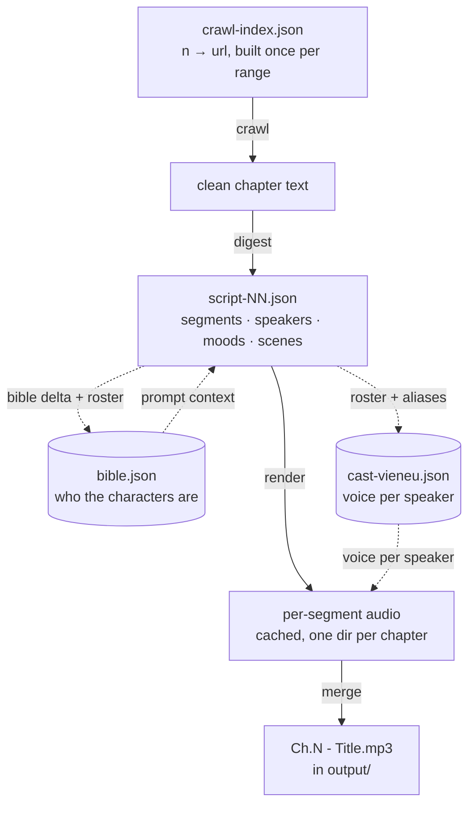
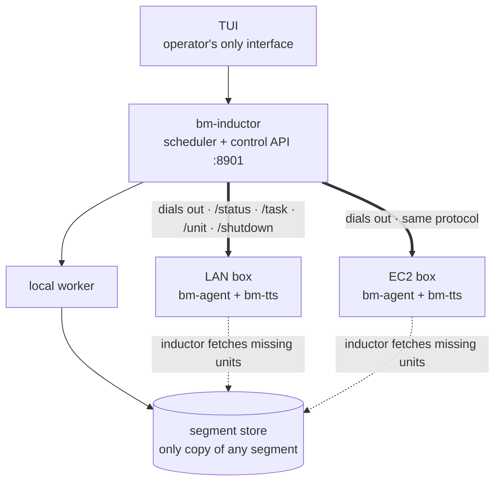
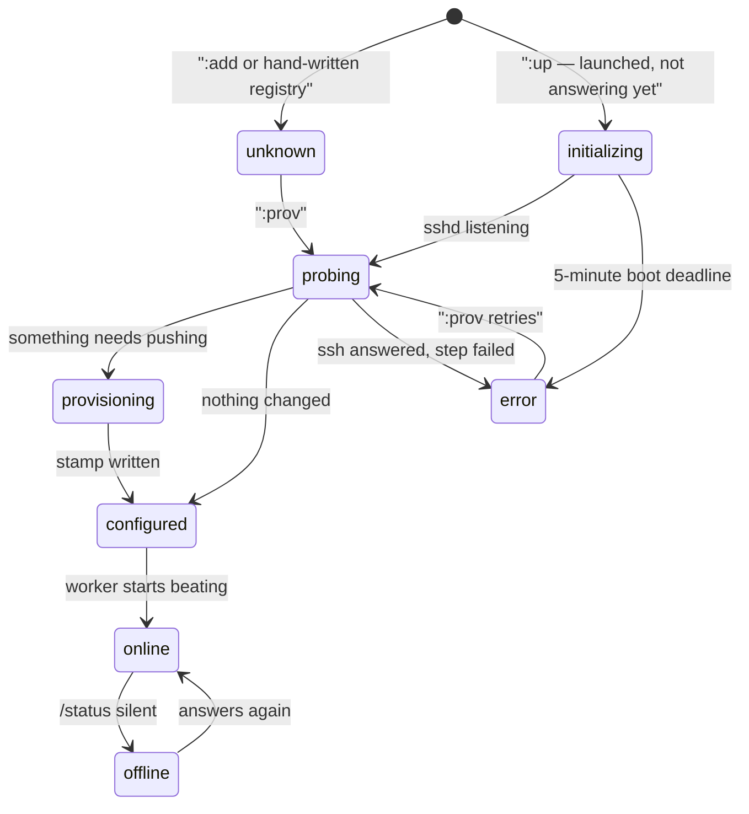

# Storycast — a web novel becomes a multi-voice audiobook

Point Storycast at a novel — chapter files you supply, or any chapter URL a
small crawler script can fetch — and it dramatizes and speaks the book:
**`Ch.42 - The Title.mp3`**, a voice per character, pauses, optional ambience —
chapter after chapter, on this machine or a LAN/cloud cluster. Born from
Vietnamese web novels, raised international: any novel, any site, any language
your prompt can dramatize.

---

## If you just want your book as audio

*You can stop reading after this section. Everything below is for people
changing the machine itself.*

You need three things: an LLM API key, the `bm-tts` voices (downloaded once),
and your book's text — either text files you already have, or a website it is
on.

**1. Tell it where the book is.** If you have the text, drop files in and
import them. If it is a website, check the site first — one command, and it
tells you whether the site will serve you at all:

```bash
bm-inductor check https://your-site.example/book/chapter-1
```

That one request saves the alternative, which is finding out from ten workers
failing at once, an hour apart, on a day. If the site is one Storycast already
has a crawler for, the command prints the settings to paste; if the site is
blocked, it says so in a sentence rather than leaving you to guess.

**2. Start the book.** `bm-inductor tui` opens the dashboard, then:

```
:t 1 50          # chapters 1..50: fetch, cast, speak, merge
:e               # how much is left
```

That is the whole run. The four stages then keep themselves going: each chapter
is fetched, someone is assigned to each line, the audio is generated, and the
chapter is saved. You can watch it, and you can fix by hand anything it got
wrong — but for a book of any length you will not be watching it.

**3. Take the files.** Finished chapters land in `output/`, named
`Ch.N - Title.mp3`. That is the deliverable — everything else is machinery.

**What it costs, honestly.** Roughly two LLM calls per chapter — one to work out
who is speaking, one to write the performance — and that is the entire
per-chapter cost of the intelligent part. Speaking is local with the built-in
voices and costs nothing per chapter. So the bill scales with how many chapters
you render, and adding workers changes how long it takes, not what it costs.

**What it will not do.** It will not get past a site that blocks it: no browser
engine, no challenge solver, and no intention of adding either. Roughly one
novel site in three refuses a program, and no amount of retrying changes that.
It also will not do voices well for a language it was not built around — the
built-in voices are Vietnamese. Cloning your own voice from a short clip works
in any language and is the way around that.

**Before you spend a day on it:** the single most common way this fails is
pointing it at a site that serves a bot check instead of a chapter. Run
`bm-inductor check` on one real chapter URL first. It costs a second.

## Clone vs. bring

The repo is the machine, not the material.

| In the repo | What it is |
| --- | --- |
| `rust/` (five crates) | Pipeline: scheduler, workers, TUI, provisioning — plus `bm-tts`, the local Vieneu TTS sidecar |
| `python/` | Voice enrollment only (the old sidecar is retired; serving never needs Python) |
| `prompts/script.txt` | **The staging contract** the automatic digest renders after speakers are fixed: text, TTS, music, effects, and sounds. Your main edit for another language/genre. Ships with the profile; the tracked copy is `rust/fixtures/profile/prompts/` |
| `prompts/analyze.txt` | Chapter-attribution template used by the automatic first pass; its legacy raw-chapter rendering remains the manual digest manager (`D`) path |
| `voices.default.json` | Built-in catalogue voices |
| `assets/`, `Makefile`, `.env.example` | Scene maps, ambience, one-command ops, config template |

Everything book-specific is runtime-created and git-ignored:

| Created by you / at runtime | What it is |
| --- | --- |
| `url_template` + `crawl` in `workspaces/<name>/settings.json` | Where chapters come from: `{n}` = number, and the [crawl script](docs/CRAWLING.md) that fetches them. **The only novel-specific settings you must change.** New workspaces default to `crawl.mode: "manual"` — nothing fetches until you name a crawler and set `"mode": "script"` |
| `workspaces/<name>/crawl/*.lua` \| `*.js` | Your crawler, per book. `assets/crawl/templates/` has five to start from, four of them written against a page captured from the live site they are for: `storya.lua` (the site this was built for), `truyencom.lua` (the easy shape), `madara.lua` (a paginated listing), `readnovelfull.lua` (slug URLs and a book index that stops at 30 chapters), `webnovel.lua` (the hard shape — and a site behind a bot check). Synced to every worker with the next provision. See [docs/CRAWLING.md](docs/CRAWLING.md) |
| `prompts/script.txt` | Your style/language, if the example doesn't fit |
| `voices.json`, `voice-pool.json`, `refs/` | Cloned voices + clips (skip to use catalogue voices) |
| `data/`, `output/` | Scripts, bible, cached audio, finished MP3s |
| `.bm/` | Ledger, settings, machines, logs |
| `.env` | API keys — **inductor only**. Workers receive keys with the task that needs them |

Same program, any novel: language, cast and voices come from your prompt, URL
template and voice files. The code only knows: fetch → script of labelled
segments → speak each segment → glue the audio.

---

## 1. The pipeline (60 seconds)

Four stages per chapter:



The dotted edges matter: **the bible is both digest input and output**, and the
cast is derived from the digest — so chapter 40 keeps chapter 1's voice for a
character with no hand config.

### The crawler is not a detail. It is the first three stages' input.

One thing is worth understanding before you write one, because it explains every
rule in the [crawling guide](docs/CRAWLING.md):

> **Your crawler decides what the AI is even asked to do. A cleaner chapter
> makes the rest of the program work; it does not merely sound nicer.**

Three links, each of which fails *quietly*:

- **Quote marks decide who speaks.** Before any AI is involved, the chapter is
  cut into pieces and each is labelled narration or dialogue — decided by `"`,
  `“` and `「` and nothing else. A crawler that returns a container with no
  quote marks in it produces a book narrated by a single voice, with no error
  anywhere: the script is complete, the checks pass, the audio renders. The
  digest now prints the split first thing so you can see it coming
  (`prepared 52 event(s): 21 narration, 31 dialogue`).
- **Left-over page furniture becomes the AI's homework.** Nav links, a
  duplicated title, a site footer: nothing refuses them. They each become a
  piece of the chapter that must be attributed and used exactly once. A dirty
  crawl makes the digest measurably harder, and the first thing to break is the
  check that every piece was used.
- **Paragraph breaks are not decoration.** A site that separates paragraphs with
  two carriage returns and no `<p>` hands over one 8,000-character line, which
  passes the "is this even a chapter" length check and yields an audio file with
  no pause in it anywhere.

The payoff runs both ways: **the cleaner the input, the more a digest refusal
means "the model got this chapter wrong" rather than "the input was junk".** No
check further down can catch text that never offered a speaker to disagree with.

- **crawl** — **manual by default**: a new workspace fetches nothing, and
  chapters come from files (`:import 34 ch34.txt`). Set `"mode": "script"` with
  a crawler and it turns `n` into a chapter: expand `{n}`, or read the site's
  index and follow links, then pick the body off the page. Which element that
  is and where it starts and stops are in the script's own table, not in Rust.
  See [docs/CRAWLING.md](docs/CRAWLING.md).
- **digest** — the chapter is split *deterministically* into `narration`/
  `dialogue` events with stable ids, then **one** LLM call answers cast + script
  together in strict JSON → `data/script-NN.json`. A gate then rejects the answer
  unless every event was spoken exactly once, in source order, with narration on
  `Narrator` and no quote delimiter inside a segment.
- **render** — speak each segment with its speaker's voice; every segment is
  cached, so a crash costs seconds, not a chapter.
- **merge** — segments + gaps + optional effects/music/scene-beats →
  `output/Ch.N - Title.mp3`.

The **inductor** owns this state (the task ledger) and hands chapters to
**agent** workers on this machine and any boxes you add over SSH.

---

## 2. Install

You need four things: **Rust** 1.75 or newer, **zig** (used to build the speech
program for other platforms), **Python 3** (used once, to prepare the voices and
to record your own), and a way to reach an AI model — a Gemini key, an
[opencode](https://opencode.ai) login, an OpenRouter key, or Ollama running on
your own machine.

```bash
git clone lhuthng/storycast.git
cd storycast
make build               # builds the Rust programs
make tts                 # builds the speech program and its speech runtime
                         # (you can skip this: adding a machine to the pool
                         #  builds the speech program for that machine itself)

cp .env.example .env     # add your key(s)
#   GEMINI_API_KEY=...      (or OPENROUTER_API_KEY, or nothing for opencode)
#   TTS_ENGINE=vieneu       (default; `gemini` for the API engine)
```

**Two things about security, so there are no surprises.**

First: **`.env` never leaves the machine you created it on.** When you add more
machines later, they are *not* given this file. Instead, each machine is sent
just the one key that the work it has been handed actually needs. So a remote
machine can do the work without ever holding your keys as a whole. The catch is
that those keys do cross the network with the task, so keep everything on a
network you trust — there is no password on the internal connection, the same as
every other local service here.

Second: **the built-in voices are downloaded once, then they are yours.** They
come from Hugging Face a single time and are converted into plain files by
`python3 tools/bake-models.py` (`--check` re-verifies them). From then on the
machines that speak need no internet connection at all, and no Python either.
### Your novel (required)

Chapters arrive one of two ways.

**Manual (the default).** Nothing fetches until you say so. Drop text files
into the workspace and import them:

```bash
:import 34 ch34.txt     # or ch34.txt / 34.txt / chapter-034.txt — the number comes from the name
```

**Scripted.** Set `"mode": "script"` and name a crawler:

```json
"crawl": { "mode": "script", "script": "crawl/mysite.lua",
            "params": { "entry": "https://site.example/truyen/ten-truyen" } }
```

A crawler is a small Lua or JavaScript file — one `crawl(input)` that returns
the chapter text, an optional `discover(input)` for sites whose URLs are slugs.
Write one without reading much of anything:

0. **`bm-inductor check <a chapter url>`** — one request, and a verdict on
   whether a crawl of that page would produce a chapter. Do this *first*. The
   alternative is finding out from ten workers failing at once, an afternoon
   apart, which is how a site behind a bot check costs you a day. It reads the
   workspace's `crawl.user_agent` and `crawl.headers`, so it also confirms a
   session cookie still works.
   If the site is one this project already has a crawler for, `check` says so
   and prints the settings block to paste — and the TUI says the same thing
   while you type into `:crawl`. Sites we have *checked and cannot crawl* are
   listed too, with the reason, so the same afternoon is not spent twice.
1. Save one chapter page (and the book's index page for slugs):
   `curl -A "Mozilla/5.0" -o ch1.html https://…/chuong-1`
2. **Paste that HTML into any AI chat together with §4 of
   [docs/CRAWLING.md](docs/CRAWLING.md) — it is a self-contained brief (the
   contract, the host functions, the refusal classes) written exactly for
   this.** Ask for a Lua script; the chat investigates the selectors and hands
   back a working crawler. Start from a template if you would rather not begin
   from nothing:   `templates/truyencom.lua` is the easy shape (the chapter URL
   is a function of `n`), `templates/madara.lua` a paginated listing,
   `templates/readnovelfull.lua` a site whose URLs carry a title slug *and*
   whose book index stops at 30 chapters, `templates/webnovel.lua` the hard
   one — slug URLs, a container one level deeper than the obvious one, a
   paid-chapter flag. `templates/storya.lua` is the crawler the pipeline
   shipped with, kept for workspaces whose settings predate the `crawl`
   block; a new workspace names no crawler at all.
3. Put it at `workspaces/<name>/crawl/mysite.lua` (per book, synced to every
   worker by the next provision), point `crawl.script` at it, and probe with
   `c` in the TUI — the probe runs the real crawler over a real chapter and
   shows the verdict, so tuning is evidence, not guessing.

**If a site refuses you.** `bm-inductor check` names a Cloudflare challenge as
one rather than calling it a 403. There is no bypass here and there is not going
to be: no TLS-fingerprint spoofing, no browser engine, no challenge solver. The
crawler speaks HTTP/1.1 with rustls and a header-shaped request, and some sites
refuse that on the fingerprint alone. What is left is a real browser user agent
in `crawl.user_agent` (the default `Mozilla/5.0` is thin) and, for the rest, a
`cf_clearance` cookie you solve in a browser and paste into `crawl.headers`.
Both are one-line changes, and `check` tells you whether either worked.

The chapter text must be prose with paragraph breaks — no navigation, no
comment sections, no repeated headline; the length guard refuses under 200
bytes and the size guard refuses a whole-page scrape. Everything else about the
format is [docs/CRAWLING.md §4](docs/CRAWLING.md).

### Cloned voices (optional)

- `voices.json` maps character → clip in `refs/` (e.g.
  `{"Narrator": "refs/narrator.mp3"}`). Both git-ignored.
- `voice-pool.json` is the tag-matched pool: `bm-inductor roster add-sample
  refs/young-female-4.mp3` — tags from the filename; enrolled on every worker
  at the next provision.
- Nothing added → built-in catalogue voices; per-engine accent policy assigns
  automatically.

### Sound design

The prompt tags each segment three ways; merge turns them into layers under
the voice:

- **`scene` = place** → **effects** (sparse). Consecutive same-speaker lines
  form a *run*; the run's majority scene matches ordered keyword rules in
  `assets/scene-map.json` (first wins). Rules name **tags**, never files. A
  window opens only when the scene names tags, lasts ≥ `min_span_s`, waits
  `cooldown_s` after the last, and the chapter spends ≤ `max_coverage` on the
  layer — a bed marks the scene, it doesn't run under everything.
- **`music` = mood** → **background music**. Closed palette in `scene-map.json`
  (`quiet`, `warm`, `busy`, `battle`, `grand`, `none`); consecutive same-value
  segments are one cue, so music changes as often as feeling does (crossfade
  on change). Quiet by design (`level: 0.06` vs effects' `0.08`–`0.22`).
  `none` (or a mood the pool can't answer) plays **no music** — validated at
  digest time. The chapter's **first cue is pulled back to the head of the
  timeline**, so the music comes up *under the title* rather than hitting on
  the first line that names a mood, and the layer's head and tail fade over
  `layers.music.fade_s` (3 s) — an opening and a closing, not the 0.3 s edge
  the sparse layers use.
- **Place ≠ mood on purpose.** One string doing both once put a hearth under a
  dawn shop: keyword `shop` hit a fire rule before the daylight rule.
- **`sound` = spot effect between lines.** `segments` holds **lines**
  (`speaker` + `text`) and **sounds** (`{"sound": "page-turn", "mode": "overlap"}`
  or `{"stop": "…"}`). The script *splits* the sentence so the sound sits where
  prose stages it:

  ```json
  {"speaker": "Narrator", "text": "Nàng lau mồ hôi trên trán, siết chặt cuốn võ thư trong tay"},
  {"sound": "page-turn", "mode": "overlap"},
  {"speaker": "Narrator", "text": ", như nhặt được báu vật."}
  ```

  Sound items have no `text`/`speaker` — **no TTS call ever sees the syntax**.
  Modes: `hit` (wait out the clip), `overlap` (zero timeline, runs under next
  speech), `trail` (hold, then tail ducks); `stop` fades, never cuts. Names and
  `dur_s` come from `assets/inject-pool.json` — a `hit` on a 51 s clip is
  refused at digest (51 s of dead air). Rides the `effects` switch +
  `inject_volume` in settings.
- **`bm-inductor digest <n>`** prints one chapter's answer and does nothing
  else — same `analyze_chapter` as the worker, no files unless `--write`.
- **Scene-change beats**: ≤ `pause.max_per_chapter`, only where narrated;
  music lifts to `pause_level` (sidechain release — shorter than
  `duck.release` never lifts).
- **One sidechain on both layers**, keyed on the whole voice track: layers drop
  whenever anyone speaks as a property of the signal path. Rules may attach
  reverb.
- **Customize**: clips in `assets/effects|music/`, registered in
  `effect-pool.json` / `music-pool.json` (registry is truth; `tags` matched by
  hand, not filename; `looped: false` = one-shot). Retune a mood in
  `music_palette` (prompt is rendered from it) or reorder place rules. Layers
  off via `"ambience": false` / `"music": false` in settings (merge-time; TUI
  run screen doesn't expose them yet). Normalize with
  `tools/normalize-audio.sh` first — `level` is gain over −23 LUFS.
- **Legacy**: scripts without `music` still merge via `legacy_scene_music` in
  `scene-map.json` (migration shim — delete once every script has the field).

---

## 3. Start it — three ways, easiest first



**Start with A.** It is two commands and no configuration, and it produces real
audio on your own machine. B is the same thing with a dashboard. C and D are
only worth the setup once A works for you and you actually want it finished
faster.

There is one idea behind all four, and it is worth knowing even if you only
ever use A: **one coordinator, any number of workers, and the coordinator is the
one that reaches out.** The machines doing the work never try to phone home.

**Why it is built that way**, because it is not an arbitrary choice. Each worker
is a small web server that answers questions, and it is never told where the
coordinator is. The alternative — workers calling in — does not work at all for
a rented machine, which cannot reach a laptop sitting behind a home router, and
the version that tried it had to fork the code in three separate places. Turning
it around removes the problem entirely: the coordinator already knows how to
reach them, because it is the one that started them.

One practical consequence, because it fails quietly: on a machine you add
yourself you must open **two** ports. Port 22 (ssh) gets you in to set it up;
the **task port** is what actually carries the work. Open the first and forget
the second and everything looks fine — the machine is reachable, it looks
healthy, it is just never given anything to do.

### A. Solo, headless

```bash
make serve START=1 COUNT=10      # terminal 1: inductor (:8901)
make agent                       # terminal 2: local worker
```

Watch `output/` fill up. `Ctrl-C` — nothing is lost (§4).

### B. TUI (recommended — everything is here)

```bash
make tui
```

| Key | Does |
| --- | --- |
| `:` | **Command line** — every operator action by word: `:add`, `:prov`, `:drop`/`:remove`, `:translate`, `:voices`, `:swap`, `:eta`, `:retry`, `:reconcile`, `:backend`, `:up [n]`/`:pool`/`:down` (§3D), `:drain`, `:quit`/`:exit`, `:X` stop. Singles still work (`:m` = `:reconcile`); aliases in `:help`. Input opens after `Enter`. No single key is destructive. |
| **R** / **K** / **S** | Read-only: overview (`Enter` launches) / **task ledger** / cast |
| **i** | Inspect selected machine |
| **arrows / k j** · **PgUp PgDn** · **G** | Move · scroll log · pin newest |
| **r** / **?** / **C** / **q** | Refresh · help · theme · quit |

`:`+`B` with no machines = local-only cluster, the easy first run. Ledger (`K`):
move, type to filter (`shelved`, `digest`, `42`), `u` retry / `F` force,
`Enter` full error, `Esc`/`q` close.

**Background jobs run together unless they contend.** Two provisions: parallel.
Two `aws` commands: serial (same account document). A waiting row says why —
`queued · needs box 10.0.0.5`.

Workers pane: cpu % / ram % + used GiB from heartbeats. Stats beside Tasks:
rows = workers, cols = stages, cells = completed tasks — plus per-worker eta
(median duration × unworked fraction; dash until first completion).

#### Audition a voice (assigns nothing)

In `:swap` step 2 and `:cast` — `Enter` is still the only key that assigns.

| Key | Plays |
| --- | --- |
| `t` | held line, **current** voice, cache only — zero synthesis |
| `T` | same line, **pointed** voice (rendered) |
| `Ctrl+T` | **another** line, pointed voice (rendered) |

Words: `:current`, `:try`/`:test`, `:another`/`:change`/`:next`.

Keys or filter, never both: screens open in audition focus (keys play; any
other letter focuses the filter). Filter focused → letters type, keys quiet,
words still audition. `^R` focuses filter; `Esc` blurs back.

Picker fixes the character (A/B on one sentence); cast overview follows the
highlighted speaker. Both print which line and which current voice — nothing
compared blind. `afplay`, one sample at a time. Inductor renders and returns
bytes → one temp file on *this* machine, overwritten each audition, removed on
TUI exit. Through the same sidecar path as the pipeline.

### C. LAN cluster

```bash
# 1. Remember the box (or skip and provision by address)
make link NAME=box-1 ADDR=192.168.2.2
# make provision ADDR=192.168.2.2 KEY=~/.ssh/your-key

# 2. Onboard over SSH: sources, bm-tts + runtime, baked models. Re-runs are
#    cheap — a content stamp makes a no-change run finish under a second.
make provision BOX=box-1

# 3. Start: `:B` is up in seconds and gives each idle box its own catch-up job
#    so they provision at once.
make tui     # press :B
```

Nobody pulls a shared queue: the inductor asks each box every couple of
seconds and hands it a chapter when it says "nothing". Idle picks up;
mid-render is left alone. Render+merge stay on the box that rendered — cached
segments are never re-uploaded.

### D. AWS workers

Operate entirely from the TUI. Only the AWS **console** is outside: create the
IAM user, policy, keypair, security group per
**[docs/AWS-IAM-USER.md](docs/AWS-IAM-USER.md)**, then `make tui`.

| TUI | What |
| --- | --- |
| `:login` | Store IAM key from `accessKeys.csv` (prompt prefills `~/Downloads/…`). Secret never typed on screen — only login route |
| `:discover --region … --pem … --instance-profile storycast-worker` | Read account into `.bm/aws.json`. Safe to re-run |
| `:profile` → pack/load | Writes `.bm/profile` — **required before `:up`**; each box's tag records its profile hash |
| `:B` | Backend up (`:8901`) — `:up`/`:prov` POST to it |
| `:up 3` | Launch three tagged boxes and link each (`.pem` + `ubuntu`) — **the one command that spends money** |
| `:B` again | Catch-up: every not-already-working box gets its own provision+start job, concurrently. Online boxes skipped and said out loud — `p` re-provisions deliberately |
| `:pool` (`l`) | Cloud view — account contents, `not linked` rows |
| `:down` (`o`) | Terminate live boxes — asks first, **refuses while a render is in flight**; needs prior `:pool`; `:down force` overrides |



Two states look broken and are not: **`initializing`** (created, ssh not up —
a probe can't tell booting from dead; five-minute deadline → `error`) and
**`configured`** (has everything, no worker beating yet — last catch-up step
moves it to `online`).

Words first for everything money-touching (`:login`, `:discover`, `:up`,
`:pool`, `:down`); keys `w`/`l`/`o` on the last three. A stray Normal-mode key
only points at the command line. `:down` terminates **by explicit instance
id**, never a filter.

Two files from the console: **`accessKeys.csv`** (user's access key →
Download .csv) and **`storycast.pem`** (EC2 → Key pairs → Create, RSA `.pem`).
`login` → `.bm/aws/credentials`; `discover --pem` → `.bm/aws/<region>.pem` —
both 0600, gitignored, `~/` expanded. Neither enters the repo.

**Instance type = RAM, not CPU.** Free plan: `c7i.xlarge` refused;
`m7i-flex.large` (2 vCPU / 8 GiB) eligible and correct — sidecar is ~2.9 GB
resident. `c7i-flex.large` (4 GiB) does **not** fit (~3.9 GB usable).
Traps, working sequences and what has actually run: **[docs/AWS-WORKERS.md](docs/AWS-WORKERS.md)**.

Headless: `bm-inductor tui --once` prints one plain-text snapshot and exits.

---

## 4. Where everything lives

First three rows tracked; everything else runtime + git-ignored (see tables
at top).

| Path | What it is |
| --- | --- |
| `prompts/script.txt` · `prompts/analyze.txt` | **Digest prompt templates.** Profile tree (git-ignored; tracked copy in `rust/fixtures/profile/prompts/`). The automatic digest renders `analyze.txt` for attribution, then `script.txt` for staging; the manual manager retains its legacy raw-chapter rendering. |
| `assets/*` | Clips, pools, scene map, licenses (tracked) |
| `voices.default.json` | Catalogue voices (tracked) |
| `output/Ch.N - Title.mp3` | **Finished chapters** |
| `data/chapters/NN.txt` · `data/script-NN.json` | Crawled (or imported) text · dramatized script |
| `data/crawl-index.json` | The chapter index: `n → url` for the current range. Hand-editable — the escape hatch for slug URLs |
| `data/bible.json` · `data/cast-vieneu.json` | Character bible · speaker→voice (one per engine) |
| `data/audio/segments-vieneu-NN/` | Cached segment audio — resumable renders |
| `voices.json` · `voice-pool.json` · `refs/` | Clone mapping · sample pool · clips |
| `workspaces/<name>/settings.json` | Run config **per book**: url_template, engine, range, speed, gap_ms, ambience, music, volumes, analyzer, models, render_batch (`:mix`, `:batch`). No workspace → same file is `.bm/settings.json` |
| `workspaces/<name>/ledger.json` | Task states; survives restarts. Root form: `.bm/ledger.json` |
| `.bm/machines.json` | Linked machines (addr, ssh user/port/key) — machine-global |
| `.bm/digest-suspend.json` | `:off` only: each box's policy as-was so `:on` restores *what each had*. File not latch — restart can't leave digest off with no way back. Deleted after restore |
| `~/.bm-worker/` | Worker's whole world: agent, bm-tts, models, sources, provision stamp |

**Restart-safe**: kill anything anytime — the ledger says where to resume;
cached segments never re-render.

### Clear all tasks

In the active workspace's `ledger.json`:

1. Stop inductor + workers (`X` in TUI, confirm, wait), quit TUI — a running
   inductor overwrites edits with its in-memory list.
2. Set `"tasks": []`; keep other fields (machine/worker runtime records).
3. Reopen. New run / `make serve` recreate for the selected range.

Do **not** delete `.bm/`, or clear `settings.json` / `machines.json`. Chapter
text, scripts, cast, segment audio and finished MP3s stay — future runs reuse them.

---

## 5. When something fails

In plain terms, and in the order worth trying them. The full guide is
**[docs/TROUBLESHOOTING.md](docs/TROUBLESHOOTING.md)**.

**Nothing is being fetched, or the wrong text is being fetched.**
Run `bm-inductor check <a real chapter url>` first, every time. One request, one
answer. A site that has started refusing you is the most common cause by a long
way, and it is the one thing a group of machines cannot tell you on its own.

**The book comes out in one voice.** The chapter had no quote marks in it, so
there was nothing for the program to tell narration from dialogue. The digest
prints the split on its first line — `prepared 52 event(s): 21 narration, 31
dialogue` — and **zero dialogue on a chapter where people are talking means your
crawler**, not the AI. See [the crawling guide](docs/CRAWLING.md#the-one-thing-worth-understanding).

**One chapter produced a wall of noise.** The crawler took the whole page instead
of the story, so nav links and footers became things the AI had to account for.
The program notices this shape and calls it "selector matched the whole page".

**A chapter will not finish.** It is retried, and after three failures it is put
aside rather than retried for ever. The task list (**K**) shows the reason in
the machine's own words. `u` releases them, and `u 24` releases one chapter.

**A machine looks fine but never gets work.** Usually one port: port 22 is open
so you can log in, but the **task port** is closed, so nothing is ever sent to
it. The machine is healthy and idle, which is the confusing part.

**Everything stalled and you do not know why.** `e` estimates what is left. If
the percentage is not moving, look at the Events pane — it records every
completion, failure, expiry and action in one stream, and it is the same stream
`/api/state` serves.

---

## 6. Tests & development

```bash
make test                            # cargo test --workspace + clippy -D warnings
cargo test -p bm-inductor tui::      # just the TUI tests
```

The suite never touches the network: the ssh targets are documentation-only
addresses, the AI and speech services are stubbed, and the dashboard renders to
an in-memory screen.

Local-only design notes (`.docs/` is git-ignored): `TUI_UX_AUDIT.md`,
`VOICE_CONFIG_PROPOSAL.md`, `PLAN.md`.

## 7. Honest limitations

The things that will cost you time, in the order they are likely to.

- **The built-in voices are Vietnamese.** Vieneu is local and free, but it is
  built for Vietnamese and it is what this project grew up on. In another
  language it will not error — it will just pronounce your book against
  Vietnamese syllable rules and sound wrong, which is worse. Three ways out:
  `TTS_ENGINE=gemini` for a cloud engine, adapt `python/tts_router.py` for
  another, or **clone a voice from your own recording** (`refs/`), which works
  in any language and is the one most people are happy with. `bm-inductor check`
  prints a warning when a site's text is not Vietnamese.
- **Vieneu is heavy** — about 1.7 GB of model files and roughly 2.9 GB of memory
  while it is running. A small cloud instance will not hold it; the README's
  sizing notes say which instance types do.
- **Gemini's free tier is about 10 calls a day**, and paying for the app does
  not raise that. On their pay-as-you-go API it is pennies per chapter.
- **Each chapter costs about two AI calls** — one to work out who is speaking,
  one to write the performance — plus one more each time the program asks for a
  correction. Free tiers rate-limit, so the analyzer falls through a list of
  models automatically rather than stopping.
- **The program refuses rather than guesses.** A chapter that fails a check is
  retried, not shipped, so a bad performance cannot slip into your library.
  Dialogue from a character it has not met gets a stable unnamed voice instead
  of being dumped on the Narrator or written into the cast. One honest gap: the
  by-hand digest (press `D`) still uses the older prompts and does not yet
  enforce the same checks as the automatic route.
- **A site you cannot fetch, you cannot use.** There is no browser here and no
  attempt to get around a refusal, so a site that blocks programs needs either
  text files or a different source. This is a deliberate line: the program would
  rather tell you a site said no than spend your afternoon retrying it.
- **Nothing is fetched until you say so.** You have to name a crawler. The
  upside is that a fresh install never starts hammering a website it was never
  pointed at.
