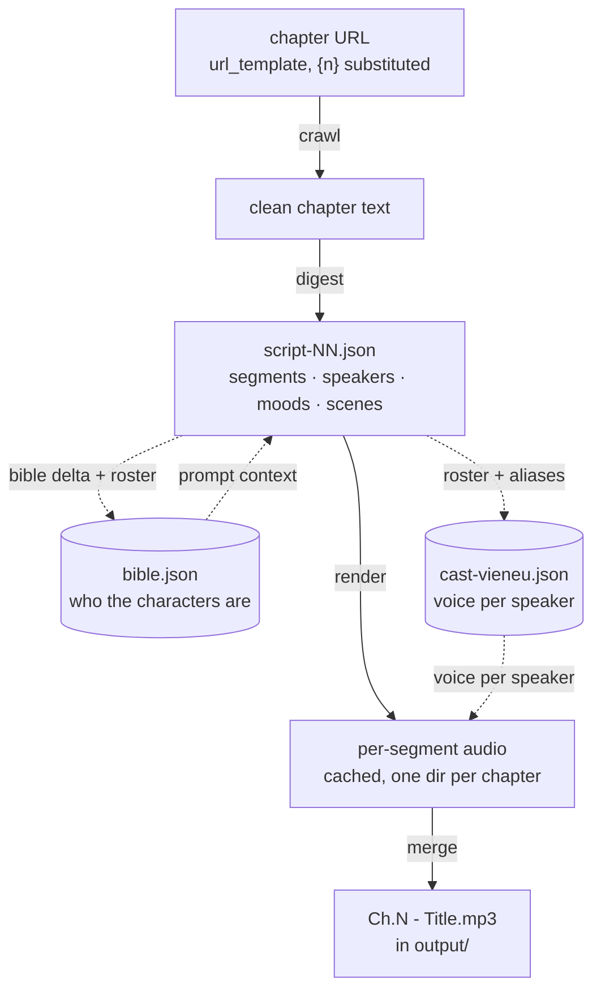
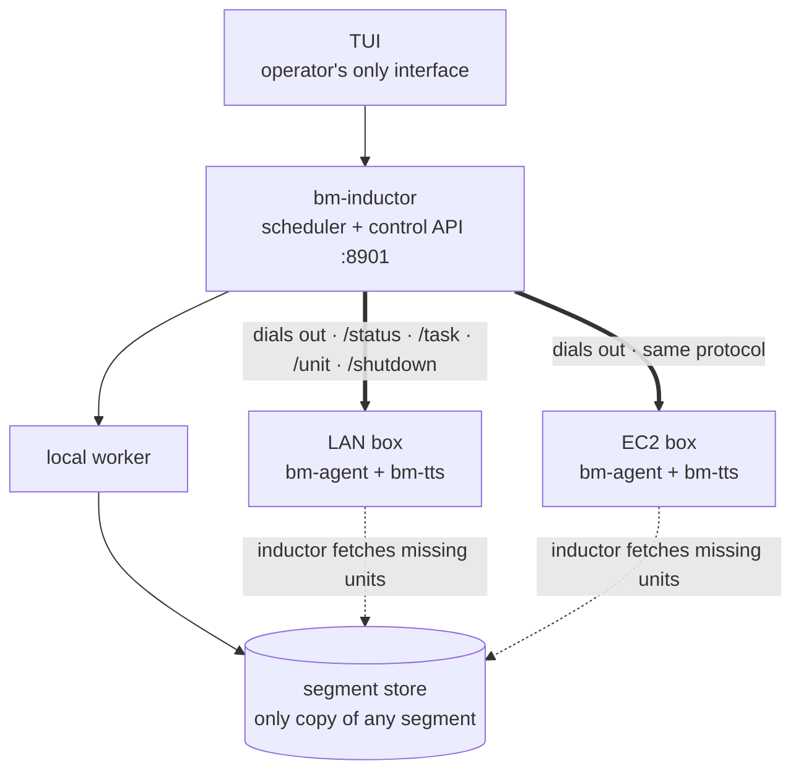
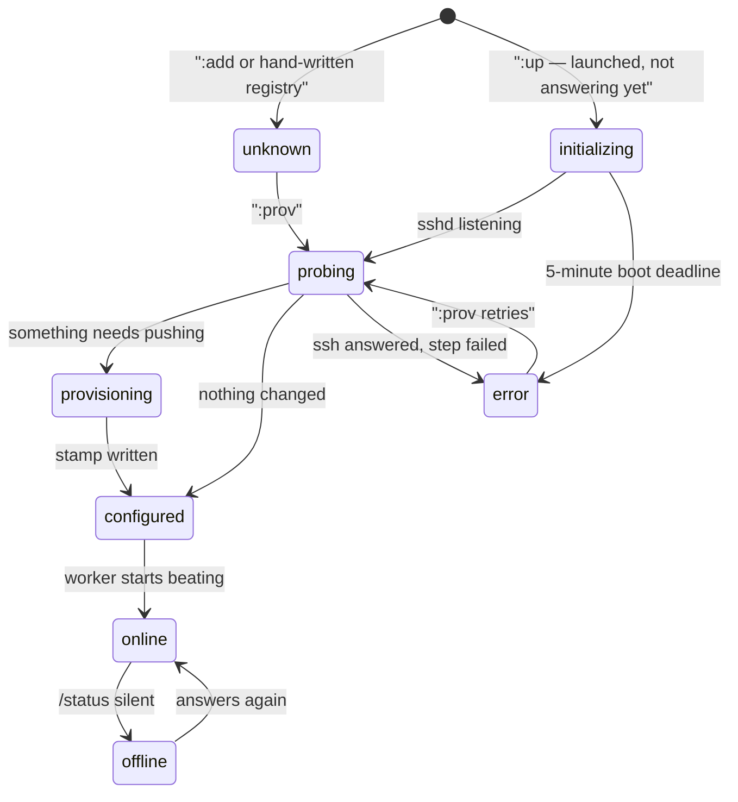

# Storycast — a web novel becomes a multi-voice audiobook

Point Storycast at any chapter URL template and it crawls, dramatizes, and
speaks the book: **`Ch.42 - The Title.mp3`**, a voice per character, pauses,
optional ambience — chapter after chapter, on this machine or a LAN/cloud
cluster. Born from Vietnamese web novels, raised international: any novel,
any site, any language your prompt can dramatize.

## Clone vs. bring

The repo is the machine, not the material.

| In the repo | What it is |
| --- | --- |
| `rust/` (five crates) | Pipeline: scheduler, workers, TUI, provisioning — plus `bm-tts`, the local Vieneu TTS sidecar |
| `python/` | Voice enrollment only (the old sidecar is retired; serving never needs Python) |
| `prompts/script.txt` | **The staging contract** the automatic digest renders after speakers are fixed: text, TTS, music, effects, and sounds. Your main edit for another language/genre. Ships with the profile; the tracked copy is `rust/fixtures/profile/prompts/` |
| `prompts/analyze.txt` | Chapter-attribution template used by the automatic first pass; its legacy raw-chapter rendering remains the manual digest manager (`D`) path |
| `voices.default.json` | Built-in catalogue voices |
| `assets/`, `Makefile`, `.env.example` | Scene maps, ambience, one-command ops, config template |

Everything book-specific is runtime-created and git-ignored:

| Created by you / at runtime | What it is |
| --- | --- |
| `url_template` in `workspaces/<name>/settings.json` | Chapter URLs, `{n}` = number. **The only novel-specific setting you must change** |
| `prompts/script.txt` | Your style/language, if the example doesn't fit |
| `voices.json`, `voice-pool.json`, `refs/` | Cloned voices + clips (skip to use catalogue voices) |
| `data/`, `output/` | Scripts, bible, cached audio, finished MP3s |
| `.bm/` | Ledger, settings, machines, logs |
| `.env` | API keys — **inductor only**. Workers receive keys with the task that needs them |

Same program, any novel: language, cast and voices come from your prompt, URL
template and voice files. The code only knows: fetch → script of labelled
segments → speak each segment → glue the audio.

---

## 1. The pipeline (60 seconds)

Four stages per chapter:



The dotted edges matter: **the bible is both digest input and output**, and the
cast is derived from the digest — so chapter 40 keeps chapter 1's voice for a
character with no hand config.

- **crawl** — fetch chapter `{n}` from the URL template, clean to plain text.
- **digest** — the chapter is split *deterministically* into `narration`/
  `dialogue` events with stable ids, then **one** LLM call answers cast + script
  together in strict JSON → `data/script-NN.json`. A gate then rejects the answer
  unless every event was spoken exactly once, in source order, with narration on
  `Narrator` and no quote delimiter inside a segment.
- **render** — speak each segment with its speaker's voice; every segment is
  cached, so a crash costs seconds, not a chapter.
- **merge** — segments + gaps + optional effects/music/scene-beats →
  `output/Ch.N - Title.mp3`.

The **inductor** owns this state (the task ledger) and hands chapters to
**agent** workers on this machine and any boxes you add over SSH.

---

## 2. Install

Needs **Rust** 1.75+, **zig** (`bm-tts` cross-build), **Python 3** (bake weights
once; enroll clone voices), and an analyzer: Gemini key,
[opencode](https://opencode.ai), OpenRouter, or local Ollama.

```bash
git clone lhuthng/storycast.git
cd storycast
make build               # Rust workspace
make tts                 # bm-tts sidecar + ONNX runtime

cp .env.example .env     # add your key(s)
#   GEMINI_API_KEY=...      (or OPENROUTER_API_KEY, or nothing for opencode)
#   TTS_ENGINE=vieneu       (default; `gemini` for the API engine)
```

**`.env` never leaves this machine.** Provisioning does not copy it; the
inductor sends each worker the keys the offered stage will read, with the task.
A remote digest works with nothing configured on the box — but keys cross the
LAN in the offer, so keep the control API on a trusted network (unauthenticated
plain HTTP, like every sidecar call here).

`bm-tts` serves Vieneu over HTTP on each worker. Weights come once from
Hugging Face, flattened by `python3 tools/bake-models.py` into `models/`
(`--check` re-verifies); provisioning pushes the bytes, so a worker needs no
internet and no Python to speak. Clone voices enroll on the inductor at bake time.

### Your novel (required)

```bash
make tui        # press c, then paste, e.g. https://example.com/truyen/any-novel/chapter-{n}
```

`{n}` is the chapter number. The TUI saves it to
`workspaces/<name>/settings.json` and probe-crawls one chapter to prove the
selector finds the text. **Only novel-specific setting you must change**
(plus `prompts/script.txt` if you want a different style).

### Cloned voices (optional)

- `voices.json` maps character → clip in `refs/` (e.g.
  `{"Narrator": "refs/narrator.mp3"}`). Both git-ignored.
- `voice-pool.json` is the tag-matched pool: `bm-inductor roster add-sample
  refs/young-female-4.mp3` — tags from the filename; enrolled on every worker
  at the next provision.
- Nothing added → built-in catalogue voices; per-engine accent policy assigns
  automatically.

### Sound design

The prompt tags each segment three ways; merge turns them into layers under
the voice:

- **`scene` = place** → **effects** (sparse). Consecutive same-speaker lines
  form a *run*; the run's majority scene matches ordered keyword rules in
  `assets/scene-map.json` (first wins). Rules name **tags**, never files. A
  window opens only when the scene names tags, lasts ≥ `min_span_s`, waits
  `cooldown_s` after the last, and the chapter spends ≤ `max_coverage` on the
  layer — a bed marks the scene, it doesn't run under everything.
- **`music` = mood** → **background music**. Closed palette in `scene-map.json`
  (`quiet`, `warm`, `busy`, `battle`, `grand`, `none`); consecutive same-value
  segments are one cue, so music changes as often as feeling does (crossfade
  on change). Quiet by design (`level: 0.06` vs effects' `0.08`–`0.22`).
  `none` (or a mood the pool can't answer) plays **no music** — validated at
  digest time. The chapter's **first cue is pulled back to the head of the
  timeline**, so the music comes up *under the title* rather than hitting on
  the first line that names a mood, and the layer's head and tail fade over
  `layers.music.fade_s` (3 s) — an opening and a closing, not the 0.3 s edge
  the sparse layers use.
- **Place ≠ mood on purpose.** One string doing both once put a hearth under a
  dawn shop: keyword `shop` hit a fire rule before the daylight rule.
- **`sound` = spot effect between lines.** `segments` holds **lines**
  (`speaker` + `text`) and **sounds** (`{"sound": "page-turn", "mode": "overlap"}`
  or `{"stop": "…"}`). The script *splits* the sentence so the sound sits where
  prose stages it:

  ```json
  {"speaker": "Narrator", "text": "Nàng lau mồ hôi trên trán, siết chặt cuốn võ thư trong tay"},
  {"sound": "page-turn", "mode": "overlap"},
  {"speaker": "Narrator", "text": ", như nhặt được báu vật."}
  ```

  Sound items have no `text`/`speaker` — **no TTS call ever sees the syntax**.
  Modes: `hit` (wait out the clip), `overlap` (zero timeline, runs under next
  speech), `trail` (hold, then tail ducks); `stop` fades, never cuts. Names and
  `dur_s` come from `assets/inject-pool.json` — a `hit` on a 51 s clip is
  refused at digest (51 s of dead air). Rides the `effects` switch +
  `inject_volume` in settings.
- **`bm-inductor digest <n>`** prints one chapter's answer and does nothing
  else — same `analyze_chapter` as the worker, no files unless `--write`.
- **Scene-change beats**: ≤ `pause.max_per_chapter`, only where narrated;
  music lifts to `pause_level` (sidechain release — shorter than
  `duck.release` never lifts).
- **One sidechain on both layers**, keyed on the whole voice track: layers drop
  whenever anyone speaks as a property of the signal path. Rules may attach
  reverb.
- **Customize**: clips in `assets/effects|music/`, registered in
  `effect-pool.json` / `music-pool.json` (registry is truth; `tags` matched by
  hand, not filename; `looped: false` = one-shot). Retune a mood in
  `music_palette` (prompt is rendered from it) or reorder place rules. Layers
  off via `"ambience": false` / `"music": false` in settings (merge-time; TUI
  run screen doesn't expose them yet). Normalize with
  `tools/normalize-audio.sh` first — `level` is gain over −23 LUFS.
- **Legacy**: scripts without `music` still merge via `legacy_scene_music` in
  `scene-map.json` (migration shim — delete once every script has the field).

---

## 3. Start it — three ways, easiest first

Same shape everywhere: **one inductor, many workers, the inductor dials.**



Workers are small HTTP servers that answer questions and are **never told
where the inductor is** — a public box cannot reach a laptop behind NAT, and
the version that tried forked local/remote through launcher, offer *and*
artifact path. Inverting removed the requirement: the inductor already has a
route, because it launched them. Firewall: inbound **22** (provisioning) and
the **task port** (work). Miss the second and the failure is quiet — 22 open,
8917 closed, box looks healthy, never driven.

### A. Solo, headless

```bash
make serve START=1 COUNT=10      # terminal 1: inductor (:8901)
make agent                       # terminal 2: local worker
```

Watch `output/` fill up. `Ctrl-C` — nothing is lost (§4).

### B. TUI (recommended — everything is here)

```bash
make tui
```

| Key | Does |
| --- | --- |
| `:` | **Command line** — every operator action by word: `:add`, `:prov`, `:drop`/`:remove`, `:translate`, `:voices`, `:swap`, `:eta`, `:retry`, `:reconcile`, `:backend`, `:up [n]`/`:pool`/`:down` (§3D), `:drain`, `:quit`/`:exit`, `:X` stop. Singles still work (`:m` = `:reconcile`); aliases in `:help`. Input opens after `Enter`. No single key is destructive. |
| **R** / **K** / **S** | Read-only: overview (`Enter` launches) / **task ledger** / cast |
| **i** | Inspect selected machine |
| **arrows / k j** · **PgUp PgDn** · **G** | Move · scroll log · pin newest |
| **r** / **?** / **C** / **q** | Refresh · help · theme · quit |

`:`+`B` with no machines = local-only cluster, the easy first run. Ledger (`K`):
move, type to filter (`shelved`, `digest`, `42`), `u` retry / `F` force,
`Enter` full error, `Esc`/`q` close.

**Background jobs run together unless they contend.** Two provisions: parallel.
Two `aws` commands: serial (same account document). A waiting row says why —
`queued · needs box 10.0.0.5`.

Workers pane: cpu % / ram % + used GiB from heartbeats. Stats beside Tasks:
rows = workers, cols = stages, cells = completed tasks — plus per-worker eta
(median duration × unworked fraction; dash until first completion).

#### Audition a voice (assigns nothing)

In `:swap` step 2 and `:cast` — `Enter` is still the only key that assigns.

| Key | Plays |
| --- | --- |
| `t` | held line, **current** voice, cache only — zero synthesis |
| `T` | same line, **pointed** voice (rendered) |
| `Ctrl+T` | **another** line, pointed voice (rendered) |

Words: `:current`, `:try`/`:test`, `:another`/`:change`/`:next`.

Keys or filter, never both: screens open in audition focus (keys play; any
other letter focuses the filter). Filter focused → letters type, keys quiet,
words still audition. `^R` focuses filter; `Esc` blurs back.

Picker fixes the character (A/B on one sentence); cast overview follows the
highlighted speaker. Both print which line and which current voice — nothing
compared blind. `afplay`, one sample at a time. Inductor renders and returns
bytes → one temp file on *this* machine, overwritten each audition, removed on
TUI exit. Through the same sidecar path as the pipeline.

### C. LAN cluster

```bash
# 1. Remember the box (or skip and provision by address)
make link NAME=box-1 ADDR=192.168.2.2
# make provision ADDR=192.168.2.2 KEY=~/.ssh/your-key

# 2. Onboard over SSH: sources, bm-tts + runtime, baked models. Re-runs are
#    cheap — a content stamp makes a no-change run finish under a second.
make provision BOX=box-1

# 3. Start: `:B` is up in seconds and gives each idle box its own catch-up job
#    so they provision at once.
make tui     # press :B
```

Nobody pulls a shared queue: the inductor asks each box every couple of
seconds and hands it a chapter when it says "nothing". Idle picks up;
mid-render is left alone. Render+merge stay on the box that rendered — cached
segments are never re-uploaded.

### D. AWS workers

Operate entirely from the TUI. Only the AWS **console** is outside: create the
IAM user, policy, keypair, security group per
**[docs/AWS-IAM-USER.md](docs/AWS-IAM-USER.md)**, then `make tui`.

| TUI | What |
| --- | --- |
| `:login` | Store IAM key from `accessKeys.csv` (prompt prefills `~/Downloads/…`). Secret never typed on screen — only login route |
| `:discover --region … --pem … --instance-profile storycast-worker` | Read account into `.bm/aws.json`. Safe to re-run |
| `:profile` → pack/load | Writes `.bm/profile` — **required before `:up`**; each box's tag records its profile hash |
| `:B` | Backend up (`:8901`) — `:up`/`:prov` POST to it |
| `:up 3` | Launch three tagged boxes and link each (`.pem` + `ubuntu`) — **the one command that spends money** |
| `:B` again | Catch-up: every not-already-working box gets its own provision+start job, concurrently. Online boxes skipped and said out loud — `p` re-provisions deliberately |
| `:pool` (`l`) | Cloud view — account contents, `not linked` rows |
| `:down` (`o`) | Terminate live boxes — asks first, **refuses while a render is in flight**; needs prior `:pool`; `:down force` overrides |



Two states look broken and are not: **`initializing`** (created, ssh not up —
a probe can't tell booting from dead; five-minute deadline → `error`) and
**`configured`** (has everything, no worker beating yet — last catch-up step
moves it to `online`).

Words first for everything money-touching (`:login`, `:discover`, `:up`,
`:pool`, `:down`); keys `w`/`l`/`o` on the last three. A stray Normal-mode key
only points at the command line. `:down` terminates **by explicit instance
id**, never a filter.

Two files from the console: **`accessKeys.csv`** (user's access key →
Download .csv) and **`storycast.pem`** (EC2 → Key pairs → Create, RSA `.pem`).
`login` → `.bm/aws/credentials`; `discover --pem` → `.bm/aws/<region>.pem` —
both 0600, gitignored, `~/` expanded. Neither enters the repo.

**Instance type = RAM, not CPU.** Free plan: `c7i.xlarge` refused;
`m7i-flex.large` (2 vCPU / 8 GiB) eligible and correct — sidecar is ~2.9 GB
resident. `c7i-flex.large` (4 GiB) does **not** fit (~3.9 GB usable).
Traps, working sequences and what has actually run: **[docs/AWS-WORKERS.md](docs/AWS-WORKERS.md)**.

Headless: `bm-inductor tui --once` prints one plain-text snapshot and exits.

---

## 4. Where everything lives

First three rows tracked; everything else runtime + git-ignored (see tables
at top).

| Path | What it is |
| --- | --- |
| `prompts/script.txt` · `prompts/analyze.txt` | **Digest prompt templates.** Profile tree (git-ignored; tracked copy in `rust/fixtures/profile/prompts/`). The automatic digest renders `analyze.txt` for attribution, then `script.txt` for staging; the manual manager retains its legacy raw-chapter rendering. |
| `assets/*` | Clips, pools, scene map, licenses (tracked) |
| `voices.default.json` | Catalogue voices (tracked) |
| `output/Ch.N - Title.mp3` | **Finished chapters** |
| `data/chapters/NN.txt` · `data/script-NN.json` | Crawled text · dramatized script |
| `data/bible.json` · `data/cast-vieneu.json` | Character bible · speaker→voice (one per engine) |
| `data/audio/segments-vieneu-NN/` | Cached segment audio — resumable renders |
| `voices.json` · `voice-pool.json` · `refs/` | Clone mapping · sample pool · clips |
| `workspaces/<name>/settings.json` | Run config **per book**: url_template, engine, range, speed, gap_ms, ambience, music, volumes, analyzer, models, render_batch (`:mix`, `:batch`). No workspace → same file is `.bm/settings.json` |
| `workspaces/<name>/ledger.json` | Task states; survives restarts. Root form: `.bm/ledger.json` |
| `.bm/machines.json` | Linked machines (addr, ssh user/port/key) — machine-global |
| `.bm/digest-suspend.json` | `:off` only: each box's policy as-was so `:on` restores *what each had*. File not latch — restart can't leave digest off with no way back. Deleted after restore |
| `~/.bm-worker/` | Worker's whole world: agent, bm-tts, models, sources, provision stamp |

**Restart-safe**: kill anything anytime — the ledger says where to resume;
cached segments never re-render.

### Clear all tasks

In the active workspace's `ledger.json`:

1. Stop inductor + workers (`X` in TUI, confirm, wait), quit TUI — a running
   inductor overwrites edits with its in-memory list.
2. Set `"tasks": []`; keep other fields (machine/worker runtime records).
3. Reopen. New run / `make serve` recreate for the selected range.

Do **not** delete `.bm/`, or clear `settings.json` / `machines.json`. Chapter
text, scripts, cast, segment audio and finished MP3s stay — future runs reuse them.

---

## 5. When something fails

- Fail 3× → **shelved** (stops starving healthy chapters). **K** shows the
  worker's full error on `Enter`; `u` re-queues (forgives strikes), `F`
  re-runs from scratch and clears partial output (e.g. stale `script-NN.json`).
- Worker died or lease expired → re-queued automatically — **silence is never
  punished as failure**.
- Events pane logs every completion, failure, expiry, operator action; same
  stream on `/api/state` → `events`.
- Full guide: **[docs/TROUBLESHOOTING.md](docs/TROUBLESHOOTING.md)**
- Under the hood: **[docs/ARCHITECTURE.md](docs/ARCHITECTURE.md)**
- Plans (any-provider LLM, AWS EC2 + S3): **[docs/ROADMAP.md](docs/ROADMAP.md)**

---

## 6. Tests & development

```bash
make test                            # cargo test --workspace + clippy -D warnings
cargo test -p bm-inductor tui::      # just the TUI tests
```

Suite never touches the network: TEST-NET SSH targets, stubbed LLM/TTS, TUI
renders to an in-memory backend.

Local-only design notes (`.docs/` is git-ignored): `TUI_UX_AUDIT.md`,
`VOICE_CONFIG_PROPOSAL.md`, `PLAN.md`.

## 7. Honest limitations

- **Vieneu** is local/free but heavy (~1.7 GB) and Vietnamese-first. Other
  languages: `TTS_ENGINE=gemini`, or adapt `python/tts_router.py`.
- **Gemini TTS** free tier ~10 calls/day (app subscription doesn't raise API
  limits); AI Studio pay-as-you-go is pennies/chapter.
- **Digest burns LLM tokens** (~2 calls/chapter: attribution then staging, plus
  one repair per refused pass); free tiers rate-limit — analyzer falls through a
  model list automatically.
- **Digest refuses instead of guessing.** A chapter that fails attribution or
  source validation is re-attempted, not shipped, so a bad script cannot land.
  Unnamed dialogue uses stable `anonymous:anon-N` voice slots rather than being
  guessed as Narrator or inserted into the character Bible. The manual digest
  manager (`D`) still runs the legacy raw-chapter prompts and does not yet
  enforce the automatic source gate.
- **Crawling** needs a predictable `{n}` URL and findable body; `c` in the TUI
  probe-crawls one chapter before you commit a range.
