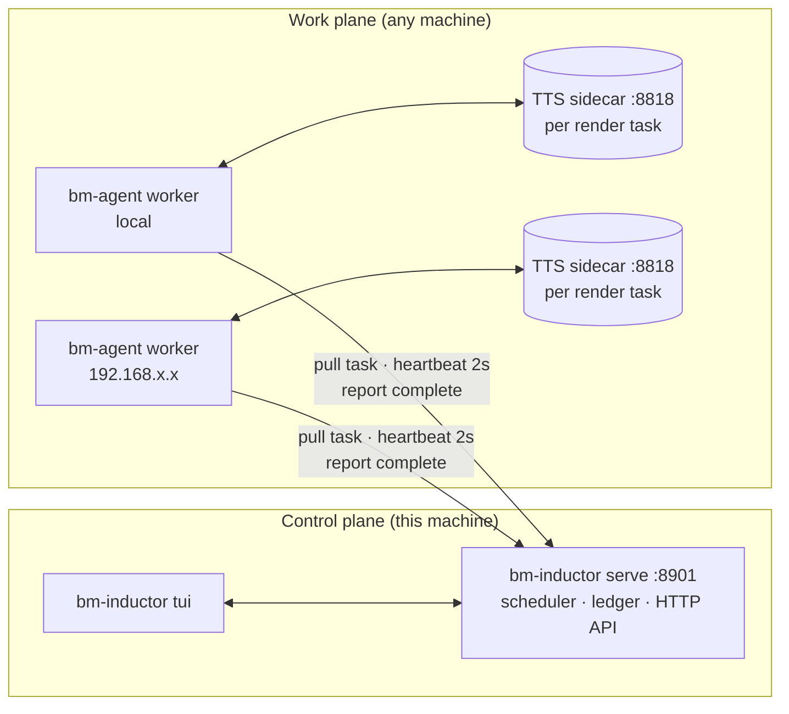
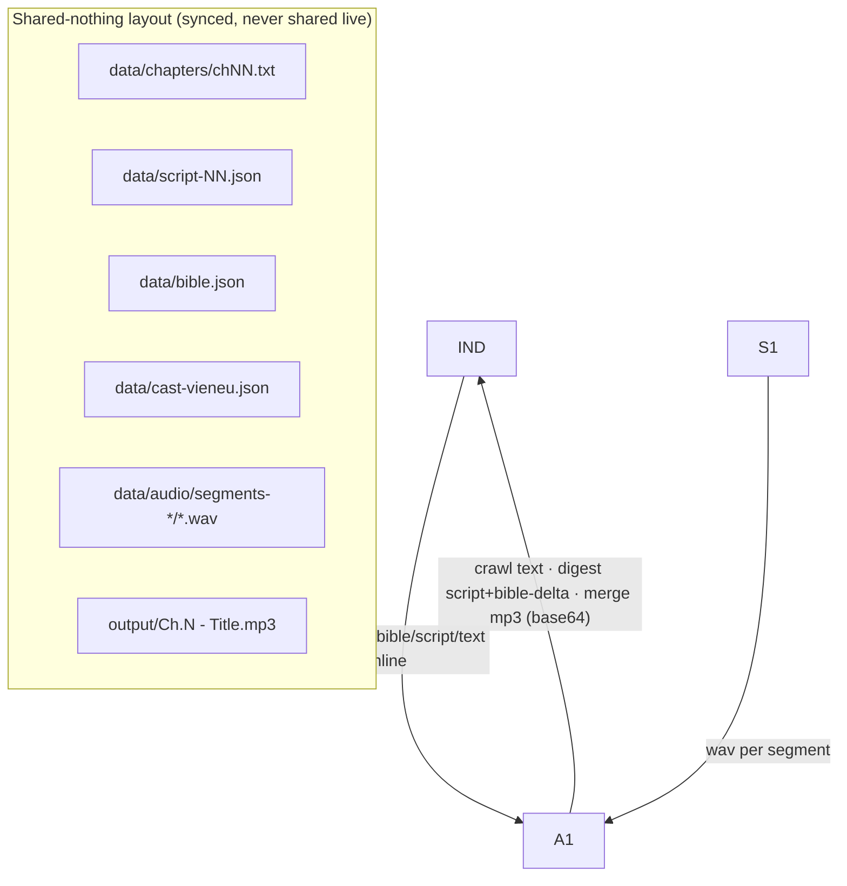
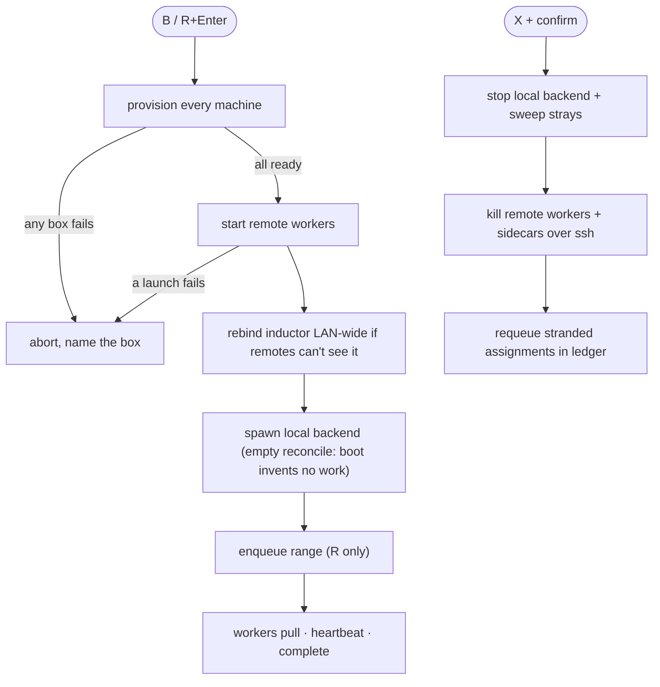
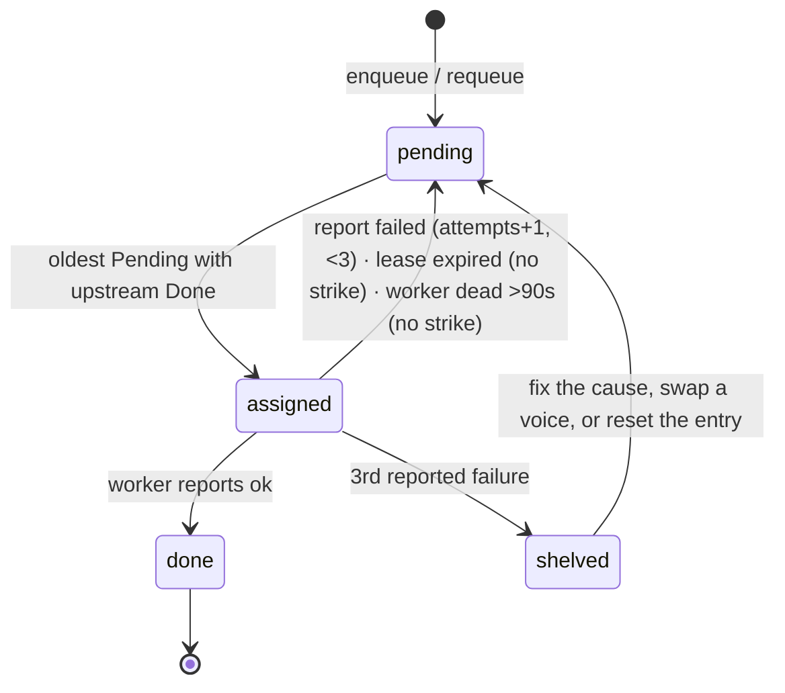
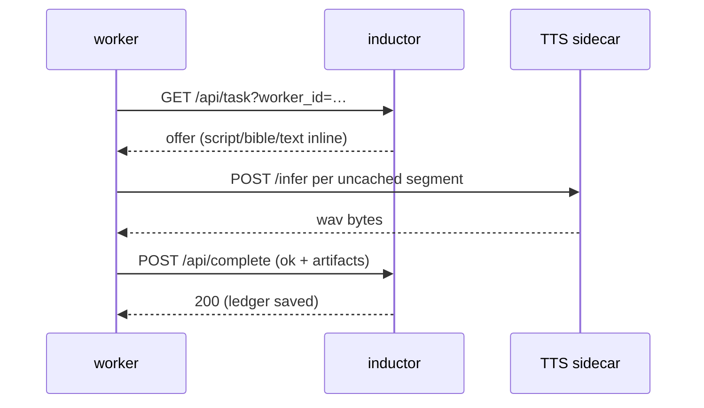

# storycast

Vietnamese web-novel chapters → multi-voice audiobooks, distributed across a
cluster of machines. One orchestrator ("inductor") schedules work; worker
agents pull tasks, report progress, and push results back. TTS runs in a
Python sidecar; everything else is Rust + Tokio.

If you only need the daily flow, read [Start, watch, stop](#start-watch-stop)
and [Changing voices](#changing-voices). The rest explains how the machine
works when something surprises you.

## Architecture

There is no shared filesystem and no shared database. The inductor is the
only decider and the only writer of shared state; everything a worker needs
rides inside the task offer, and everything it produces comes home in the
completion report. Small files go out (~30 KB scripts), mp3s (~5 MB) come
home. Segment caches never cross the network.

## Start, watch, stop

Prereqs: Rust toolchain, `ffmpeg`, `ssh`, `rsync`, `curl`, Python 3.12 with
`python/requirements.txt`, voice reference clips in `refs/` (see
[Voices](#voices)).

| Goal | Keys |
|---|---|
| Start everything | `B` |
| Preview + start with a chapter range | `R`, `e` edits range, `Enter` launches |
| Enqueue a range on a running backend | `t`, type `<start> <count>` |
| Stop everything, everywhere | `X`, confirm |
| Add a machine / provision it / drop it | `a`, `p` (`P` forces), `d` |

**`B` means ready, not hopefully-ready.** It provisions every registered
machine first (agent binary, sources, venv, voice enrolment), starts a worker
on each remote, then boots the local backend — and aborts the whole start if
any box fails, naming it. When remotes exist the inductor binds LAN-wide so
they can reach it; solo runs stay on loopback. If a running inductor turns
out loopback-bound while remotes are registered, `B` restarts it LAN-wide
automatically (workers re-register on their own; in-flight reports still
count).

**`X` means quiet afterwards.** It stops the local backend, sweeps the local
box for strays, then kills workers and sidecars on every registered machine
over ssh, each reporting its own outcome. Tasks stranded on dead workers are
requeued into the ledger the moment no inductor answers — stop→start loses
nothing to lease waits. In-flight tasks return to the queue; the ledger keeps
everything.

**Watch:** the Workers pane (live beat: stage, chapter, progress bar,
activity), the Tasks pane (per-stage done/open/failed/shelved), Events (every
completion and refusal lands here). Finished mp3s land in `output/`.

## How tasks flow

One chapter is four tasks: `crawl → digest → render → merge`. Each stage only
becomes offerable when its upstream stages read `Done`, so a chapter walks
the chain in order while different chapters overlap across workers.

- **Workers pull; the inductor is the only decider** (eligibility, leases,
  strikes). There is no push and no worker-side scheduling.
- **Leases expire back to the pool with no strike** — silence is not failure
  (crawl 10m, digest 20m, render 90m, merge 30m). A reaper also frees tasks
  assigned to workers with no live beat (>90s), so kills and crashes unstick
  themselves within ~2 minutes without waiting out leases.
- **3 reported failures shelve a chapter;** the rest flow around it. Shelving
  counts *reported* failures, so fix the cause first (dead box, stale binary,
  bad voice), then unstick it.
- **Merge runs where the segments are** (affinity): the machine that rendered
  a chapter merges it. Segment caches never cross the network.
- **Ledger (`.bm/ledger.json`) persists assignments + strikes;** startup
  reconciles from artifacts on disk, so restarts resume instead of restarting.
- **Digest workers return bible deltas; the inductor merges as the single
  writer.** Scripts hold content only — headlines are never segments.

Typical offer/complete round trip:

## How fast it renders

Measured medians from this repo's own throughput ledger (`.bm/stats.jsonl`,
which also feeds `e` / eta):

| Stage | Median wall time | Unit |
|---|---|---|
| digest | ~71 s | per chapter (LLM: script + bible delta) |
| render | ~63 s | per chapter (~29 TTS calls, ~2 s/call) |
| merge | ~3 s | per chapter (local ffmpeg assemble) |
| crawl | seconds | per chapter (fetch + clean) |

What decides render speed, in order:

1. **Cache hits.** Every segment file that already exists (>1 KB) is skipped.
   Re-running a chapter after a partial render only voices the missing runs.
2. **Run batching.** Consecutive lines by one speaker render as a single TTS
   call, so chatty chapters cost fewer calls than the line count suggests.
3. **Sidecar lifecycle.** The agent boots the sidecar per render task and
   stops it after (~3–5 GB transient RSS returns to the OS), so the first
   call of a task pays model-load while the rest run hot.
4. **Worker count.** Digest and render parallelise across boxes; merge sticks
   to the render box by affinity.

`e` (eta) estimates the remaining range from measured throughput ÷ live
workers, falling back to guesses (marked `(guess)`) with no data yet.

## Scripts: what they are and how they're handled

`data/script-NN.json` is the chapter's directed content: an ordered `segments`
array of `{speaker, text, mood, scene}` plus `roster`/`mentions` metadata.
The digest stage writes it (via the analyzer chain, below); render and merge
only read it. Treat scripts as build input: never hand-edit one without
purging that chapter's `data/audio/segments-*/` dir, or stale audio will be
served as fresh.

Chapter headlines (`Chương N, <title>`) are spoken but are never segments:
the assembler drops the headline row and renders it as a separate title clip.

**Digest backends** (`R` → `e` → `<start> <count> [analyzer] [models,…]`):
`opencode` | `openrouter` | `local` | `gemini`. With `analyze_models` set,
each model gets a few attempts in order, then `opencode` as last resort; only
key/request errors stop immediately. Model names go into the API URL verbatim
— use full IDs (`gemini-3.6-flash`, not `3.6-flash`). A digest that returns
unparseable JSON gets one repair pass before the chain moves on. Secrets
(`GEMINI_API_KEY`, …) live in each machine's own `.env` and never travel in
offers — a fresh box fails digests until it has its own key.

## Voices

`voices.default.json` is the shipped catalogue: every preset with
gender/accent/style, committed on purpose so a fresh clone renders with no
local config. It states no preference and excludes nothing.

Your taste lives in `.bm/voices.json` (gitignored): excluded accents and a
`default_cast`. The cast file (`data/cast-vieneu.json`) stores voice **keys**,
stable across renames. Enrolled clones (`voices.json` + `refs/*.wav`) and
pooled samples (`voice-pool.json`, tags from filenames) are vetted at adding
and always assignable. Provisioning re-enrolls whatever is missing on every
run, so a venv rebuild never silently loses the cast — one bad clip is
skipped loudly without blocking the rest.

**Changing voices:** `S` shows the whole cast with a verdict per row
(`ok`, `shared`, `blocked`, `unknown`, `unassigned`); `Enter` jumps to the
picker. `s` picks character → voice (`Tab` auditions into
`data/previews/`). A swap deletes **only** that speaker's cached segment
files, drops the stale mp3s, and requeues render+merge for the touched
chapters — everyone else keeps cache. **Rule: `X`, swap, `B` — never swap
while workers show anything but idle.** Mid-play swaps are refused
(`busy: render:5 on w1 — X stops everything, then swap`); with the inductor
down the picker reads from disk (`offline` in the header) and commits against
the files, guarded by inductor-down + no-local-workers.

## Operations reference (TUI keys or `POST /api/op`)

| Key | Op | What it does |
|---|---|---|
| `t` | translate | Enqueue crawl+digest for a range (`start count`). Idempotent. |
| `c` | crawl-setup | Persist the URL template; probe-crawl one chapter, report selector health. |
| `v` | voices | Read the roster, enforce policy, refill cast gaps. |
| `s` | swap-voice | Repoint one character (see above). Blocked mid-play; works offline. |
| `e` | eta | Remaining work from measured throughput ÷ live workers. |
| `u` | — | No such key: orphaned tasks free themselves via the reaper. |

TUI keys: `a` add machine · `p` provision selected · `P` force re-provision ·
`d` drop · `i` inspect · `r` refresh · `?` help · `C` colour · `q` quit.
`A` pools a sample clip (tags from filename, voice auto-rolls); `N` adds a
named voice (`path as Name`, manual assignment only).
`bm-inductor tui --once --api …` prints one plain-text snapshot and exits.

Provisioning is idempotent: configured machines get a sources sync + voice
check only; the venv build runs only when missing. `p` reports
`complete — ready` vs `INCOMPLETE` honestly instead of always "finished".

## Troubleshooting (earned the hard way)

- **Remote box never gets tasks** — no worker process there (`pgrep` it).
  Provision installs; only `B` starts. Also check the inductor bind: remotes
  need LAN-wide (`0.0.0.0`), which `B` sets automatically when remotes are
  registered; a hand-started `--bind 127.0.0.1` is deaf to them.
- **`B` provisions only local** — the TUI knew zero machines (fresh launch +
  dead inductor). Current builds fall back to the ledger file; older ones
  default local-only. `X`, then `B` again once the registry is visible.
- **Tasks stuck `assigned` to a dead worker** — the reaper frees them ~2 min
  after boot automatically (no key, no lease wait). Strikes are kept.
- **Chapter never appears (e.g. ch2 missing)** — its digest is stranding or
  shelved upstream; renders only offer after digest reads Done. Check Tasks
  for `shelved: digest:N`, fix thelogged cause, unstick.
- **Render fails on a voice** — the gate is gone, so this is now the engine
  refusing (unknown/unenrolled voice). Re-provision (`p`) re-enrolls; check
  the probe's `voices=` list for the name.
- **Digest 404s on Gemini models** — short names don't exist on v1beta; use
  full IDs. A `503` means the model exists but is overloaded — the chain
  moves on by itself.
- **Digest fails `GEMINI_API_KEY missing` on a remote** — keys are
  per-machine; that box has no `.env`. Copy the key over, restart its worker.
- **Merge stuck `assigned` + worker idle** — affinity points at a machine the
  scheduler can't map. Heartbeats reheal the map; check `affinity` vs
  `workers` in `/api/state`.
- **Fresh box digests fail on auth** — `opencode auth login` needs a browser
  on that machine. Provisioning installs the CLI; login stays yours.
- **Reports vanish for big mp3s** — axum's default 2 MB body cap 413s them;
  this repo disables the limit (LAN-only API). Re-enable auth/limits only
  past 10 MB.
- **Nested `assets/assets` (or `refs/refs`) on a worker** — rsync directory
  semantics: sources must sync *contents* (trailing slash).
- **A completion during an inductor outage** — the worker retries, then moves
  on; the task requeues on lease expiry and reruns. Chapters are never lost,
  but finished work can be discarded — keep outages short.
