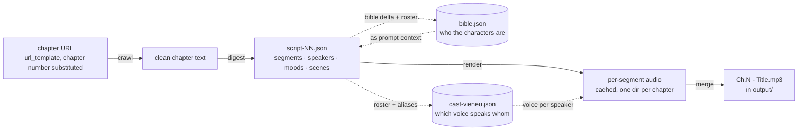
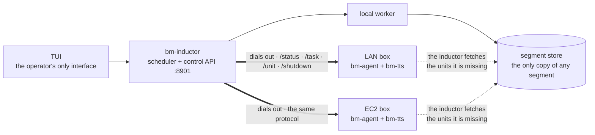
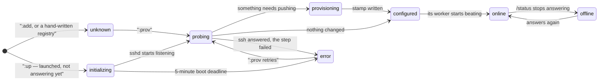

# Storycast — turn a web novel into a multi-voice audiobook, on one machine or a whole cluster

Storycast takes a novel that exists as web pages and produces finished,
multi-voice audiobook chapters: **`Ch.42 - The Title.mp3`**, with a different
voice per character, pauses, and optional ambience — automatically, chapter
after chapter, optionally spread across several computers on your LAN.

It is **not tied to one novel, one site, or one language**. Point it at any
chapter URL template and it will crawl, dramatize and speak it.

## What you get when you clone, and what you bring

The repo is the _machine_, not the _material_. A fresh clone contains:

| In the repo                           | What it is                                                                                                                                                                                                            |
| ------------------------------------- | --------------------------------------------------------------------------------------------------------------------------------------------------------------------------------------------------------------------- |
| `rust/` (five crates)                 | The pipeline: scheduler, workers, dashboard, provisioning — plus `bm-tts`, the Rust TTS sidecar (Vieneu voices, local, unlimited) |
| `python/`                             | Voice-enrollment tooling and the retired Python sidecar (kept for reference); serving no longer uses it — the last Python dependency is enrollment, until that is ported too |
| `prompts/analyze.txt`                 | An **example** dramatization prompt (written for Vietnamese web novels). This is the main thing you edit for another language or genre — the program only requires that it returns the JSON shape described inside it |
| `voices.default.json`                 | The built-in catalogue voices the engine ships with                                                                                                                                                                   |
| `assets/`, `Makefile`, `.env.example` | Scene maps, ambience loops, one-command operations, config template                                                                                                                                                   |

Everything _specific to your book_ is created at runtime and git-ignored, so a
fresh clone is a valid empty state:

| Created by you / at runtime (ignored by git) | What it is                                                                                                         |
| -------------------------------------------- | ------------------------------------------------------------------------------------------------------------------ |
| `url_template` in `workspaces/<name>/settings.json` | Where the chapters live — `{n}` is the chapter number. **This is the only novel-specific setting you must change** |
| Edits to `prompts/analyze.txt`               | Your own dramatization style/language, if the shipped example doesn't fit                                          |
| `voices.json`, `voice-pool.json`, `refs/`    | Your cloned voices and reference clips (skip entirely to use the catalogue voices)                                 |
| `data/`, `output/`                           | Scripts, character bible, cached audio, finished MP3s                                                              |
| `.bm/`                                       | Ledger, settings, machine registry, logs                                                                           |
| `.env`                                       | Your API keys (from `.env.example`) — **on the inductor only**. A worker gets the keys its current task needs with the task itself |

So the same program converts any novel: the language, cast and voices all come
from your prompt, your URL template and your voice files — the code only knows
how to fetch a chapter → turn prose into a script of labelled segments → speak
each segment with the right voice → glue the audio together.

---

## 1. What it actually does (the 60-second version)

For each chapter, four stages run in order:



The dotted edges are the part that is easy to miss: **the bible is an input to
digest and an output of it**, and the cast is derived from the digest rather
than chosen up front. That is what lets chapter 40 keep the voice chapter 1 gave
a character, without any of it being configured by hand.

- **crawl** — downloads chapter `{n}` from your URL template and cleans it into
  plain text.
- **digest** — sends the text + the character bible to an LLM with your prompt
  (`prompts/analyze.txt`). The LLM answers in strict JSON: who speaks, which
  pronoun/alias belongs to whom, and the chapter split into segments with
  speaker + mood + scene. Result: `data/script-NN.json`.
- **render** — speaks every segment through the TTS engine using the voice
  assigned to that segment's speaker. Each finished segment is cached, so a
  crash costs seconds, not a chapter.
- **merge** — concatenates the segments (gaps, plus the optional effect and
  music layers and the beats between scenes) into the final `Ch.N - Title.mp3`
  in `output/`.

A scheduler — the **inductor** — owns this state and hands chapters to workers
(**agents**), on this machine and on any boxes you add over SSH.

---

## 2. Install

Requirements: **Rust** (1.75+), **zig** (for the `bm-tts` cross-build), **Python 3**
(only to bake the model weights once and to enroll clone voices), and
an analyzer of your choice: a Gemini API key, [opencode](https://opencode.ai),
an OpenRouter key, or a local Ollama.

```bash
git clone lhuthng/storycast.git
cd storycast
make build               # compiles the Rust workspace
make tts                 # cross-builds the bm-tts sidecar + stages its ONNX runtime

cp .env.example .env     # then edit: put your key(s) in
#   GEMINI_API_KEY=...      (or OPENROUTER_API_KEY, or nothing if you use opencode)
#   TTS_ENGINE=vieneu       (default; `gemini` for the API engine)
```

`.env` is the **single source of truth for keys, and it never leaves this
machine.** Worker boxes are provisioned by copying files, and `.env` is
personal and git-ignored, so it is deliberately not one of them — instead the
inductor sends each worker the keys the offered stage will read, with the task.
That means you set a key once, here, and a remote digest works with nothing
configured on the box at all. It also means the keys cross your LAN in the
task offer: keep the control API on a trusted network (it is unauthenticated
plain HTTP, like every other sidecar call in this repo).

The Vieneu TTS sidecar is `bm-tts` (`rust/crates/bm-tts`), served over HTTP on
each worker. The weights arrive once from Hugging Face and are flattened by
`python3 tools/bake-models.py` into `models/` (plus a manifest `--check` can
re-verify); provisioning pushes those bytes, so a worker needs no internet and
no Python to speak. Clone voices are enrolled on the inductor at bake time.

### Tell it about your novel

```bash
make tui        # press c, then paste your template, e.g.:
                #   https://example.com/truyen/any-novel/chapter-{n}
```

`{n}` is where the chapter number goes. The TUI saves it to the active
workspace's `settings.json` (`workspaces/<name>/settings.json`) and immediately
probe-crawls one chapter to prove the selector finds the text. This URL template
is the **only novel-specific thing you must change** to convert a different
novel (plus, if you want a different dramatization style,
`prompts/analyze.txt`).

### Tell it who speaks (optional, for cloned voices)

- `voices.json` maps character names → a clip in `refs/`, e.g.
  `{"Narrator": "refs/narrator.mp3"}`. Both are git-ignored: they are personal.
- `voice-pool.json` is the tag-matched sample pool. Add a clip with
  `bm-inductor roster add-sample refs/young-female-4.mp3` — tags come from the
  filename, and the clip is enrolled on every worker at the next provision.
- Add nothing and the engine's built-in catalogue voices are used; a per-engine
  accent policy assigns a voice to each character automatically.

### Give it atmosphere (sound design)

Chapters don't have to be dry voices. The dramatization prompt tags every segment
with two independent things, and the merge stage turns each into its own layer
under the voice — plus a third layer the script places by hand:

- **`scene` is the place** (`"market-stall-morning"`, `"forest-night"`) and drives
  **effects**, which are sparse and deliberate. Consecutive same-speaker lines
  form a *run*; the run's majority scene label is matched against ordered keyword
  rules in `assets/scene-map.json` (first match wins), and a rule names *tags*,
  never files. A window opens on a scene that names effect tags, lasts at least
  `min_span_s`, waits `cooldown_s` after the previous window closed, and the
  chapter may not spend more than `max_coverage` of its runtime on the layer — so
  a bed marks the scene instead of running under the whole chapter.
- **`music` is the mood**, and drives **background music**. It is one value from
  a *closed* palette declared in `assets/scene-map.json` (`quiet`, `warm`, `busy`,
  `battle`, `grand`, `none`), and the palette names the tags the music pool
  matches on. Consecutive segments sharing a value are one cue, so **a chapter can
  change its background music as often as its feeling changes** — a change of
  value is where the track crossfades. The layer is quiet on purpose (`level:
  0.06` against the effects' `0.08`–`0.22`), and `none` — or a mood the pool
  cannot answer — plays **no music at all**; there is no silent filler track.
  Because the vocabulary is closed and validated at digest time, "this mood has
  no track" cannot happen by accident.
- **The two are separate on purpose.** A place is where we are, a mood is what it
  feels like. One string doing both jobs is how a shop at dawn (`martial-shop-
  morning`) once came out with a hearth crackling under it: the keyword `shop`
  matched a fire rule that sat *before* the daylight rule, so `morning` never got
  a say.
- **`sound` is a spot effect, and it lives *between* the lines.** A `segments`
  array holds two kinds of item: a **line** (`speaker` + `text`) and a **sound**
  (`{"sound": "page-turn", "mode": "overlap"}`, or `{"stop": "boiling-water"}`).
  The injection is a *split* — the script writes the sentence's two halves as two
  lines and the sound as a third item between them, so the effect lands where the
  prose stages it rather than at the end of a line:

  ```json
  {"speaker": "Narrator", "text": "Nàng lau mồ hôi trên trán, siết chặt cuốn võ thư trong tay"},
  {"sound": "page-turn", "mode": "overlap"},
  {"speaker": "Narrator", "text": ", như nhặt được báu vật."}
  ```

  A sound item has no `text` and no `speaker`, which is the whole point: the
  renderer is handed the lines, so **no TTS call can ever be given the syntax**.
  Modes are `hit` (the narration waits out the clip), `overlap` (zero timeline
  time, running under the following speech) and `trail` (a solo `hold` seconds,
  then the tail ducks under the speech); `stop` fades a running one, never cuts
  it. Names come from `assets/inject-pool.json`, whose entries also carry
  `dur_s` — a `hit` on a 51 s clip is refused at digest time, because that is 51 s
  of dead air. The layer rides the `effects` switch and has its own
  `inject_volume` in the workspace's `settings.json`.
- **`digest` can be asked on its own.** `bm-inductor digest <n>` prints the
  analyzer's answer for one chapter and does nothing else — no render, no merge,
  no ledger task, no bible merge, and no file at all unless `--write` is passed.
  It is the same `analyze_chapter` the digest worker calls, so what you see is
  what a run would have produced.
- **A beat where a scene changes.** At most `pause.max_per_chapter` per chapter,
  placed only where the change is *narrated*, with narration resuming outranking
  narration handing off. The music lifts to `pause_level` inside it — which is
  the sidechain releasing, so a beat shorter than `duck.release` never lifts at
  all.
- **Everything is ducked.** One sidechain compressor, keyed on the whole voice
  track, sits on both layers as a single bus — so "the layers drop whenever
  anyone speaks" is a property of the signal path rather than a rule each layer
  has to remember, and the narrator ducks them exactly as a character does.
  Rules can also attach a reverb preset for room feel.
- To customize: add clips to `assets/effects/` or `assets/music/` and register
  them in `assets/effect-pool.json` / `assets/music-pool.json` — the registry is
  the truth: one key per *sound* with its takes under `files`, and `tags` is what
  a scene matches on (written by hand, not derived from the filename), so
  `looped: false` marks a one-shot stinger; add or retune a **mood** in `scene-map.json`'s
  `music_palette` (the digest prompt is rendered from it, so the analyzer can
  offer it immediately), or reorder the place rules; or switch a layer off with
  `"ambience": false` / `"music": false` in the workspace's `settings.json` (the stock TUI run
  screen doesn't yet expose either, but both are read at merge time). Normalize
  new clips with `tools/normalize-audio.sh <src> <dest>` first: the scene map's
  `level` is a gain over a −23 LUFS source, and that only holds if every clip in
  a pool was brought to the same spec.
- Chapters digested before segments carried `music` keep merging through the
  `legacy_scene_music` shim in `scene-map.json`, which scores their `scene` label
  to a palette value. It is a migration shim, not the design — delete it once
  every script on disk carries the field.

---

## 3. Start it — three ways, easiest first

Whichever way you run it, the shape is the same: **one inductor, many workers,
and the inductor does all the dialling.**



The direction is not a detail. A worker is a small HTTP server that answers
questions and is **never told where the inductor is**, because a box on the
public internet cannot reach a laptop behind NAT — and the version that tried
needed a local/remote fork in the launcher, the offer *and* the artifact path.
Inverting it removed the requirement instead of working around it: the inductor
already has a route to every worker, because it launched them. A consequence
worth knowing before you go hunting for it: **a worker that can reach you and
you cannot reach is useless**, so the ports your firewall has to admit are
inbound **22** (provisioning) and the **task port** (the work itself). The
second is the one that gets missed, and its failure is quiet — a box with 22
open and 8917 closed launches, accepts ssh, looks healthy in the console and is
never driven.

### A. "Just run it on this machine" (solo, headless)

```bash
make serve START=1 COUNT=10      # terminal 1: inductor (scheduler + API on :8901)
make agent                       # terminal 2: a local worker
```

That's it — watch `output/` fill up with `Ch.N - Title.mp3`. Stop with `Ctrl-C`;
nothing is lost (see §4).

### B. "Run it and watch it" (recommended — the TUI does everything)

```bash
make tui
```

| Key                    | Does                                                                                                                                  |
| ---------------------- | ------------------------------------------------------------------------------------------------------------------------------------- |
| `:`                    | **Command line — every operator action runs here, by word**: `:add`, `:prov`, `:drop`/`:remove`, `:translate`, `:voices`, `:swap`, `:eta`, `:retry`, `:reconcile`, `:backend`, `:up [n]`/`:pool`/`:down` (EC2, see §3D), `:drain`, `:quit`/`:exit`, `:X` stop. Single letters still work (`:m` is `:reconcile`); aliases in `:help`. Actions that need input open their prompt after `Enter`. No single key can fire anything destructive. |
| **R** / **K** / **S**  | Read-only screens — system overview (`Enter` launches) / **task ledger** / cast overview                                             |
| **i**                  | Inspect the selected machine (probe output, capabilities)                                                                              |
| **arrows / k j**       | Move the selection · **PgUp PgDn** scroll the log · **G** pin to newest                                                               |
| **r**                  | Refresh now · **?** full help · **C** theme default→dim→mono · **q** quit                                                             |

`:` + `B` with no machines registered runs a local-only cluster — the easy
first run. In the task ledger (`K`): `j/k` or arrows to move, type to filter
(e.g. `shelved`, `digest`, `42`), `u` retry / `F` force re-run the highlighted
row, `Enter` for the full error, `Esc`/`q` to close.

**Background jobs run together unless they need the same thing.** Provisioning
two boxes at once is the point, so neither waits; two `aws` commands are
serialised, because both read-modify-write the same account document. A row
that *is* waiting says what it is waiting for — `queued · needs box 10.0.0.5` —
so "why is this not running" is answered on the row instead of in a log.

The dashboard's Workers pane shows each live box with cpu % and ram % +
used GiB from its heartbeats. Beside Tasks sits Stats: rows are workers,
columns the four stages, each number completed tasks of that stage on that
worker — plus a TUI-measured eta per worker (median task duration for the
stage, scaled by the unworked fraction; a dash until anything completes).

#### Hearing a voice before you commit to it

In the voice picker (`:swap` step 2 of 2) and the cast overview (`:cast`) — the two screens that
know which voice a speaker has — three keys audition and **none of them assign**.
`Enter` is still the only key that changes the cast.

| Key           | Plays                                                                                |
| ------------- | ------------------------------------------------------------------------------------ |
| `t`           | the held line with the **current** voice, from cache only — zero synthesis            |
| `T`           | that same held line with the **pointed** voice (rendered)                             |
| `Ctrl+T`      | **another** line with the **pointed** voice (rendered)                                |

The same three run as words from the command line — `:current`, `:try`
(`:test`), `:another` (`:change`, `:next`).

Keys or filter, never both: both screens open in audition focus, where the
keys play and any other letter focuses the filter instead. While the filter
is focused every letter types (`t`/`T` included) and the keys go quiet —
the words still audition. `^R` focuses explicitly; `Esc` blurs back to the
audition keys.

In the picker the character is fixed, so `:current` replays the current A/B sentence
and never rolls; in the cast overview it follows the highlighted speaker.
The line is held per character, so the incumbent and the candidate are compared on
one sentence rather than two. Both screens print which line is loaded and what the
current voice is, so nothing is compared blind.

The sample **plays by itself** — there is nothing to open. Playback is `afplay`,
one sample at a time; starting one stops the last. The inductor renders and hands
the audio back as bytes, so it is written to a single temp file on *this* machine,
overwritten on every audition and removed when the TUI exits: nothing accumulates
in the repo, and the file is next to the speaker even when the inductor is on
another box. Rendering goes through the TTS sidecar exactly as the pipeline does,
so what you hear is what will be spoken.

### C. "Spread it over the LAN" (cluster)

```bash
# 1. Remember the other box (writes .bm/machines.json, git-ignored)
make link NAME=box-1 ADDR=192.168.2.2

#    …or skip `link` and onboard straight by address:
#    make provision ADDR=192.168.2.2 KEY=~/.ssh/your-key

# 2. Onboard it over SSH: pushes sources, the bm-tts sidecar + runtime and the
#    baked models, starts the TTS sidecar. Cheap to re-run — a content stamp
#    makes a nothing-changed run finish in under a second.
make provision BOX=box-1

# 3. Start the cluster: `:B` brings the backend up in seconds and hands each
#    box that is not already working its own catch-up job, so the boxes
#    provision *at the same time* and the press returns immediately.
make tui     # press :B
```

The queue is shared but nobody pulls from it: the inductor asks each box what it
is doing every couple of seconds and hands it a chapter when it says "nothing".
So an idle machine picks up work automatically, and a box that is mid-render is
left alone. A chapter's render+merge stays on the box that rendered it, so
cached segments are never re-uploaded.

### D. "Run the workers on AWS" (a cloud pool)

**You operate this from the TUI.** Storing the key, reading the account into the
pool, launching, linking, provisioning, starting workers and destroying boxes are
all `:` commands. The only step outside the dashboard is the AWS **console** —
create the IAM user, its policy, the keypair and the security group by following
**[docs/AWS-IAM-USER.md](docs/AWS-IAM-USER.md)**, then:

```bash
make tui
```

| In the TUI | What it does |
| --- | --- |
| `:login` | store the IAM user's key from the console's `accessKeys.csv` — the prompt asks for the path, prefilled `~/Downloads/accessKeys.csv`. The secret is never typed on screen, so this is the only login route there is |
| `:discover --region eu-central-1 --pem ~/Downloads/storycast.pem --instance-profile storycast-worker` | read the account into `.bm/aws.json`: AMI, subnet, security group, keypair, instance profile. Safe to re-run — anything already set is kept |
| `:profile` → `pack default` → `:profile` → `default` | save then load a profile, writing `.bm/profile` — **required before `:up`**, because every box's marker tag records the profile hash it was launched for |
| `:B` | backend up (`:8901`) — `:up` and `:prov` `POST` to it, so nothing works without this |
| `:up 3` | launch three tagged boxes and **link each one** into the cluster with the pool's `.pem` and `ubuntu` login — the one command that spends money |
| `:B` again | the catch-up run: every linked box that is **not already working** gets its own provision-and-start job, and they all run at once. A box that is already online is skipped and says so — `p` is the deliberate re-provision |
| `:pool` (`l`) | the **Cloud** view — what the account holds, and which rows are `not linked` |
| `:down` (`o`) | terminate the live boxes — asks first, and **refuses while a render is in flight**; needs a prior `:pool` so it has ids; `:down force` overrides |

A box moves through a small number of states, and two of them are the ones that
look like faults and are not:



`initializing` and `configured` are the two that read as broken and are not.
`initializing` is a box that has been created and has not answered ssh yet — EC2
says `running` seconds before `sshd` listens, and **a probe cannot tell a booting
box from a dead one**, so it stays `initializing` with a clock running rather
than being called dead. It is the only state with a deadline (five minutes);
after that it becomes `error` and the note says why. `configured` is a box that
has everything it needs and simply has no worker beating yet — the last step of
the catch-up is what moves it to `online`.

All of these are words first (`:login`, `:discover`, `:up`, `:pool`, `:down`) and
`:up`/`:pool`/`:down` also have keys (`w`/`l`/`o`); a stray key in Normal mode only
points at the command line — no single keypress stores a credential, launches or
destroys anything. `:down` terminates **by explicit instance id**, never a filter,
so it cannot touch boxes that are not yours.

The **two files** are the only things you hand it, and both come from the console:
**`accessKeys.csv`** is the **Download .csv file** button on the user's access key,
and **`storycast.pem`** is the browser download from **EC2 → Key pairs → Create key
pair** (RSA, `.pem`). `:login` writes the key to `.bm/aws/credentials`; `:discover
--pem` copies the key to `.bm/aws/<region>.pem` — both 0600 and gitignored. A
leading `~/` is expanded for you, nothing is edited by hand, and neither file
enters the repo.

**Pick the instance type deliberately.** On an AWS **Free plan** account
`c7i.xlarge` is refused outright; `m7i-flex.large` (2 vCPU / 8 GiB) is eligible
and is the size to use — the TTS sidecar is ~2.9 GB resident the moment the
weights load. **RAM is what decides this, not CPU**: the tempting cheaper
`c7i-flex.large` sits on the same free-tier list at 2 vCPU / **4 GiB** and does
not fit, because ~2.9 GB of sidecar plus the agent and the OS will not go into
~3.9 GB usable. That trap, the working `aws up`/`down` sequences, and the honest
ledger of what has actually been run on EC2 are in
**[docs/AWS-WORKERS.md](docs/AWS-WORKERS.md)**.

Headless or screen-reader friendly: `bm-inductor tui --once` prints one
plain-text snapshot and exits (fine in scripts, `watch`, CI).

---

## 4. Where everything lives

Everything below except the first three rows is created at runtime and
git-ignored — see the two tables at the top for the tracked/ignored split.

| Path                                        | What it is                                                                                  |
| ------------------------------------------- | ------------------------------------------------------------------------------------------- |
| `prompts/analyze.txt`                       | **The dramatization prompt — your main customization point** (tracked; an example you edit) |
| `assets/effects/`, `assets/music/`, `assets/*-pool.json`, `assets/scene-map.json`, `assets/LICENSES.json` | Sound-design clips, the pools that name them, the scene labels, and clip provenance (tracked) |
| `voices.default.json`                       | The built-in catalogue voices (tracked)                                                     |
| `output/Ch.N - Title.mp3`                   | **The finished audiobook chapters**                                                         |
| `data/chapters/NN.txt`                      | Crawled, cleaned chapter text                                                               |
| `data/script-NN.json`                       | The dramatized script (segments + speakers + moods + scenes)                                |
| `data/bible.json`                           | The growing character bible (canonical names, aliases, voice traits)                        |
| `data/cast-vieneu.json`                     | Speaker → voice assignment (one per engine)                                                 |
| `data/audio/segments-vieneu-NN/`            | Cached per-segment audio (one dir per chapter, per engine) — renders are resumable          |
| `voices.json`                               | Character → reference clip (clone voices)                                                   |
| `voice-pool.json`                           | Tagged sample pool for automatic voice assignment                                           |
| `refs/`                                     | Your voice clips                                                                            |
| `workspaces/<name>/settings.json`           | Run config, **per book**: url_template, engine, start/count, speed, gap_ms, ambience, music, effect/music volumes, analyzer, models, render_batch (`:mix` edits speed + volumes, `:batch` edits render_batch). At the repo root the same file is `.bm/settings.json`, which is what a checkout with no workspace selected uses |
| `workspaces/<name>/ledger.json`             | The task ledger — which chapter/stage is in which state; survives restarts. `.bm/ledger.json` at the root, same rule as settings |
| `.bm/machines.json`                         | Linked machines (addr, ssh user/port/key) — machine-global, so it stays in `.bm/` whichever workspace is active |
| `.bm/digest-suspend.json`                   | Written by `:off` only: every machine's work policy as it was, so `:on` can put back *what each box had* rather than switching digest on everywhere. Deleted once the restore succeeds. A file rather than a latch, so an inductor restart in between cannot leave digest off with no way back |
| `~/.bm-worker/`                             | A worker's whole world on any machine: agent binary, `bm-tts` + ONNX runtime, baked `models/`, sources, `.provision_stamp.json` |

The pipeline is **restart-safe**: all of the above is on disk. Kill anything at
any time — the inductor picks up exactly where the ledger says, and cached
segments are never re-rendered.

### Clear all tasks

Tasks are stored in the active workspace's **`ledger.json`**
(`workspaces/<name>/ledger.json`). To remove every task (including
pending, running, failed, and completed tasks):

1. Stop the inductor and workers first (`X` in the TUI, confirm, and wait for
   shutdown), then quit the TUI. A running inductor can overwrite your edits
   with its in-memory task list.
2. In that `ledger.json`, replace the entire `"tasks"` array with `"tasks": []`.
   Keep the other fields unchanged to preserve machine and worker runtime records.
3. Reopen the TUI. Starting a new run creates tasks for the selected chapter range;
   `make serve` also recreates tasks for its `START`/`COUNT` range on startup.

Do **not** delete `.bm/`, and do not clear the workspace's `settings.json` or
`.bm/machines.json`.
Clearing tasks does not delete chapter text, scripts, cast assignments, cached
segment audio, or finished MP3s under `data/` and `output/`; future runs can reuse them.

---

## 5. When something fails (the short version)

- A task that fails 3 times is **shelved** so it stops starving healthy
  chapters. Open **K**: the row shows _why_ — the worker's actual error, in
  full on `Enter`. `u` re-queues it (forgiving the strikes), `F` re-runs it from
  scratch and clears any partial output (e.g. a stale `script-NN.json`).
- A task whose worker dies, or whose lease expires, is re-queued automatically
  — silence is never punished as a failure.
- The Events pane records every completion, failure, expiry and operator action
  with its reason; the same stream is on `/api/state` under `events`.
- Full guide: **[docs/TROUBLESHOOTING.md](docs/TROUBLESHOOTING.md)**.
- Under the hood (crates, state machine, API, provisioning cache):
  **[docs/ARCHITECTURE.md](docs/ARCHITECTURE.md)**.
- Plans (any-provider LLM, AWS EC2 + S3): **[docs/ROADMAP.md](docs/ROADMAP.md)**.

---

## 6. Tests & development

```bash
make test                            # cargo test --workspace + clippy -D warnings
cargo test -p bm-inductor tui::      # just the TUI tests
```

The suite never touches the network: SSH targets in tests are TEST-NET
addresses, the LLM/TTS sides are stubbed, and the TUI renders to an in-memory
backend.

More design reading, kept local (`.docs/` is git-ignored, so it is not in the
repo history):

- `.docs/TUI_UX_AUDIT.md` — the reasoning behind every pane and key in the dashboard
- `.docs/VOICE_CONFIG_PROPOSAL.md` — the voice pool / accent policy design
- `.docs/PLAN.md` — the original build plan, milestone by milestone

## 7. Honest limitations

- **Vieneu is local and free but heavy**: ~1.7 GB of model weights, and it
  speaks Vietnamese best. For other languages, either use the Gemini TTS engine
  (`TTS_ENGINE=gemini`) or adapt `python/tts_router.py` to bring your own.
- **Gemini TTS is quota-limited** on the free API tier (~10 TTS calls/day); the
  Gemini _app_ subscription does not raise API limits. Pay-as-you-go in AI
  Studio costs pennies per chapter.
- **Digest burns LLM tokens** — roughly one analyzer call per chapter. Free
  model tiers work but rate-limit; the analyzer chain falls through a list of
  models automatically.
- **Crawling needs a predictable URL** (`{n}` template) and a findable chapter
  body. `c` in the TUI saves the template and probe-crawls one chapter to
  prove it before you commit to a range.
