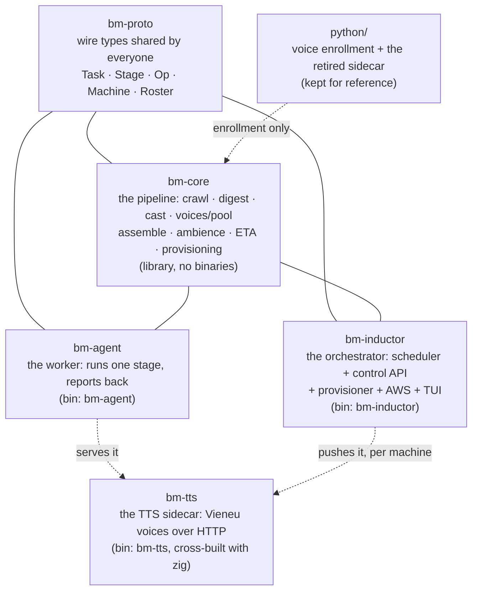
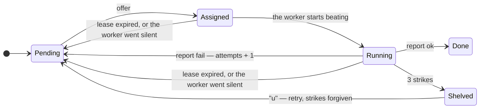
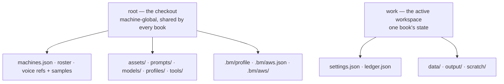
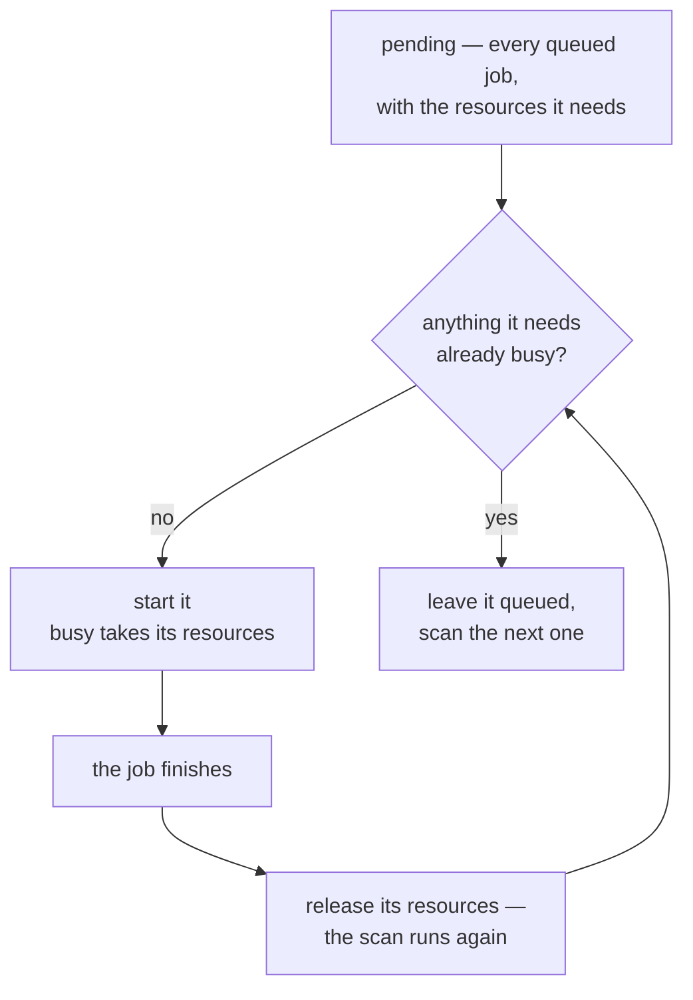
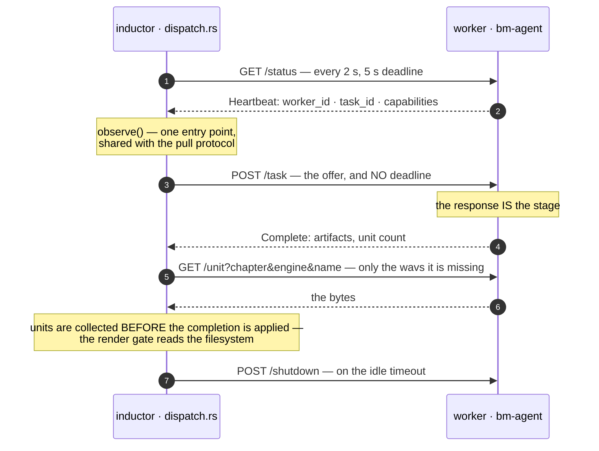
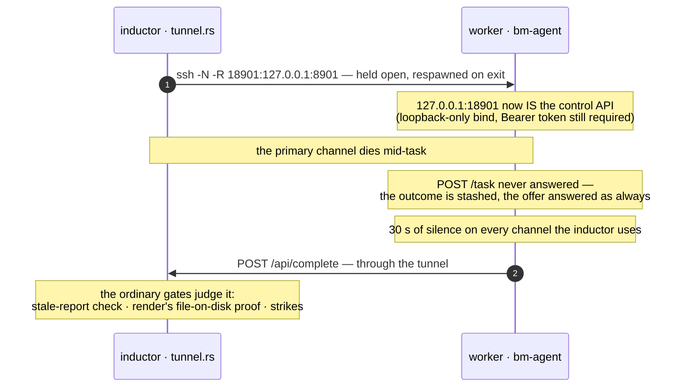
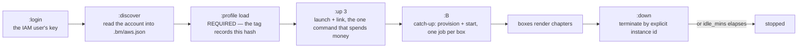

# Architecture — how Storycast works under the hood

Companion to the [README](../README.md), which is the "how do I run it" guide.
This one is the "why is it built this way" guide. Everything here describes
code that exists in this repo — five Rust crates plus a Python enrollment
tool — not aspirations.



`bm-tts` is the fifth crate and the one that used to be Python: serving is a
Rust binary now, cross-built with `zig` and pushed to each worker with its ONNX
runtime. The `python/` tree that remains is the enrollment tooling — the last
thing still needing an interpreter, until that is ported too. It is not on the
serving path, so a worker needs no Python at all.

## 1. One idea: work is a ledger of tasks, not a loop

Every unit of work is a `(stage, chapter)` pair held in one place — the
**ledger** (`ledger.json`, in the active workspace; see "Config lives next to
the ledger" below) — with one of six states:



The two edges back to `Pending` are **not** the same edge, and the difference is
the whole failure policy: a report that fails costs a strike, silence costs
nothing.

* **offer** — a worker asks `POST /api/offer`; the inductor only offers a task
  when its *upstream* stages are `Done` (crawl → digest → render → merge), so
  ordering is a property of the data, not of luck.
* **lease** — a running task has a deadline per stage (crawl 10 min, digest 20
  min, render 90 min, merge 30 min). An expired lease returns the task to the
  pool **without a strike**: silence is not failure. A background `reap` runs
  every 10 s and also re-queues tasks stranded on workers that stopped sending
  heartbeats (~90 s window).
* **an expiry on a *live* worker is a different event, and says so.** The
  strike-free rule above is written for a worker that died — it deserves nothing
  and needs nobody. A worker that is **alive and stuck** looks identical from
  here (fresh beat, task never finished), and the requeue is silent, so the task
  is handed out again and again with nothing anywhere saying so. `reap` therefore
  counts expiries that happened **while the holder was still beating**
  (`Task.expiries`) and emits its own event — a `warn` on the first, an `error`
  from the second, naming the row, the worker and where to look. On 2026-09-22
  two digest rows looped that way for ~80 minutes while the TUI showed a
  percentage that never moved, and this distinction is what was missing.
* **strikes** — three failed attempts shelve a task so it stops being retried
  forever. The operator lifts this with `u` (blanket retry) or per task from
  the K ledger (`u` retry, `F` force — which also deletes the stage's on-disk
  artifact, so reconcile cannot mistake stale output for a finished chapter).

Because state lives only in the ledger plus artifacts on disk, any process can
die at any moment. Restarting the inductor re-reads the ledger; restarting a
worker is enough for it to be picked up again, because the inductor is the one
asking — there is no registration it has to get back in on (§7).

### Config lives next to the ledger, not in it

Three files, three jobs: **`settings.json`** (app-wide defaults for *this book*,
including `ssh.{user,port,key}`), **`machines.json`** (per-machine connection
config, keyed by address, written when a box is bound with `:a`, `link` or
`provision`), and **`ledger.json`** (runtime only: task states plus per-machine
liveness under `machine_state`). The API joins config with runtime and serves
the same `Machine` shape as always, so the TUI never sees the split.

**Where the first two live is the one thing to get right**, because the answer
is "it depends" and the wrong half is silent: `Layout::state_file` puts
`settings.json` and `ledger.json` **under the active workspace**
(`workspaces/<name>/`) and falls back to `.bm/` only when there is no workspace
— legacy mode, where `work == root`. So a per-book setting like `render_batch`
lives in `workspaces/<name>/settings.json`, while `machines.json` and the
profile pointer are machine-global and stay in `.bm/` whichever book is active.
Both halves are per-book state that the workspace switch moves; anything an
operator is told to edit should name the workspace form unless they are on a
bare checkout.

One chain resolves the ssh key, highest wins: the machine's own entry, else
the app default, else ssh decides (agent / `~/.ssh/config` — no key at all is
legal, not a gap). The machine overlay prints the winner and its source, so a
mispointed key names where it was set. `.env` holds API keys only; the SSH key
is a *path*, which is config, not a secret.

### Two scopes: the book, and the machine

`Layout` is a **pair** of paths, not one, and almost every bug in this area is
somebody using the wrong half:



* **`work`** — the book: `ledger()`, `settings()`, `data()`, `script(n)`,
  `cast(e)`, `seg_dir(e, n)`, `bible()`, `output()`, `scratch()`. These are
  `workspaces/<name>/…` when a workspace is selected, and `root` itself when one
  is not.
* **`root`** — the machine: `machines()`, `roster()`, `voice_refs()`,
  `voice_samples()`, `assets()`, `pools()`, `scene_map()`, `prompts`, `models/`,
  `profiles/`, `tools/`, and the `.bm/` pointers (`.bm/profile`,
  `.bm/active-workspace`, `.bm/aws*`).

Three constructors, and **picking the wrong one is silent**:

| | |
|---|---|
| `Layout::new(root)` | `work = root`. **Tests and legacy mode only.** |
| `Layout::resolve(root)` | Follows `.bm/active-workspace`; **refuses** a stale pointer. Every *runner* — `serve`, `provision`, `bm-agent`, `roster`, `segments`, `digest`. |
| `Layout::resolve_or_root(root)` | Falls back to the root and hands the error back. **The management plane only** — the dashboard and `workspace`, which must open on the broken pointer they exist to repair. |

No pointer file means this root *is* the workspace: a fresh clone just works and
state appears under it on demand. Only a *stale* pointer is an error, because
silently running at the root would scatter one book's state where another was
expected. A **worker** root (`$HOME/bm-worker`) is flat — no pointer, so
`work == root` there too, which is what makes the same binary work on both ends.

### The profile is the other pointer, and it is verified

`assets/` and `prompts/` are the *profile*: the live, git-ignored tree that
decides how a book sounds and how it is dramatized. `.bm/profile` names which
profile the tree claims to be, plus the **hash of its contents**.

`bm_core::profile::verify` is the load gate: the pointer must exist **and** the
live tree must still hash to what it claims. Anything that *runs* calls it
first; the TUI, which loads and switches profiles, does not. That asymmetry is
deliberate — a dashboard that refused to open because the tree drifted could not
be used to fix the drift.

The hash is computed as sha256 over `path + NUL + content-hash` lines in sorted
order, and the parallel version **must stay byte-identical** to the sequential
one: every box's pointer was computed that way, so a different order would read
as false "profile drift" on every machine at once.

This is why every box's marker tag records the profile hash it was launched for
— and why `:profile` → `load` is a **required step before `:up`**. A box is a
faithful mirror of one profile; launching one into a pool that has since changed
profiles is the mismatch the tag exists to catch.

## 2. The stages (bm-core)

* **crawl** (`crawl.rs`) — fetch `url_template` with `{n}` replaced, extract and
  clean the chapter body. `POST /api/op {"op":"crawl-setup"}` saves the template
  and probe-crawls one chapter, so a bad selector fails loudly *before* you
  enqueue a range.
* **digest** (`digest/`) — one LLM call per chapter: the prompt
  (`prompts/analyze.txt`) + the bible + the chapter text in; strict JSON out
  (`segments`, `roster`, `new_characters`, `aliases`, `fixes`). The inductor is
  the **single writer** of `data/bible.json` and the cast files — workers send
  the finished script and their bible delta back inside the completion report,
  which removes any read-modify-write race between machines. A digest that
  lands a *changed* script invalidates the chapter's render+merge (segments
  and mp3 go, both tasks requeue fresh) — otherwise the kept render would
  speak the old dramatization under the new one. The "analyzer" is
  pluggable (`opencode | openrouter | gemini | local`) with a fallback chain
  over models.
  **The digest can also be run by hand** (`D`, the digest manager), which is what
  to reach for when every backend is unavailable — a rate-limited fallback, a 503,
  or simply a model already open in a browser. The operator gets round 1's prompt
  on the clipboard, pastes it into any model, pastes the answer back, and the
  same for round 2. **It is the same digest, not a looser one**: the prompts are
  the shipped templates, the answers go through the *same* validators
  (`manual_accept`), and the result is assembled by the *same* `assemble_outcome`
  the worker's path uses — so an answer the automatic route would have refused is
  refused here too, with the validator's own complaint as the message. It is
  reported over `/api/complete` with a worker's own body under the reserved
  `operator` id, which is also what makes finishing by hand win a race: the row
  goes `Done` and the box still grinding on it finds a row it no longer owns, so
  its report is dropped as stale. `:off` / `:on` stop and restore digest work
  across every machine — `:off` snapshots each box's whole policy to
  `.bm/digest-suspend.json` first, so `:on` restores *what each box had* rather
  than switching digest on everywhere.
* **render** (`bm-agent/src/tts.rs` + `python/`) — speaks each script segment
  through the engine. Vieneu runs as an HTTP sidecar on `127.0.0.1:8818` per
  machine, **worker-owned and warm across offers** (see §4): one sidecar per
  box, never duplicated, and recycled on a memory budget rather than only when
  it goes idle.

  A render is **one task per take** — `render:<ch>:<pos>` — where a take is one
  unit of `plan_render` (a run on the local engine, a line in the cloud). Its
  name is a hash of the inputs that produce it:
  `take_key = sha256(engine | voice_key | text | temperature | silence_p)` and
  `file = t-<take_key[..16]>.wav`, so *holding the file is proof of holding the
  right bytes* and a changed input is a different name rather than the same
  name with different audio.

  **One offer, `render_batch` takes.** A take is scheduled, gated and settled on
  its own ledger row — that is what makes a local edit cost one segment instead
  of a chapter — but the *assignment* covers a slice of one chapter at once:
  `Settings::render_batch` takes per offer, five by default, clamped to 1–64 by
  `Settings::render_batch()`. The reason is that a worker pays a fixed cost per
  offer — a round trip, a heartbeat, a completion report, a unit collection —
  and a chapter is dozens of takes. The grouping is recorded on the row the
  offer names (`Task::batch`) and nowhere else, so the completion gate and the
  settle both read it from the ledger; **no word of it travels on the wire**,
  because the offer already carried `render_units` as a list. A batch never
  spans two chapters: the progress line and the
  inductor's unit collection are all keyed by chapter. The lease grows with the
  batch (capped at 4× the stage's own) so a long batch does not expire under a
  box that is simply working.

  The chapter's takes and their files are recorded in `data/render-NN.json`
  (**the render plan**, `bm-core/src/assemble/renderplan.rs`), written by the
  inductor and never re-derived. That plan is the single namer: the offer, the
  completion gate, the offer-time heal, `segments`, and the merger all read it,
  which is what removed the five independent re-derivations that used to
  disagree: a name computed from the script, cast, bible and engine at offer
  time, again for the force list, again on the worker's disk, again at the
  completion gate, and again by the merger — each against whatever state those
  files happened to be in.

  A chapter with **no** stored plan predates this and is *adopted*: the first
  plan records every wav already on disk and marks only the genuinely absent
  takes as work, so writing one re-speaks nothing. Where the store already has
  the files, that adoption is exact; where a text changed *before* the plan
  existed it is a deliberate one-time blind spot, caught by the first edit
  after (see the module docs in `renderplan.rs`).

  So an offer carries **one take and nothing else**: voice, text, parameters,
  the file to write, and the chapter's `cast_hash`. It ships no script and no
  cast, because a take is self-sufficient — there is nothing on the box the
  worker has to look up. The worker skips a take whose file it already holds
  (`pending_units` in `bm-agent`, the same present-and-non-trivial test
  `assemble` applies), and a render report is gated on that file being present:
  the worker's word is not evidence. `render_force` is therefore empty in the
  normal case (content addressing is the force list); the one exception is an
  **adopted** pre-plan file that this store lacks, which is forced explicitly.

  A local edit is consequently **one segment, not a chapter**: the plan's diff
  names the changed takes, deletes exactly the files they superseded, and
  requeues only those. A chapter is **shared, not owned**: no row ever carries
  affinity — not for a chapter, not for a batch — so every worker is
  independent and any box may take any take. What keeps a merge possible is
  the **store**, not a pin: every render report ships the wavs it produced
  (`Complete.unit_files`), `/api/complete` stores them *before* the row turns
  `Done`, and `collect_units` pulls any still missing from the box that just
  answered — so once a chapter's takes are `Done` this disk holds all of them.
  A box that already holds a file pushes nothing (the store is idempotent by
  name). Only workers advertising the `render-segments` capability are offered
  renders.
* **merge** (`assemble/`, `ambience.rs`) — concatenates segments with
  `gap_ms` pauses and optional ambience beds keyed by the script's `scene`
  labels, and writes `output/Ch.N - Title.mp3`. It is offered only when the
  plan is **covered** — every take's task `Done`, which is the same question
  the mixer asks, so the two cannot disagree. The offer carries the plan's
  file list (`merge_takes`, in mix order): the mixer cannot re-derive a
  content-addressed take name from the script and the cast and must not try.
  A merge task carries **no affinity**: it runs wherever it is offered, and
  the only precondition is the store — a merge is offered just when this disk
  already holds every segment (`missing_wavs` empty); a starved one heals its
  render (requeues the takes the store lacks) and yields to the next stage.
  A merge that starts anyway and finds a piece missing pulls it from the
  inductor's store (`GET /api/segment`, over the reverse tunnel), so the
  segments come from the one disk guaranteed complete. A local merge ships no
  mp3 — the file itself is the evidence. A remote merge ships its mp3 home,
  base64, inside the report.

## 3. The control API (bm-inductor, axum, default :8901)

| Endpoint | What it does |
|---|---|
| `GET /api/state` | The whole world for the TUI: `tasks`, `machines`, `beats`, `counts`, `settings`, `events` |
| `POST /api/offer` | A worker asks for work; answers with a task offer (or nothing) |
| `POST /api/complete` | A worker reports done/failed (+ artifacts: script, text, bible delta, mp3, rendered wavs — `unit_files` stored before the row turns Done) |
| `POST /api/segment` | A worker uploads one rendered wav (name validated against the expected set) |
| `GET /api/segment` | A merge worker pulls one rendered wav it lacks from the inductor's store |
| `POST /api/heartbeat` | Progress: stage, chapter, %, activity, ETA |
| `GET /api/roster` | The resolved voice roster (catalogue + pool + policy verdicts) |
| `POST /api/op` | Operator ops: `translate`, `crawl-setup`, `voices`, `swap-voice`, `preview-voice`, `eta`, `requeue`, `retry`, `retry-task` |

Every state change the scheduler makes also appends an **event** to an
in-memory ring buffer (`bm-inductor/src/state/`): completions with duration,
failures **with the worker's own error text**, lease expiries, orphan
requeues, and operator actions. `/api/state` exposes it and the TUI folds it
into the Events pane, deduplicating by monotonic id — which is how a digest
failing on a distant box becomes a readable line on your screen instead of a
stuck row.

## 4. Provisioning, and why second runs are fast

`bm-core/src/provision/` onboards a machine over plain `ssh`/`rsync` — no SSH
library, so your `~/.ssh/config` and keys are reused and every command is
visible in the TUI log (the machine overlay shows which key won —
`machines.json`, `settings.json`, or the ssh default):

1. **probe** — one ssh round trip: hostname, CPUs, RAM, disk, agent version,
   python present, enrolled voices, TTS up, and the **provision stamp**.
2. **decide** — compute a local stamp (`compute_provision_stamp`): two SHA-256
   digests, one over the *sources* (`prompts/`, requirements, cast files, scene
   map, agent version) and one over the *voices* (`voices.json` content plus
   `refs/` file signatures). Compare against the stamp the target stored at
   `~/.bm-worker/.provision_stamp.json` during its last provision.
   3. **do only what changed** — sources unchanged: skip the whole rsync pass;
       voices unchanged: skip `ensure_voices`; the sidecar and its ONNX runtime
       already staged: skip the ~700 MB push of `models/`. Local copies compare
       size+mtime per file, exactly like rsync.
4. **write the stamp**, start the TTS sidecar if it is not answering, and
   re-probe so the TUI shows the post-provision truth.

**On a box that is already configured, the installers are not run at all.**
`may_install(configured, force)` gates `ensure_opencode` and `ensure_ffmpeg`:
the first provision on a fresh box installs, and every later one only asks
`command -v` whether the tool is there. Without that, a re-provision of a
perfectly healthy box re-ran `npm i` (bounded at 600 s) and `apt install -y`
for no reason — which is most of what made `B` feel slow on a cluster that was
already working. The check-only path says "force a re-provision to try again"
when a tool is missing, so the remedy is named rather than silently skipped.

**The agent binary is inside that same gate, and the gate is the version
string.** `install_agent` sits in the `else` of `if already`, where
`already = probe.configured(agent_version) && !force` and `configured()` is
`agent_version == env!("CARGO_PKG_VERSION") && rust_ready()`. So on a box already
running this version, `:prov` logs `already configured (agent 0.2.4 + tts
sidecar)`, syncs sources and **does not push the binary**: a rebuilt `bm-agent`
whose version did not change never reaches the box. Only a version difference, or
`force`, reaches `install_agent`. Note the asymmetry — the *staging* half is
content-aware (`agent_binary_staged` refuses a candidate older than
`crates/bm-{agent,core,proto}/src`, so what would be pushed is never stale), while
the *push* half is version-only. Remedy: `P` / `:reprov` ("forcing past the
skip-if-configured check"), or `bm-inductor provision --addr <ip> --user thang
--force` — or bump the version in `rust/Cargo.toml`, which is the route
`docs/TROUBLESHOOTING.md` names from the operator's side.

**And a push does not restart the worker.** Provisioning kills the TTS sidecar
(`pkill -x bm-tts`) but nothing kills `bm-agent`; `start_remote_workers` checks
`pgrep` first and reports `worker already running (pid …)` instead of replacing
it. So the box keeps executing the old binary until its worker is stopped and
relaunched — the remote shape of the local trap, that a rebuild does not restart
the process already running it. The local node is never provisioned at all
(`provision_machine` returns early for `is_local_node`: "runs from the repo,
nothing to provision"), so a rebuilt `bm-agent` is picked up there the moment its
worker is relaunched.

### What `B` does now, and what it used to do

It used to provision every registered machine inside the start job (a `JoinSet`),
and only start the backend once every machine reported ready — a *provision-gated
start*, so "started" always meant "ready". That is gone, and the reason is the
one this repo keeps rediscovering: **a job's duration was being used as a
guard.**

The start is now **degraded**: `B` brings the backend up in seconds, then hands
each box that still needs work to the dashboard as a **job of its own** and
ends. So:

* The press returns immediately, and a five-minute push to one box no longer
  holds the cluster lane — nor queues everything behind it.
* Boxes catch up **concurrently**, because each catch-up job holds
  `Res::Box(addr)` and nothing else.
* A failing box lands in `Error` with its reason and **never vetoes the rest**.
* A box already `online` is **skipped and said out loud** — `online` is the state
  this path exists to reach, and it is *working*. Re-provisioning it anyway is
  what made `B` on a healthy cluster take minutes. `p` is the deliberate
  re-provision.

The trade is real and worth naming: "started" no longer implies "every box
ready". The footer says which boxes are still catching up instead.

### Host keys are not verified, on purpose

Every box here is either an instance launched minutes ago or a worker linked by
hand, and every call is scripted (`BatchMode=yes`), so the "continue
connecting?" prompt becomes a hard `exit 255 — Host key verification failed`.
A fresh instance always presents a key nobody has seen.

So the transport declines verification and never reads or writes `known_hosts`.
That is not only about first contact: AWS hands the same public IP to a
different box later, and `StrictHostKeyChecking=no` alone still refuses a
*changed* key. `~/.ssh/config` is still read — an `-o` overrides one option, it
does not replace the file — so Host aliases, `ProxyJump` and `IdentityFile`
keep working. The policy is one constant (`HOST_KEY_OPTS`) used by **both** the
direct `ssh` and the `ssh` that `rsync` spawns through `-e`; setting it on one
transport only would fix the probe and leave every push failing identically.

### Machine states, and the gates that read them

A machine's state is a *decision*, not a label: `unknown` (never contacted),
`initializing` (created, not yet answering), `probing`, `provisioning`,
`configured` (has everything it needs, no worker beating yet), `online` (a
worker is answering), `offline` (was answering, now silent), `error`. Two gates
read it:

* **`accepts_work`** — only `online` is handed tasks. Every other state is a
  deliberate "not yet", and offering work into one is how a task lands on a box
  that cannot run it. `unknown` passes separately, as "no opinion formed": a
  hand-written ledger or the legacy pull worker asking before its first beat,
  neither of which may be stranded.
* **`coming_up`** — `initializing`/`probing`/`provisioning`/`configured`. The
  dispatcher stamps `offline` on any box that fails to answer `/status`, and
  must not do that while the box is still on its way up: a box twenty seconds
  into its first boot is not gone, and calling it gone is how a freshly launched
  pool looks broken.

`initializing` is the only state with a deadline (`BOOT_DEADLINE_SECS`, five
minutes). A state with no exit condition is a lie — a box terminated before it
booted, or launched into a subnet this machine cannot dial, would sit there for
ever — so it becomes `error`, with the reason in the note. `state_since` is what
makes both the deadline and the overlay's `state age` line possible.

The third reader is the *failed provision*. `verdict_after_failed_provision`
(`tui/jobs.rs`) decides what a failed run leaves behind, and it separates two
outcomes that look identical from the operator's chair. If ssh never answered
**and** the box was already `initializing`, nothing was learned — a probe cannot
tell a booting box from a dead one — so it stays `initializing` and the boot
deadline is what gives up. If ssh *did* answer, the failure is real (missing
python, full disk, failed push) and it is `error` whatever the clock says. Both
the `:prov` retry and the catch-up job `B` dispatches for each box ask it,
because `B` is the automated path and runs seconds after `:up` — the likeliest of
all to meet a box mid-boot.
Restoring `initializing` re-stamps the clock, which is the right rule: while the
operator is retrying, somebody is watching the box.

### One box, one sidecar

The TTS sidecar is ~2.85 GB resident the moment its weights load (measured on
the `m7i-flex.large` this project provisions), and the boxes are 8 GiB. One
model fits; two are the OOM this cluster kept taking, so almost every rule below
is a way of making "two" impossible rather than survivable.

* **`bm-tts` binds its port before it loads, and `/health` answers 503
  `{"status":"loading"}` until it is ready.** The port is therefore the
  single-instance lock, taken *before* the expensive allocation: a second launch
  dies on the bind having allocated nothing. A 200 still means ready — the
  reference's worry that "health answering early makes a cold start look fast"
  is answered by the 503, not by loading first.
* **The worker waits, it never races.** `Tts::probe` answers `Up | Loading |
  Absent`; only `Absent` (connection refused) is a reason to spawn. A bound port
  answering 503 is a server mid-load, and `Sidecar::ensure` polls it for the
  whole startup budget instead of starting a second model — including when its
  *own* child exits early, which is what a lost bind race looks like.
* **The worker owns the lifetime.** The sidecar is kept warm *between* tasks
  (a per-task stop would reload 2.85 GB for every offer), reaped after
  `SIDECAR_IDLE_SECS` (180 s) of having no work, and stopped on worker exit —
  a spot reclaim that leaves a model behind spends the next box's memory on a
  machine nobody drives. Provisioning's own detached server is adopted rather
  than duplicated; it is *not* ours to kill by signal, so `POST /shutdown` asks
  it to exit.
* **A busy box is never idle, so idleness is not a memory guard.** The model's
  resident set grows across a long run of inferences — allocator fragmentation,
  cached activations, whatever the runtime keeps — and the idle reaper could not
  see it, because it is keyed on *not working*. `Sidecar::recycle_if_over_budget`
  is the guard that covers load, and it runs at the one moment that is safe: the
  top of a render arm, **before the first `/infer`**, never during one (a
  recycled request loses the take, and TTS is stochastic, so it cannot be
  reproduced from its inputs). It fires when the sidecar's resident set reaches
  **half the box's RAM** (`SIDECAR_RSS_FRACTION`, ~4 GiB on an 8 GiB box — a
  fraction rather than a fixed size, so it scales with the machine and needs no
  configuration) **or** the process has served `SIDECAR_MAX_RENDERS` (200)
  takes, whichever comes first, with a `SIDECAR_MIN_LIFETIME_SECS` (300 s)
  cooldown so a badly-tuned budget costs one reload per interval rather than one
  per offer. The action is `reap_all`, not `stop`, and that is the one place the
  worker overrides its own "an adopted server is somebody else's to keep" rule:
  a box about to be killed by its own memory cannot leave the decision to
  whoever started the model. The count trigger is deliberately *not* gated on
  the memory reading — a count cannot be unavailable, so the guard still fires
  on a platform that reports no per-process memory.
* **A merge reaps every sidecar first** (`reap_all`, waited out until the port
  is quiet). ffmpeg's working set is the one thing that co-resides badly with a
  model, and a merge runs nowhere else than the box that takes it — the two
  must never co-reside in 8 GiB.
* **The cluster can see the count.** The heartbeat carries `sidecars` and
  `sidecar_gb`, and both are a census of **processes**: `census_refresh_kind`
  asks sysinfo for memory and explicitly *not* for tasks, because on Linux
  sysinfo lists every thread as a process in its own right, each reporting its
  parent's whole RSS — one 2.4 GiB model with an 8-thread pool read as
  `8 bm-tts processes … 19.5 GB` on an 11.6 GB box, which also armed the memory
  budget below against a phantom. `observe` raises an **error event on the
  transition** to >1 (edge-triggered — the dispatcher polls every couple of
  seconds and an event per poll is a log nobody reads), and `offer` withholds
  work from a box over `MEM_PCT_CEILING` (90%) so the scheduler does not feed
  the box that is about to die. Both are visible in the Workers pane's `tts`
  column. The remedy when it happens is still `X`, which sweeps `bm-tts` over
  ssh.

Two consequences worth knowing. Readiness (`Probe::configured`) deliberately
stays about the binary and the weights, *not* a live `/health`: tying it to a
running sidecar would deny a registered box over a sidecar restart and drag
`may_install` into re-running package installs on a healthy cluster. And
`configured` is consulted before a worker even beats, so the wait above is what
closes the race — not the gate.

## 5. Voices: three layers

1. **Catalogue** — voices built into the engine (`voices/`), each with
   gender/accent/language/style metadata and a stable *key*.
2. **Pool** — your clips (`voice-pool.json`), tagged from filenames or by hand
   (`roster add-sample`); enrolled into the engine's voice store on every
   worker during provisioning (enrollment is keyed by name, so a renamed entry
   re-enrolls even with an identical clip).
3. **Cast** — `data/cast-<engine>.json`, speaker → voice. Assignment is
   automatic under a per-engine **accent policy** (the shipped Vieneu policy
   restricts to Central/South accents), constrained by the bible's
   `voice_hint` and the pool's tags. `s` repoints one speaker, `S` shows the
   whole cast with health verdicts, `v` re-reads the roster and refills gaps.

## 6. The TUI (bm-inductor/src/tui/)

The dashboard is a module, not a file. `tui.rs` is the module root — it holds
the entry points (`run`, `run_loop`, `snapshot`) and the `mod` declarations. The
rest splits two ways: the shared machinery by *kind* of code, then the two
per-screen concerns — key handling and drawing — one file per screen:

```
tui.rs        entry points + module wiring
tui/layout.rs tier constants, column widths, size_class — and the
              `const _: () = assert!(...)` guards that prove they fit
tui/screen.rs the modal state machine (Screen, Picker, Confirm, TextPrompt…)
tui/app.rs    App and its state transitions
tui/style.rs  colours, glyphs, cell/line formatting
tui/model.rs  pure view-model helpers (folding, filtering, sorting, rollups)
tui/jobs.rs   background jobs: the `Job` enum, the resource scheduler
              (`run_jobs_with`), and one function per job
tui/audio.rs  the speaker: one reused temp file, played by afplay
tui/audition.rs the line index and the chooser behind "hear a real line"
tui/sound.rs  the three clip pools, what each entry is used for, and the
              prompt/registry edits — pure, so the guard is testable
tui/input.rs  the modal key chain, in order, then normal::normal_key
tui/input/    one file per modal block; `audition.rs` is the shared
              four-key audition decision both voice screens call, and
              `cloud.rs` / `policy.rs` are the AWS ones
tui/draw.rs   the tier dispatch and the overlay match
tui/draw/     one file per pane or overlay — `cloud.rs` is the pool view,
              `policy.rs` the IAM policy view
tui/tests.rs  every test
```

Outside the TUI, the modules the cloud work added:

```
dispatch.rs        the inductor-drives loop — asks every worker, hands out work
aws_ops.rs         one implementation per AWS verb, shared by CLI and TUI
state/observe.rs   what the inductor records when a worker speaks to it
state/relink.rs    keep EC2 boxes pointed at the address they carry now
provision/aws_credentials.rs  the credential store and the verify-then-write order
```

To follow a key press: `input.rs` → `input/<screen>.rs` → `jobs.rs` →
`app.rs` → `draw.rs` → `draw/<pane>.rs`.

### The job scheduler: queue on a resource, not on a lane

**What it replaced.** `Job::lifecycle() -> bool` classified a job as
"lifecycle" and pushed it into one serial lane shared with every other lifecycle
job. That is a *classification*, used as if it were a *dependency*, and the two
are not the same thing: `aws discover` queued behind a five-minute box push, and
a provision of box A queued behind one of box B, because all three had been
filed under the same word.

`Job::resources() -> Vec<Res>` names what a job actually touches:

| `Res` | held by | means |
|---|---|---|
| `Command` | everything else | the default lane — the old command lane, still serial among its own members |
| `Cluster` | `StartBackend`, `StopBackend` | the backend and the fleet as a whole; `B` and `X` must never interleave |
| `Box(addr)` | `Provision { machine }` | **one box's** ssh/rsync channel |
| `Aws` | `AwsUp`, `AwsDown`, `AwsLogin`, `AwsDiscover` | the account, and the `.bm/aws/` document it is written into |

`Res` is `Ord` so a job naming several takes them in a stable order — two jobs
with overlapping sets then queue rather than deadlock.



The scan re-runs **from the head after each launch**, and that is not a detail: a
later job may fit where an earlier one did not, so skipping past it would be
exactly the unnecessary queueing this exists to remove. FIFO is still preserved
among jobs that genuinely contend.

A job that names nothing conflicting is `Command`, and that lane stays serial on
purpose — two model-loading previews at once is not a thing anyone asked for.
A job may also name **nothing at all**: the read-only indexes (`LoadRoster`,
`LoadLines`, `LoadSounds`) hold no resource, so they start on the very next
scan even while a five-minute provision runs — they read files or make one
GET, and queueing them behind heavy work is exactly the wait they exist to
avoid.

**The queue is visible.** `Job::resource_label()` drops `Command` (true of most
jobs, worth nothing on a row) and the jobs screen renders the rest, so a blocked
row says `queued · needs box 10.0.0.5`. A job that shows a resource is a job that
can be *blocked*, and the row answers "why is this not running" without a log.

**Two guards were durations, and the job got shorter.** Both were attached to how
long `start backend` took, and both broke silently when it stopped taking
minutes:

* `App::backend_start_outstanding` spanned the whole catch-up loop, and that is
  what refused a second `B`. With the start job ending in seconds it released
  immediately, so a second `B` would have queued a duplicate push at **every**
  box. `App::catchup_jobs` — the ids of the catch-up provisions still running —
  now holds it open until the last one finishes.
* `DoneKind::StartDone` used to clear the `X` cancel flag. But `StartDone` now
  arrives *while* the catch-up provisions are still running, so clearing it would
  leave `X` with nothing to set and a mid-push provision would launch its worker
  anyway. It is deliberately **not** cleared.

Same lesson twice: **a guard scoped to a job's duration is not a boolean, and
shortening the job breaks it.** `Ev::JobFinished` releases the flag, and
`StartDone` *reads* `!catchup_jobs.is_empty()` rather than assigning, so the two
events can arrive in either order without losing it.

**The TUI is the operator's only interface.** Anything an operator has to do to
run the cluster — launch, link, provision, start a worker, terminate, store the
AWS key, read the account into the pool, load a profile — belongs on a `:`
command or a screen. A shell command in a guide is a gap to close, not a
workflow; the only step outside the dashboard is the AWS **console** (creating
the IAM user, its access key, the keypair and the security group), because AWS
offers no other way to create them.

One implementation per verb still holds: every `:` command calls the same
`aws_ops` function and `Job` the CLI does, never a second copy — `aws_ops::login`
and `aws_ops::discover` are what both `aws login` and `:login`, `aws discover` and
`:discover` run. The flags for those two are defined **once**, as clap `Args`
structs (`aws_ops::LoginArgs`/`DiscoverArgs`): the CLI derives its subcommand
from them and the TUI parses the prompt through the same definition, so a flag
cannot mean two things depending on which end it was typed at.

**The sound-design editor (`:sound`) is a screen because its guard needs a
load.** Three registries, the scene map and every `data/script-*.json` decide
what may be removed, so it is a `Job` like the audition index rather than a
keypress handler — and it is re-run after every save, because the guard is read
off it. The rule it enforces is the one this pipeline keeps having to relearn:
a scene names *tags*, not sounds, so dropping a sound a rule can still reach
makes the scene score zero and go *quiet* instead of failing. "In use" is
therefore a reference — a rule, a palette value, or a chapter's script — and
never "a merge happens to be running", which is a different question with a
different answer. `save_pool` rewrites only the entry that changed: the
registries are hand-formatted and their `_note` is the only written record of
why a pool is shaped the way it is, so an untouched pool round-trips byte for
byte.

**Auditioning a voice is the one place the TUI makes a sound.** The split is
deliberate and worth keeping: the *inductor* renders (`Op::PreviewVoice` calls the
sidecar and ships the wav back in `OpResult::audio_b64`), and the *TUI* plays,
because the speaker is on the operator's desk and the inductor may be on another
box. Four consequences that are easy to undo by accident:

* The wire carries **bytes, not a path**. A path is only meaningful to a client
  that shares the inductor's filesystem, and it puts the sample on the wrong
  machine — so the client writes it, next to the speaker.
* **One file, reused.** `audio::Player` overwrites a single temp path and removes
  it on drop, so auditioning twenty voices leaves one clip behind rather than
  twenty. The inductor writes nothing at all: an audition is not a pipeline
  artifact and has no business in `data/`.
* Playback is **not** a `Job`. `audio::Player` spawns and returns. Two reasons,
  and the second is the one that survives the scheduler change: a five-second
  sample is immediate feedback the operator is *waiting on*, and the lane it
  would land in (`Res::Command`) is deliberately serial — so parking a sound
  there queues it behind whatever else is in that lane for no benefit.
* The in-flight marker (`App::audition`) lives on the `App`, not on a screen —
  "one render at a time" is a property of the process, since both the picker and
  the cast overview can start one.
* `dispatch_op` returns whether it actually dispatched, and the marker is set
  **only** on success. A refused dispatch sends no `Done`, so a marker set
  regardless would never be cleared and the screen would wedge behind a render
  that never started.

Because `App::pending` is incremented by every dispatch and decremented only by
`Ev::Done`, **every arm of `run_job` owes exactly one `Done`** — a job that
reports its payload without one leaves the footer claiming work is running for
the rest of the session.

* **Non-blocking by construction** — HTTP polling lives in a background Tokio
  task that ships `Ev::State` over an MPSC channel; the draw loop only drains a
  channel, so a slow inductor can never freeze the interface.
* **Responsive tiers** — below 76×20 a guard panel explains the problem instead
  of drawing a clipped lie; below 100×32 a compact tier folds the Tasks pane
  into the footer; above that, the full five-pane dashboard. Column widths and
  key-hint lines are checked at compile time, so they cannot silently overflow.
* **No silent defaults** — every prompt is prefilled with the value actually in
  force, and arguments are echoed before submission.
* **No blank panes** — each pane has an explicit empty/loading/error state that
  says what to do next.
* `K` opens the task ledger overlay (type to filter), `Enter` opens a task's
  page with the full `task.detail`, `u`/`F` re-queue it. `--once` renders the
  same data as plain text for scripts, `watch` and screen readers.

## 7. The transport: the inductor drives, nothing dials it

Every worker is a small HTTP server that answers questions. `dispatch.rs` is the
other half — the loop that asks. **A worker is never told where the inductor is**,
and `lifecycle.rs` asserts the launch script never contains the argument that
would tell it.



Four consequences, each of which is easy to undo by accident:

* **`POST /task` has no timeout on purpose.** The response *is* the stage's
  outcome, and a render takes as long as it takes. Timing out would abandon a
  task the worker is still running, and the lease would then strike it — a
  self-inflicted failure.
* **The task runs on its own task, not awaited inside the poll loop.** Awaiting
  it would stop `/status` for the whole stage — twenty minutes for a render — and
  a beat older than 90 s is exactly what the reaper's orphan pass reads as
  "worker gone". That is not hypothetical: it requeued a digest the worker was
  45% through, then rejected the report as stale.
* **One entry point for liveness.** `Inner::observe(&Heartbeat)` sits behind
  `/status`, `/api/register` *and* `/api/heartbeat`. Two copies would let the
  machine state, the worker map and the capability list disagree depending on
  which way the report travelled, and the panes would show whichever arrived
  last. The counterpart is `Inner::note_silence`, named and separate because
  *nobody answered* has a case that is easy to get wrong: a box that is coming
  up cannot answer, and silence about it is not news.
* **`.no_proxy()` on the client.** Worker addresses are loopback, LAN, or a
  cloud private network. An ambient `HTTP_PROXY` answering in their place is a
  trap this repo has already paid for three times.

**Why the direction was inverted.** The pull protocol required the inductor to
be reachable *from* every worker — which a box on the public internet cannot do
to a laptop behind NAT, and which forced a local/remote fork through the
launcher, the offer *and* the artifact path. Inverting it removes the
requirement instead of working around it: the inductor already has a route to
every worker, because it launched them. The pull protocol still exists for a
worker given `--inductor`; it is the transition path, not the design.**Idle auto-off.** `Settings.idle_mins` (default 5, `0` disables) shuts the cluster down when there is nothing to do. `Inner::idle()` is deliberately not `busy()`: a shelved crawl leaves digest/render/merge `Pending` for ever, so `busy()` stays true in exactly the case the timer exists for.

### The one channel that runs backwards

The inversion has one cost, and it is paid at the worst possible moment. The pushed task's answer *is* the report — so a mid-task **uplink blip** does not just kill a connection, it kills the completion of a stage that already ran. The render finished on the box, the word "done" died on the wire, the lease expires, the chapter re-renders somewhere else. Hours of GPU time for nothing.

The fix keeps the inversion: the inductor uses the route it already has (ssh, the same one provisioning uses) to hold open one **reverse** forward per box — `ssh -N -R 18901:127.0.0.1:8901 box`, one child per remote worker, restarted on exit (`bm-inductor/src/tunnel.rs`). The worker gains a loopback address that *is* the control API, and reports through it — but only under a gate that makes the hook a backup and never a rival:



* **The task handler stashes every outcome** (`Progress::pending`, written in `push.rs`'s task arm) and then answers on the connection that asked, exactly as before. The stash costs nothing while the primary channel is healthy; it is the difference between a finished stage and a re-rendered one when that channel dies.
* **The sender (`bm-agent/src/hook.rs`) fires only on silence** — 30 s without a single request from the inductor, judged on `Push::silent_for` (the inductor's own polls, not the worker's failed sends). A healthy dispatcher asks every 2 s even with no work to give, so a live inductor never meets a hook post. Refraining is the design: the hook must never race the primary answer with a duplicate.
* **The inductor's gates stay the authority.** A hook post is an ordinary `POST /api/complete`: a report for a task already re-queued comes back as `stale` and is ignored; a render whose take file never landed fails the completion gate. The tunnel grants reachability, never authority.
* **A new offer clears the stash.** Work arriving means the inductor is talking again — and the stashed outcome is stale by definition, its task already re-decided. (The hook had the whole silent window to deliver it.)
* **Nothing new is exposed.** The remote bind stays on the box's own loopback (no `GatewayPorts`), so the hook port is closed to the box's network; the tunnel is built by the same `Ssh` transport — BatchMode, declined host-key verification, `ExitOnForwardFailure=yes` so a failed bind kills the client and the supervisor respawns — and requires nothing the cluster does not already assume. Local boxes get no tunnel (they share the inductor's loopback); a box with `task_port: null` gets nothing, exactly as it is offered nothing.
* **The pull protocol is untouched.** A `--inductor` worker has no instruction channel, so no stash and no hook; its reports already retry on their own connection. Both hooks (in the grep sense) live entirely in serve mode.

The tunnel is infrastructure, and infrastructure that only works while nothing goes wrong is decoration: the supervisor re-derives the wanted set every 5 s from the same registry `dispatch` reads, kills children of departed boxes, and respawns dead ones — a lost NAT mapping is noticed by the client's own keepalives (`ServerAliveInterval=5`, `CountMax=2`) in about ten seconds, not at the next human glance.

## 8. The cloud plane: EC2 boxes as ordinary machines

The design goal is that **a cloud box is not a special kind of worker.** It is
linked, provisioned and driven by the same code as a LAN box; the AWS half only
creates it and gives it an address.



* **One identity, and it is not yours.** The app runs as an IAM user created for
  it, with the key in the ignored `.bm/aws/credentials` (0600, AWS's own INI
  format). There is **no fallback to the ambient AWS identity**: no stored user,
  no AWS call. `aws show` names the user it will act as. `.env` and the shell
  cannot override it — see [AWS-CREDENTIALS.md](AWS-CREDENTIALS.md).
* **The tag is the safety boundary, in two places at once.** Every box carries
  `storycast-worker` = the profile hash it was launched for. `aws-policy.json`
  scopes `ec2:TerminateInstances` to `aws:ResourceTag/storycast-worker` **and**
  `:down` terminates by **explicit instance id**, never a filter. Either alone
  would be enough to be careful; both together mean the tool cannot touch a box
  that is not yours even if one of them is wrong.
* **`PassRole` is scoped too** — to the one worker role, and only when passed to
  `ec2.amazonaws.com`. The instance profile is what lets a box pull its own
  asset plane instead of receiving a 668 MB upload from your connection.
* **Addresses rotate, so the registry is repaired, not trusted.** An EC2 public
  address changes on every stop/start and every spot relaunch, while the
  instance id is stable for the box's whole life. `state/relink.rs` reconciles
  the registry against one account listing: a box whose address moved is re-keyed
  to the address it carries now, and an agent-reported *private*-address ghost of
  the same instance is folded into the real entry. Every repair is returned as a
  log line, so the events pane explains what changed and why. **No operator
  selection is involved** — that is the point.
* **The instance type is chosen for RAM, not CPU.** The TTS path is a
  hand-written SIMD matvec with no GPU code, so 2 vCPU is the floor — but the
  sidecar is **~2.85 GB resident the moment the weights load**, so a 4 GiB box
  does not fit. 8 GiB is the size to use. Two cautions from that measurement: a
  macOS/arm64 build of the same binary idles at ~1.0 GB, so **measuring on the
  wrong platform understates it by ~2.8×**; and `models/` is 668 MB on disk, so
  **never size a box from `du`**.
* **Spot is a good fit.** Render and merge are idempotent and the lease reaper
  requeues an interrupted task, so a reclaimed box costs a retry rather than a
  lost chapter. It needs `AWSServiceRoleForEC2Spot`, which the operator user
  cannot create — request one spot instance once in the console, or set
  `"spot": false`.
* **Not built: S3.** `output/` and the segment store are still local. The
  `SegmentStore` trait (`bm-core/src/segments.rs`, `LocalStore` the only
  implementation) exists so `S3Store` is an implementation rather than a
  rewrite; see [ROADMAP.md](ROADMAP.md).
