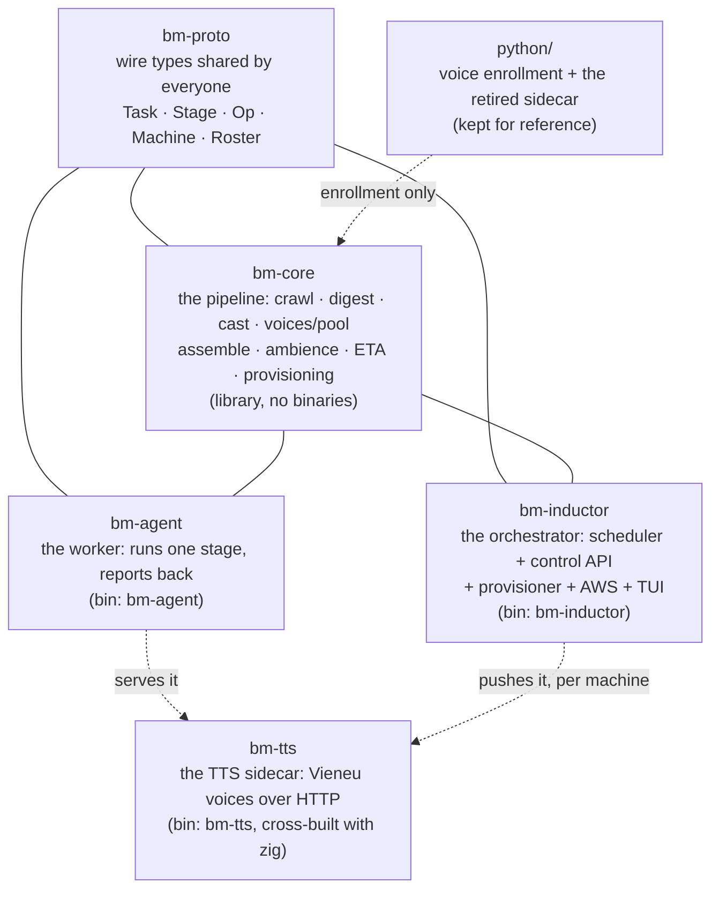
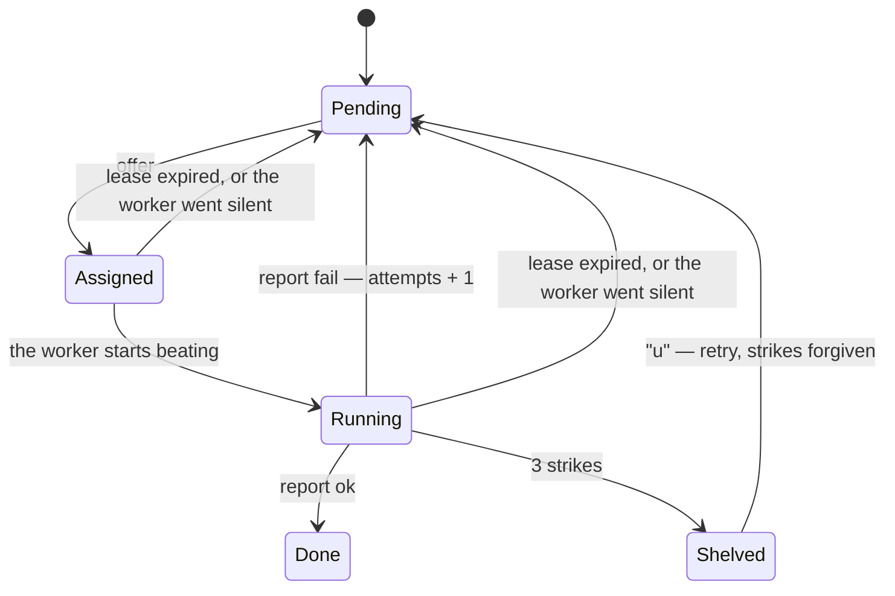
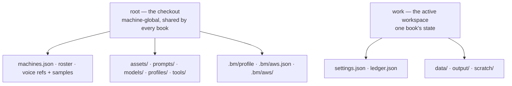
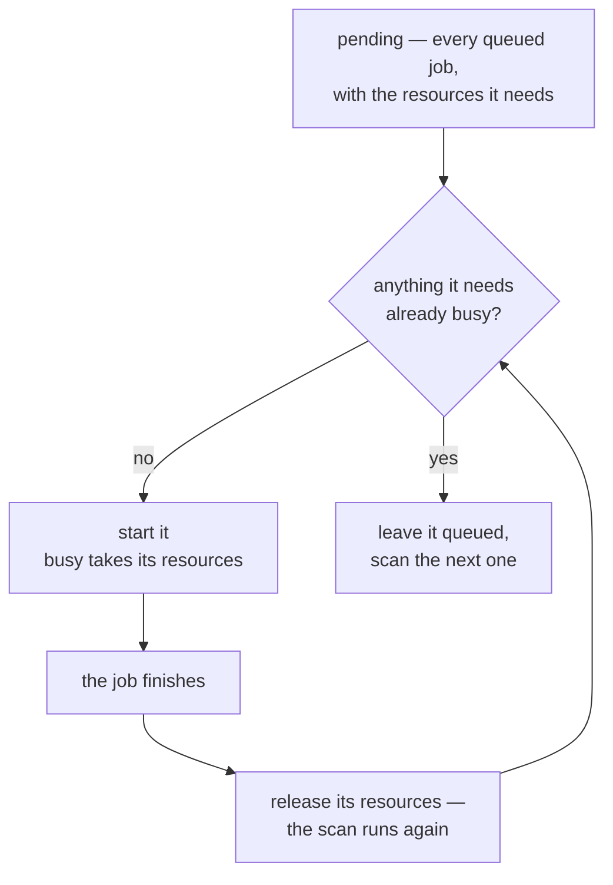
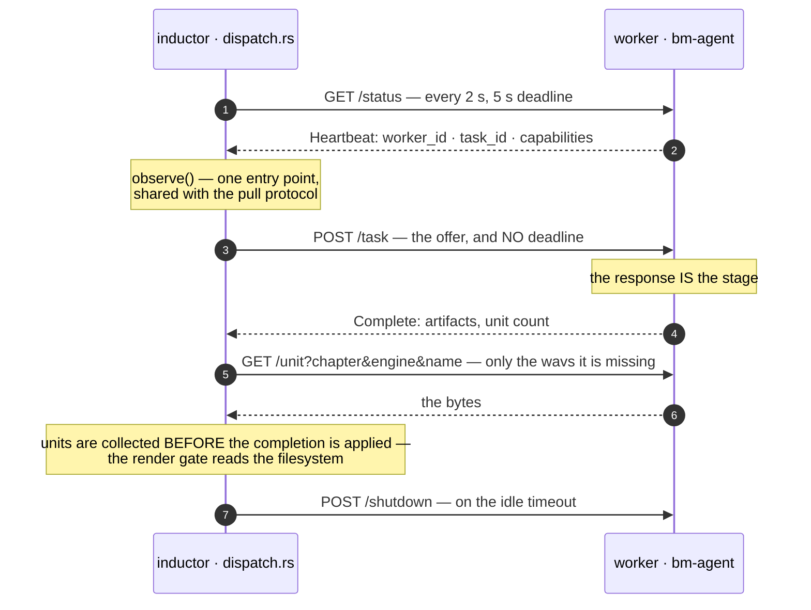
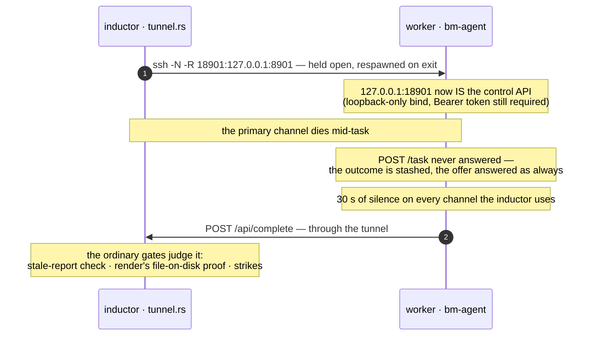
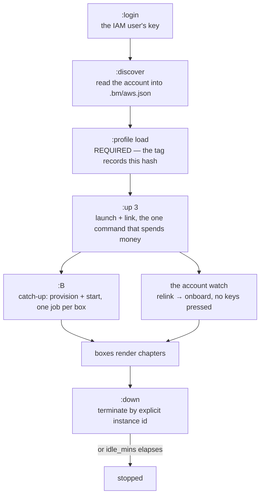

# Architecture — how Storycast works under the hood

## In plain words

*You can stop reading after this section.*

A book goes through four steps, in order, one chapter at a time:

1. **Get the text.** Either you drop files in, or a small script fetches the
   chapter from a website. (That part is [CRAWLING.md](CRAWLING.md).)
2. **Work out who is speaking.** An AI reads the chapter and labels each piece
   as narration or as a particular character.
3. **Speak it.** Each labelled piece is turned into audio, using that
   character's voice, with pauses.
4. **Glue it together.** One MP3 per chapter, in order.

The AI is used in step 2 and in *writing* the performance (where the pauses go,
how a line should be read). The actual speaking in step 3 is `bm-tts`: with the
built-in Vieneu voices that is local, costs nothing per chapter and needs no
internet. (Other TTS backends can be configured instead; they cost money and
have their own limits — see the README.)

**Why it is split across several machines.** Rendering a whole book on one
machine is slow, and most of that time is the machine's own limit rather than
the work being hard. So there is a coordinator (the *inductor*) that decides
what each machine should be doing and holds the to-do list, and *workers* that
each grab one task and report back. The to-do list is a file — a ledger — and
it is the only thing that is really "state". If the coordinator dies, the
workers keep their current task and the ledger is the thing that gets read back.

**What each piece is, and which you can ignore:**

| Piece | What it is | Do you touch it? |
| --- | --- | --- |
| The inductor | The coordinator, and the dashboard you drive it from | You use it; you do not change it |
| Workers | Identical boxes that each run one step for one chapter | You do not touch it |
| The ledger | A file listing every task and its state | Only to read, when something went wrong |
| Crawler scripts | One small file per website, saying where the text is | **Yes — this is the part you will write** |
| Prompts | How the AI casts and performs your book | **Yes — this is the part that makes it sound like your book** |
| The voices | Built-in Vietnamese voices, or ones you clone from a clip | Only if you want your own |

**The two things that will surprise you**, both deliberate:

- **Nothing is fetched until you say so.** A new workspace has no crawler and
  downloads nothing. A program that starts hammering a website it was never
  pointed at is a bad neighbour, and this one is trying not to be.
- **It never tries to get around a site that blocks it.** No browser, no
  solving bot checks, no pretending to be a different program. If a site
  refuses it, the honest answer is that the site refused. It would rather tell
  you than quietly spend a day retrying.

**The parts that are genuinely hard**, and where the detail below earns its
length: not restarting work that was already done, telling a finished stage
from a stalled one, and stopping a doomed task early instead of burning an
afternoon on it. Everything else is plumbing.

## For people changing the machine

Companion to the [README](../README.md), which is the "how do I run it" guide.
This one is the "why is it built this way" guide. Everything here describes
code that exists in this repo — five Rust crates plus a Python enrollment
tool — not aspirations.



`bm-tts` is the fifth crate and the one that used to be Python: serving is a
Rust binary now, cross-built with `zig` and pushed to each worker with its ONNX
runtime. The `python/` tree that remains is the enrollment tooling — the last
thing still needing an interpreter, until that is ported too. It is not on the
serving path, so a worker needs no Python at all.

## 1. One idea: work is a list of tasks, not a loop

*This section is about the one decision the whole system rests on. If you only
remember one thing: there is no "run the book" loop anywhere in this program.
Instead, every piece of work is a separate row in a file, and the program works
by deciding who should do which row next.*

Every unit of work is one *stage* of one *chapter* — the pair `(crawl, 34)`,
`(digest, 34)`, `(render, 34)`, `(merge, 34)`. All of these rows live together
in one file, the **ledger** (`ledger.json`, inside the book you are working on;
see "Config lives next to the ledger" below). Every row is in one of six states:



Look closely at the diagram: **two different arrows lead back to `Pending`**, and
the difference between them is the entire failure policy of this program. One
means *"the machine tried and reported that it failed"*, and that costs the task
a mark against it. The other means *"the machine stopped answering"*, and that
costs nothing. A computer that crashed has not done anything wrong.

The jargon, defined once here:

* **A worker** is a machine that does the work. **The inductor** is the
  coordinator that decides who does what. **A heartbeat** is a worker saying
  "still here" every few seconds.
* **offer** — a worker asks the inductor "what should I do?" The inductor only
  offers a stage when the stages before it are finished (crawl -> digest ->
  render -> merge), so the order things happen in is guaranteed by the data
  rather than by luck.
* **lease** — a time limit on one running task (crawl 10 min, digest 20 min,
  render 90 min, merge 30 min). If the time runs out, the task goes back on the
  pile **without a mark against it**, because silence is not failure. A
  background job called `reap` does this every 10 seconds, and also rescues
  tasks stranded on workers that stopped sending heartbeats (~90 s window).
* **an expiry on a worker that is still alive is a different event, and says
  so.** The rule above is written for a machine that *died* — it deserves
  nothing and needs nobody. A machine that is **alive and stuck** looks exactly
  the same from here: fresh heartbeat, task never finished. Because the
  re-queueing is silent, the task gets handed out again and again with nothing
  anywhere recording that it keeps happening. So `reap` also counts expiries that
  happened **while the machine was still sending heartbeats**
  (`Task.expiries`) and logs its own event — a `warn` on the first, an `error`
  from the second, naming the row, the worker and where to look. On 2026-09-22
  two digest rows looped that way for ~80 minutes while the TUI showed a
  percentage that never moved, and this distinction is what was missing.
* **strikes** — three failed attempts shelve a task, so a task that cannot
  succeed does not get retried for ever. The operator lifts this with `u` (retry
  everything) or per task from the K ledger (`u` retry, `F` force — which also
  deletes that stage's output file, so nothing downstream can mistake old output
  for a finished chapter).

**Why this matters more than it looks:** because all the state lives in the
ledger file plus files on disk, any program here can be killed at any moment
without losing anything. Restart the coordinator and it re-reads the list;
restart a worker and its work is simply handed out again, because the
coordinator is the one asking — there is no list of "who is online" that a
restarted worker has to get itself back onto (section 7).
| File | What is in it |
| --- | --- |
| `settings.json` | Your preferences for *this book*, including ssh details |
| `machines.json` | How to reach each machine, written when a box is added with `:a`, `link` or `provision` |
| `ledger.json` | Only ever the task list, plus which machines are alive |

The API joins these together and shows one "machine" shape to the TUI, so the
dashboard never has to know they were separate.

**Where the first two live is the one thing to get right**, because the answer
is "it depends" and getting the wrong half fails silently. `settings.json` and
`ledger.json` sit **inside the book you are working on**
(`workspaces/<name>/`), and only fall back to `.bm/` when there is no book
selected — the older single-book mode, where `work == root`. So a per-book
setting like `render_batch` lives in `workspaces/<name>/settings.json`, while
`machines.json` and the profile pointer are machine-wide and stay in `.bm/`
whichever book is active. If you are told to edit a file, it should name the
`workspaces/<name>/` form unless you are on a bare checkout with no books.

For the ssh key, three places are tried in order and the first hit wins: the
machine's own entry, then the app-wide default, then letting ssh decide for
itself (an agent, or `~/.ssh/config` — having no key at all is a valid choice,
not a gap). The machine screen prints the winner and *where it came from*, so a
key pointing at the wrong place tells you which line set it. `.env` holds API
keys only. An ssh key is a *path* to a file, which is configuration, not a
secret.

### Two scopes: the book, and the machine

A **workspace** is one book. The program is built around the idea that some
things belong to the book you are working on and some things belong to the
machine itself, and mixing them up is the source of most bugs in this area.
`Layout` is a *pair* of folders, not one:



* **The book** (`workspaces/<name>/`, or the checkout root itself when no book
  is selected): the task list, the settings, the chapter text, the scripts, the
  cast, the character bible, the finished MP3s.
* **The machine** (always the checkout root): which boxes exist, the voice
  roster, the shared assets and prompts, the AWS account, and which profile is
  loaded.

In code these are the two halves of `Layout`: `work` and `root`. There are three
ways to build one, and **picking the wrong one fails silently**:

| | |
|---|---|
| `Layout::new(root)` | Treats the root as the book. **Only for tests and the old single-book mode.** |
| `Layout::resolve(root)` | Reads `.bm/active-workspace` and **refuses** to run if it points at a book that does not exist. This is what every command that does actual work uses — `serve`, `provision`, `bm-agent`, `roster`, `segments`, `digest`. |
| `Layout::resolve_or_root(root)` | Falls back to the root but hands the error back to the caller. **Only the dashboard and the `workspace` command**, because those are the tools you would use to *fix* a broken pointer and so must still open when it is broken. |

If there is no pointer file, this checkout *is* the book — a fresh clone works
immediately. Only a pointer that points at nothing is an error, because quietly
running in the wrong place would scatter one book's files where another book was
expected. On a worker (`$HOME/bm-worker`) there is no pointer at all, so the two
folders are the same one, which is what lets the same program run on both ends.

### The profile is the other pointer, and it is checked

`assets/` and `prompts/` are the **profile**: the live, git-ignored set of files
that decides how your book sounds and how it is dramatized. The file
`.bm/profile` records which profile that tree claims to be, *and a fingerprint
(hash) of its contents*.

`bm_core::profile::verify` is the gate every program checks before it runs
anything — the pointer must exist **and** the files on disk must still hash to
what the pointer claims. The TUI is the one exception, and that is on purpose: a
dashboard that refused to open because the files had drifted would be no use for
fixing the drift.

The fingerprint is a sha256 over `path + NUL + content-hash` lines in sorted
order, and the version that runs in parallel **must produce byte-identical
output** to the one that runs in sequence: every machine's pointer was computed
the sequential way, so a different order would look like false "your files have
drifted" warnings on every machine at once.

This is also why each box's marker records the profile hash it was started for,
and why `:profile` then `load` is a step you must do before `:up`. A box is a
faithful copy of one profile; starting one into a group that has since switched
profile is the mismatch the marker exists to catch.

## 2. The stages (bm-core)

The four stages are the actual work. Each one takes one chapter, produces one
file, and that file is what the next stage reads.

**The stage boundary that matters is crawl -> digest, and it is not a
handoff — it is a dependency.** What the crawler kept decides what the digest is
even asked to do, and the link has no gap in it:

```
script -> chapter text -> the prepared split -> attribution -> staging -> audio
```

The middle of that chain is where the coupling lives, and it is worth stating
plainly because it is invisible when it works. `prepare_chapter` decides
narration-vs-dialogue **from quote marks alone** (`"`, `“`, `「`) — no model is
involved. So a crawler that returns a container with no quote marks in it
produces a chapter that is entirely narration, and from there *nothing
downstream fails*: the attribution answer is complete, `validate_source_alignment`
is satisfied, the chapter renders, every ledger row is green — while the book is
read in one voice.

That is the shape of the whole failure policy here, and it is deliberate: the
validators exist to catch a **model disagreeing with the text it was given**,
because that is the only thing a validator can do. None of them can catch text
that never offered a speaker to disagree with. So the digest prints the split —
`prepared 52 event(s): 21 narration, 31 dialogue` — as the first line of its
log, in `assemble_outcome` and therefore in **both** the automatic and the
by-hand path. It is worded as something to check rather than an accusation,
because a genuinely single-voice chapter is a real thing and a warning that
fires on every quiet chapter is a warning the operator learns to ignore.

Two more links in the same chain, for the same reason:

* **Left-over page furniture becomes the model's homework.** Nav links, a
  duplicated title, a site footer: nothing refuses them, and each becomes an
  event that must be attributed and consumed exactly once. A dirty crawl makes
  the source gate *harder to satisfy* in direct proportion to how dirty it was.
* **Paragraph breaks are load-bearing.** A site that separates paragraphs with
  two carriage returns and no `<p>` yields one 8,000-character line, which
  clears `MIN_CHAPTER_BYTES` (200) without complaint and yields an audio file
  with no pause in it. This is why the split on CR lives in `truyencom.lua`
  rather than in Rust: it is a fact about that website.

So the design rule that follows, and the one the templates are written to show:
**the script's job is to hand over prose and nothing else.** Everything the
crawler fails to strip becomes work the model must account for, at the far end
of a pipeline where it is expensive to notice.

* **crawl** (`crawl/`) — get the text of one chapter and clean it up.
  **Nothing is fetched by default**: a new workspace adopts chapters from files
  you supply (`:import`). If you set `crawl.mode: "script"`, it runs your
  **crawler script** instead — a small Lua or JavaScript file, looked for in
  your own book's `crawl/` folder first (so your crawler wins over the shared
  one) and in `assets/crawl/` after that. Whatever the script returns is
  written to `data/chapters/chNN.txt`.
  The program supplies the script with tools (`fetch`, `select`, `select_text`,
  `strip_tags`, `sanitize`, `challenge`) and a time budget. **Every rule about
  a particular website lives in the script**, not in the program: which part of
  the page is the story, where it starts and stops. That is a fact about a
  website, not about this program, so it belongs next to whoever can read the
  page.
  The one exception is `challenge(page)`, which spots a Cloudflare
  "are you a robot" page — including the version that arrives saying `200 OK`,
  where there is no error status to notice. Without it, the program would
  cheerfully save the bot-check page as if it were a chapter of your book.
  The mapping from chapter number to URL is worked out once and frozen into
  `data/crawl-index.json`. `POST /api/op {"op":"crawl-setup"}` saves your
  template and then tries one chapter **through exactly the same code a worker
  would use**, so a broken selector fails loudly *before* you queue a whole
  range. The manual default is on purpose: a workspace with no novel in it has
  not named a site, and any other default would fetch *something* the first
  time you pressed the button.
  Full details: [CRAWLING.md](CRAWLING.md), which also has a section you can
  paste into an AI chat to have a crawler written for you.
* **the link check** (`crawl/probe.rs`, `bm-inductor check <url>`) — one
  request to a URL you paste in, and a plain answer to "would this page give us
  a chapter?". It exists because a group of machines **cannot notice** a site
  that has started refusing them. It notices one machine at a time, a minute
  apart, for an afternoon. It uses your own user agent and headers, so if you
  are relying on a session cookie this is the command that tells you whether it
  still works, and it exits with an error code when the answer is no, so a
  setup script can check it. It writes nothing and fixes nothing. It just names
  the problem in a second instead of in a day.
* **the known-sites registry** (`crawl/known.rs`) — a short list of websites
  this project has already written a crawler for, so you do not have to. For a
  URL it recognises, it knows the crawler, knows what shape that site is, and
  can print the settings block that makes it run (generated from the settings
  type, so it cannot go out of date). `check` prints it, and the TUI's `:crawl`
  prompt shows it while you type. **Sites that are blocked are in the list too,
  with the reason** — "this one refuses us" is an answer, and leaving it out
  just means somebody spends the same afternoon finding out. Nothing uses this
  list to make decisions; it only tells you things.
* **digest** (`digest/`) — decide who speaks each line, and how it should be
  performed. This is the stage that uses the AI, in two calls per chapter.
  The chapter is first **cut into pieces by the program, not by a model**: the
  text is split into ordered events, each with a stable id (`e0001`…) and a kind
  of `narration` or `dialogue`, decided by quote marks alone. No model, no
  rewriting, and the chapter heading is thrown out.
  The **first call** (attribution) shows those pieces along with the character
  bible and asks for one thing: which character speaks each piece. A validator
  then *proves* the answer is complete and in order — narration must be the
  Narrator, dialogue must be a real character or a reusable anonymous voice slot
  (`anonymous:anon-N`), and dialogue may never fall back to the Narrator.
  The **second call** (staging) gets the same pieces and that now-fixed answer,
  and chooses only presentation: where to split lines, small grammar fixes,
  mood, scene, music, effects, sounds. **It is not allowed to name a speaker** —
  the program attaches the validated answer after the fact, precisely so that a
  model trying to write a better audio prompt cannot quietly turn a character's
  line back into narration.
  A final check (`validate_source_alignment`) proves the finished script against
  the original text: every piece was used exactly once, in order; no stray quote
  mark leaked into the spoken text; and a line split for a sound or because it
  was too long for one audio request keeps the same speaker. Each call gets
  **one chance to fix its own answer**. Anonymous speakers are given stable
  voices from the pool but never become part of the character bible.
  Only the inductor ever writes `data/bible.json` and the cast files. Workers
  send their finished script and their changes back with their report, so two
  machines can never overwrite each other's notes. If a digest comes back with
  a *changed* script, the chapter's render and merge are thrown away and
  requeued — otherwise the audio would speak the old version with the new
  staging. The "analyzer" (which AI service to use) is swappable
  (`opencode | openrouter | gemini | local`) with a fallback chain.
  **You can also run this stage by hand** (press `D`) — this is the way out
  when every AI service is unavailable, rate-limited, returning errors, or
  simply when you would rather use a model you already have open in a browser.
  The program puts round one's prompt on your clipboard; you paste the answer
  back; same for round two.
  One honest limitation: **the by-hand route does not yet enforce the same
  rules.** The manual manager still uses the older two-pass templates and
  answer-checking, so it does not run `prepare_chapter` or
  `validate_source_alignment` — meaning a chapter you finish by hand can still
  end up with the attribution the automatic route would have rejected. Until
  it is switched over, the automatic path and `bm-inductor digest` are the two
  that hold the line. They do share `assemble_outcome`, so the finished file is
  built the same way either way, and a refusal is still the validator's own
  complaint.
  Hand-finished work is reported over `/api/complete` under the reserved
  `operator` id, which is also what makes finishing by hand win a race: the row
  goes `Done`, and a machine still grinding on it finds a row it no longer owns,
  so its report is discarded as stale. `:off` / `:on` stop and restore digest
  work on every machine — `:off` saves each machine's whole policy to
  `.bm/digest-suspend.json` first, so `:on` restores *what each machine had*
  rather than switching everything on.
  The **attribution pass** renders those events with the bible and asks only for
  chapter identity fields plus a complete `speakers` map. Its validator proves
  every event has one answer in source order: narration maps to `Narrator`;
  dialogue maps to a canonical character or a reusable `anonymous:anon-N` voice
  slot, never to Narrator. The **staging pass** receives the same events and that
  immutable map, then chooses only text splits, grammar fixes, mood, scene,
  music, effects, and sounds. It does not return `speaker`; code attaches the
  validated map after generation, so a model optimizing a large audio prompt
  cannot regress dialogue to Narrator.
  `validate_source_alignment` still proves the finished script against the
  source: every non-heading event consumed **exactly once, in source order**;
  no quote delimiter merged into segment text; and a segment split for a sound
  seam or long TTS line keeps the same `source_id` and therefore the same fixed
  speaker. Each pass gets **one repair of its own answer**. Anonymous slots are
  assigned stable pooled voices but never enter the character Bible.
  The inductor is the **single writer** of `data/bible.json` and the cast files
  — workers send the finished script and their bible delta back in the report,
  which removes any read-modify-write race between machines. A digest that
  lands a *changed* script invalidates the chapter's render+merge (segments
  and mp3 go, both tasks requeue fresh) — otherwise the kept render would
  speak the old dramatization under the new one. The "analyzer" is
  pluggable (`opencode | openrouter | gemini | local`) with a fallback chain
  over models.
  **The digest can also be run by hand** (`D`, the digest manager), which is what
  to reach for when every backend is unavailable — a rate-limited fallback, a 503,
  or simply a model already open in a browser. The operator gets round 1's prompt
  on the clipboard, pastes it into any model, pastes the answer back, and the
  same for round 2.
  **It is not yet the source-gated digest.** The manual manager still renders the
  legacy two-pass templates (`build_prompt`, then `build_script_prompt` against
  round 1's cast) and checks answers with `parse_script`, so it runs neither
  `prepare_chapter` nor `validate_source_alignment`: a chapter finished by hand
  can still ship the attribution the automatic path now refuses. Until it is
  pointed at `build_attribution_prompt` / `parse_attribution` and
  `build_staging_prompt` / `parse_staged_script`, the automatic route and
  `bm-inductor digest` are the ones that enforce the contract. The two paths do
  share `assemble_outcome`, so the artifact is built the same way once accepted,
  and a refusal is still the validator's own complaint. It is
  reported over `/api/complete` with a worker's own body under the reserved
  `operator` id, which is also what makes finishing by hand win a race: the row
  goes `Done` and the box still grinding on it finds a row it no longer owns, so
  its report is dropped as stale. `:off` / `:on` stop and restore digest work
  across every machine — `:off` snapshots each box's whole policy to
  `.bm/digest-suspend.json` first, so `:on` restores *what each box had* rather
  than switching digest on everywhere.
* **render** (`bm-agent/src/tts.rs` + `python/`) — turn each piece of the
  script into actual audio. The built-in Vieneu voices run as a small HTTP
  service on `127.0.0.1:8818` on each machine, **owned by that machine and kept
  warm between tasks** (see section 4): one service per box, never duplicated,
  and put away on a memory budget rather than only when it has nothing to do.

  A render is **one task per take** — `render:<chapter>:<position>` — where a
  *take* is one unit of work from `plan_render` (one run of the local engine, or
  one line sent to a cloud service). The take is named by a hash of everything
  that produces it:
  `take_key = sha256(engine | voice_key | text | temperature | silence_p)`, and
  the file is `t-<take_key[..16]>.wav`. So *having the file is proof that the
  right bytes exist*, and changing any input gives a different name rather than
  quietly overwriting — which is what makes stopping and restarting safe, and
  what makes "did this already render?" answerable without rendering it again.
  The order of the pieces is worked out once, by the machine handing the task
  out, and the same list travels with the task to the machine doing the mixing —
  so the two can never disagree about what order things go in. That list is
  `merge_takes`, in mix order. The mixer is *not* allowed to work the order out
  for itself from the script and the cast: the take names are hashes, and
  re-deriving a hash is exactly the sort of thing that silently disagrees.
* **merge** (`assemble/`, `ambience.rs`) — join the pieces into one MP3, adding
  the pauses, music and effects the staging asked for.
  A merge task carries **no affinity**: it runs wherever it is offered, and the
  only precondition is that the files are there — a merge is offered just when
  this disk already holds every piece (`missing_wavs` empty). A machine that is
  missing some heals its own render (requeues the takes it lacks) and then
  yields to the next stage.
  If a merge starts anyway and finds a piece missing, it fetches it from the
  inductor's store (`GET /api/segment`, over the reverse tunnel), so the pieces
  come from the one disk that is guaranteed to be complete. A merge on the
  inductor itself ships no MP3 — the finished file on disk *is* the evidence. A
  merge on a remote machine sends its MP3 home, base64-encoded, inside its
  report.

## 3. The control API (bm-inductor, axum, default :8901)

One HTTP service, running on the coordinator, on port 8901 by default. The
machines call it; it never calls them (see section 7). The whole surface is
thirteen routes, and there is nothing else:

| Endpoint | What it is for |
| --- | --- |
| `GET /api/task` | A machine asking "what should I do?" — answered with a task, or with nothing |
| `POST /api/register` | A machine saying hello for the first time |
| `POST /api/heartbeat` | A machine reporting progress: which stage, which chapter, what percent, an ETA |
| `POST /api/complete` | A machine reporting a task finished or failed, plus the files it produced |
| `POST /api/segment` | A machine handing over one rendered audio file |
| `GET /api/segment` | A machine fetching one audio file it does not have |
| `GET /api/state` | The dashboard asking for everything it displays |
| `GET /api/roster` | The voice roster as resolved: catalogue, pool, and the policy's verdicts |
| `POST /api/op` | Operator actions: start a range, retry, switch profile, and so on |
| `POST`/`DELETE /api/machines` | Adding and removing a machine |
| `POST /api/machines/state` | Setting whether a machine is allowed to work |
| `POST /api/machines/policy` | Setting which stages a machine will run |
| `POST /api/relink` | Re-pointing a cloud box whose address has changed |

Every change the scheduler makes also writes an **event** into a ring buffer held
in memory: completions with how long they took, failures **carrying the
machine's own error text**, lease expiries, tasks rescued after a machine died,
and anything you did. `/api/state` hands these over and the dashboard folds
them into its Events pane, dropping duplicates by a counter that only ever goes
up. That is how a digest failing on a distant machine becomes a readable line on
your screen rather than a row that simply stops moving.

There is **no authentication**, and that is worth knowing rather than an
oversight: this is plain HTTP on a trusted network, and an API key sent along
with a task crosses that network. Keep it on a network you trust, and do not
expose it to the internet.

## 4. Provisioning, and why second runs are fast

`bm-core/src/provision/` onboards a machine over plain `ssh`/`rsync` — no SSH
library, so your `~/.ssh/config` and keys are reused and every command is
visible in the TUI log (the machine overlay shows which key won —
`machines.json`, `settings.json`, or the ssh default):

1. **probe** — one ssh round trip: hostname, CPUs, RAM, disk, agent version,
   python present, enrolled voices, TTS up, and the **provision stamp**.
2. **decide** — compute a local stamp (`compute_provision_stamp`): three SHA-256
   digests, compared against the stamp the target stored at
   `~/.bm-worker/.provision_stamp.json` during its last provision.
   * `sources_hash` — `prompts/` by signature; the content of the small
     manifests that must match exactly (requirements, cast files, the clone
     manifest `voices.json`, the scene map, the three clip-pool registries);
     the effect, music and inject clip directories by signature; the crawl
     scripts by content, from **both** the profile's `assets/crawl/` and the
     active workspace's `crawl/`; and the agent version.
   * `tts_hash` — the baked `models/` directory **minus** `models/voices.json`,
     by signature, plus `manifest.json` by content, plus the `bm-tts` binary by
     content. Excluding the store is what lets a new voice ship without
     re-sending 668 MB of weights, and including the binary's bytes is what
     lets a rebuilt sidecar actually redeploy.
   * `voices_hash` — the clone manifest and the baked store by content, plus
     `refs/` by signature.

   A digest being *computed* is not the same as being *consulted*, and the
   difference has bitten this repo twice. `tts_hash` and `sources_hash` each
   gate their own push; `voices_hash` gates the model push alongside
   `tts_hash`, so an edited reference clip reaches every box instead of being
   silently dropped. `agent_hash` — a content hash of the agent binary — is a
   fourth field that exists because a version *string* cannot see a rebuild:
   every dev build between releases reports the same version. Nothing in the
   stamp is decorative.
3. **do only what changed** — sources in sync: skip the whole rsync pass. Models
   in sync *and* the remote roster already naming every declared voice: skip the
   push of `models/`. Local copies compare size+mtime per file, exactly like
   rsync.
4. **write the stamp**, start the TTS sidecar if it is not answering, and
   re-probe so the TUI shows the post-provision truth.

**That ~700 MB is the next thing to fix, and it is not a stamp problem.** The
stamp already makes a *re*-provision free; what still costs 886 MB is the
*first* push to a new box, and three quarters of it is 667 MB of TTS weights
that are identical on every machine and change only when you re-bake them. The
design for publishing them as an artifact the box fetches and verifies itself is
in [ARTIFACTS.md](ARTIFACTS.md). It is not implemented; this section describes
what the code does today.

**On a box that is already configured, the installers are not run at all.**
`may_install(configured, force)` gates `ensure_opencode` and `ensure_ffmpeg`:
the first provision on a fresh box installs, and every later one only asks
`command -v` whether the tool is there. Without that, a re-provision of a
perfectly healthy box re-ran `npm i` (bounded at 600 s) and `apt install -y`
for no reason — which is most of what made `B` feel slow on a cluster that was
already working. The check-only path says "force a re-provision to try again"
when a tool is missing, so the remedy is named rather than silently skipped.

**The agent binary is inside that same gate, and the gate is the version
string.** `install_agent` sits in the `else` of `if already`, where
`already = probe.configured(agent_version) && !force` and `configured()` is
`agent_version == env!("CARGO_PKG_VERSION") && rust_ready()`. So on a box already
running this version, `:prov` logs `already configured (agent 0.2.4 + tts
sidecar)`, syncs sources and **does not push the binary**: a rebuilt `bm-agent`
whose version did not change never reaches the box. Only a version difference, or
`force`, reaches `install_agent`. Note the asymmetry — the *staging* half is
content-aware (`agent_binary_staged` refuses a candidate older than
`crates/bm-{agent,core,proto}/src`, so what would be pushed is never stale), while
the *push* half is version-only. Remedy: `P` / `:reprov` ("forcing past the
skip-if-configured check"), or `bm-inductor provision --addr <ip> --user thang
--force` — or bump the version in `rust/Cargo.toml`, which is the route
`docs/TROUBLESHOOTING.md` names from the operator's side.

**And a push does not restart the worker.** Provisioning kills the TTS sidecar
(`pkill -x bm-tts`) but nothing kills `bm-agent`; `start_remote_workers` checks
`pgrep` first and reports `worker already running (pid …)` instead of replacing
it. So the box keeps executing the old binary until its worker is stopped and
relaunched — the remote shape of the local trap, that a rebuild does not restart
the process already running it. The local node is never provisioned at all
(`provision_machine` returns early for `is_local_node`: "runs from the repo,
nothing to provision"), so a rebuilt `bm-agent` is picked up there the moment its
worker is relaunched.

### What `B` does now, and what it used to do

It used to provision every registered machine inside the start job (a `JoinSet`),
and only start the backend once every machine reported ready — a *provision-gated
start*, so "started" always meant "ready". That is gone, and the reason is the
one this repo keeps rediscovering: **a job's duration was being used as a
guard.**

The start is now **degraded**: `B` brings the backend up in seconds, then hands
each box that still needs work to the dashboard as a **job of its own** and
ends. So:

* The press returns immediately, and a five-minute push to one box no longer
  holds the cluster lane — nor queues everything behind it.
* Boxes catch up **concurrently**, because each catch-up job holds
  `Res::Box(addr)` and nothing else.
* A failing box lands in `Error` with its reason and **never vetoes the rest**.
* A box already `online` is **skipped and said out loud** — `online` is the state
  this path exists to reach, and it is *working*. Re-provisioning it anyway is
  what made `B` on a healthy cluster take minutes. `p` is the deliberate
  re-provision.

The trade is real and worth naming: "started" no longer implies "every box
ready". The footer says which boxes are still catching up instead.

### Host keys are not verified, on purpose

Every box here is either an instance launched minutes ago or a worker linked by
hand, and every call is scripted (`BatchMode=yes`), so the "continue
connecting?" prompt becomes a hard `exit 255 — Host key verification failed`.
A fresh instance always presents a key nobody has seen.

So the transport declines verification and never reads or writes `known_hosts`.
That is not only about first contact: AWS hands the same public IP to a
different box later, and `StrictHostKeyChecking=no` alone still refuses a
*changed* key. `~/.ssh/config` is still read — an `-o` overrides one option, it
does not replace the file — so Host aliases, `ProxyJump` and `IdentityFile`
keep working. The policy is one constant (`HOST_KEY_OPTS`) used by **both** the
direct `ssh` and the `ssh` that `rsync` spawns through `-e`; setting it on one
transport only would fix the probe and leave every push failing identically.

### Machine states, and the gates that read them

A machine's state is a *decision*, not a label: `unknown` (never contacted),
`awaiting-ip` (the account has the box and has not given it an address yet),
`initializing` (created, not yet answering), `probing`, `provisioning`,
`configured` (has everything it needs, no worker beating yet), `online` (a
worker is answering), `offline` (was answering, now silent), `error`. Three gates
read it:

* **`accepts_work`** — only `online` is handed tasks. Every other state is a
  deliberate "not yet", and offering work into one is how a task lands on a box
  that cannot run it. `unknown` passes separately, as "no opinion formed": a
  hand-written ledger or the legacy pull worker asking before its first beat,
  neither of which may be stranded.
* **`coming_up`** — `awaiting-ip`/`initializing`/`probing`/`provisioning`/
  `configured`. The dispatcher stamps `offline` on any box that fails to answer
  `/status`, and must not do that while the box is still on its way up: a box
  twenty seconds into its first boot is not gone, and calling it gone is how a
  freshly launched pool looks broken.
* **`dialable`** — everything except `awaiting-ip`. This is the gate on *asking*:
  `RunInstances` returns before EC2 has assigned the instance a public address,
  so a launched box is registered by its instance id — the handle the account
  read repairs it by — and there is no `http://i-0abc…:8917/status` to poll.
  `unknown` passes deliberately: a hand-added machine has never been probed, and
  probing it is the only way to find out.

`awaiting-ip` and `initializing` are the two states with a deadline
(`BOOT_DEADLINE_SECS`, five minutes). A state with no exit condition is a lie —
a box terminated before it booted, a box the account never addressed, or one
launched into a subnet with no route out, would sit there for ever — so it
becomes `error`, with the reason in the note. `state_since` is what makes both
the deadline and the overlay's `state age` line possible.

### Launch, watch, onboard

A launch that ends with boxes the dashboard cannot dial is the failure this pair
exists to remove, and it has three parts:

* **The launch asks for a public address** (`--associate-public-ip-address`)
instead of trusting the subnet's `MapPublicIpOnLaunch` default. The transport is
inverted — the inductor dials the box, nothing dials the inductor — so
reachability resting on a per-subnet checkbox nobody re-reads fails *silently*:
ssh may answer and the box is never driven. Asking is the only version of this
that cannot be wrong quietly.
* **Every instance is registered at birth, keyed by whatever it has.** With an
address, that is the address. Without one, it is the instance id, so the record
exists from the first second and the account read has something to repair. The
private address is kept in the note — information for an operator whose inductor
sits in the same VPC — and never in the address column, where it used to sit as
a plausible-looking address for a box on the other side of the internet.
* **An address arriving is a state transition, not an event nobody hears.**
`relink` re-keys the entry to the public address, moves only that box from
`awaiting-ip` to `initializing` (restarting its deadline from the moment it could
actually be dialed), and marks its note as waiting to be onboarded. The
dashboard reads that marker and hands the box to the same provision job `:prov`
runs.

The watch that drives this is gated on `has_pending_launch` — some machine is
`awaiting-ip` or `initializing` *and* carries an EC2 id — so the account is read
while a launch is in flight and never otherwise. A settled cluster spends no API
calls and the watch stops itself. The marker is a note rather than a field
because the provision job clears it by rewriting the note: exactly the lifetime
wanted, with nothing that has to remember to clear a flag, and no latch that can
get stuck and re-provision a box on every poll.

The third reader is the *failed provision*. `verdict_after_failed_provision`
(`tui/jobs.rs`) decides what a failed run leaves behind, and it separates two
outcomes that look identical from the operator's chair. If ssh never answered
**and** the box was already `initializing`, nothing was learned — a probe cannot
tell a booting box from a dead one — so it stays `initializing` and the boot
deadline is what gives up. If ssh *did* answer, the failure is real (missing
python, full disk, failed push) and it is `error` whatever the clock says. Both
the `:prov` retry and the catch-up job `B` dispatches for each box ask it,
because `B` is the automated path and runs seconds after `:up` — the likeliest of
all to meet a box mid-boot.
Restoring `initializing` re-stamps the clock, which is the right rule: while the
operator is retrying, somebody is watching the box.

### One box, one sidecar

The TTS sidecar is ~2.85 GB resident the moment its weights load (measured on
the `m7i-flex.large` this project provisions), and the boxes are 8 GiB. One
model fits; two are the OOM this cluster kept taking, so almost every rule below
is a way of making "two" impossible rather than survivable.

* **`bm-tts` binds its port before it loads, and `/health` answers 503
  `{"status":"loading"}` until it is ready.** The port is therefore the
  single-instance lock, taken *before* the expensive allocation: a second launch
  dies on the bind having allocated nothing. A 200 still means ready — the
  reference's worry that "health answering early makes a cold start look fast"
  is answered by the 503, not by loading first.
* **The worker waits, it never races.** `Tts::probe` answers `Up | Loading |
  Absent`; only `Absent` (connection refused) is a reason to spawn. A bound port
  answering 503 is a server mid-load, and `Sidecar::ensure` polls it for the
  whole startup budget instead of starting a second model — including when its
  *own* child exits early, which is what a lost bind race looks like.
* **The worker owns the lifetime.** The sidecar is kept warm *between* tasks
  (a per-task stop would reload 2.85 GB for every offer), reaped after
  `SIDECAR_IDLE_SECS` (180 s) of having no work, and stopped on worker exit —
  a spot reclaim that leaves a model behind spends the next box's memory on a
  machine nobody drives. Provisioning's own detached server is adopted rather
  than duplicated; it is *not* ours to kill by signal, so `POST /shutdown` asks
  it to exit.
* **A busy box is never idle, so idleness is not a memory guard.** The model's
  resident set grows across a long run of inferences — allocator fragmentation,
  cached activations, whatever the runtime keeps — and the idle reaper could not
  see it, because it is keyed on *not working*. `Sidecar::recycle_if_over_budget`
  is the guard that covers load, and it runs at the one moment that is safe: the
  top of a render arm, **before the first `/infer`**, never during one (a
  recycled request loses the take, and TTS is stochastic, so it cannot be
  reproduced from its inputs). It fires when the sidecar's resident set reaches
  **half the box's RAM** (`SIDECAR_RSS_FRACTION`, ~4 GiB on an 8 GiB box — a
  fraction rather than a fixed size, so it scales with the machine and needs no
  configuration) **or** the process has served `SIDECAR_MAX_RENDERS` (200)
  takes, whichever comes first, with a `SIDECAR_MIN_LIFETIME_SECS` (300 s)
  cooldown so a badly-tuned budget costs one reload per interval rather than one
  per offer. The action is `reap_all`, not `stop`, and that is the one place the
  worker overrides its own "an adopted server is somebody else's to keep" rule:
  a box about to be killed by its own memory cannot leave the decision to
  whoever started the model. The count trigger is deliberately *not* gated on
  the memory reading — a count cannot be unavailable, so the guard still fires
  on a platform that reports no per-process memory.
* **A merge reaps every sidecar first** (`reap_all`, waited out until the port
  is quiet). ffmpeg's working set is the one thing that co-resides badly with a
  model, and a merge runs nowhere else than the box that takes it — the two
  must never co-reside in 8 GiB.
* **The policy can turn the sidecar off entirely.** Render is the only stage
  that needs the model, so a box whose work policy turns render off has no use
  for ~2.85 GB of weights — and a box switched to digest-only never goes idle,
  which meant the old lifecycle (warm across tasks, reaped only on idleness)
  held the model for nothing. The dispatcher owns the instruction and owns
  **convergence**, not one-shot delivery: a single push misses the box down at
  edit time, the box that reboots back into its default, the inductor
  restarted since, the worker busy behind the timeout, and the hand-edited
  `machines.json`. So on every status poll it compares three books — what the
  policy says, what it last successfully told the box, and what the box
  **reports** it believes (the beat's `sidecar_keep`) — and pushes
  `POST /sidecar-policy` on any disagreement. A worker told to keep none stops
  its model on the reaper's next tick and refuses stale render offers with a
  403, which the dispatcher answers by releasing the covered rows **strike-free**
  (`release_render_rows` — a policy decision must never shelve a chapter);
  rendering back on restores the normal warm lifecycle. Five unanswered tries
  per desired value and the push goes quiet until the policy changes, so an
  agent that predates the endpoint cannot flood the log.
* **The cluster can see the count.** The heartbeat carries `sidecars` and
  `sidecar_gb`, and both are a census of **processes**: `census_refresh_kind`
  asks sysinfo for memory and explicitly *not* for tasks, because on Linux
  sysinfo lists every thread as a process in its own right, each reporting its
  parent's whole RSS — one 2.4 GiB model with an 8-thread pool read as
  `8 bm-tts processes … 19.5 GB` on an 11.6 GB box, which also armed the memory
  budget below against a phantom. `observe` raises an **error event on the
  transition** to >1 (edge-triggered — the dispatcher polls every couple of
  seconds and an event per poll is a log nobody reads), and `offer` withholds
  work from a box over `MEM_PCT_CEILING` (90%) so the scheduler does not feed
  the box that is about to die. Both are visible in the Workers pane's `tts`
  column. The remedy when it happens is still `X`, which sweeps `bm-tts` over
  ssh.

Two consequences worth knowing. Readiness (`Probe::configured`) deliberately
stays about the binary and the weights, *not* a live `/health`: tying it to a
running sidecar would deny a registered box over a sidecar restart and drag
`may_install` into re-running package installs on a healthy cluster. And
`configured` is consulted before a worker even beats, so the wait above is what
closes the race — not the gate.

## 5. Voices: three layers

1. **Catalogue** — voices built into the engine (`voices/`), each with
   gender/accent/language/style metadata and a stable *key*.
2. **Pool** — your clips (`voice-pool.json`), tagged from filenames or by hand
   (`roster add-sample`); enrolled into the engine's voice store on every
   worker during provisioning (enrollment is keyed by name, so a renamed entry
   re-enrolls even with an identical clip).
3. **Cast** — `data/cast-<engine>.json`, speaker → voice. Assignment is
   automatic under a per-engine **accent policy** (the shipped Vieneu policy
   restricts to Central/South accents), constrained by the bible's
   `voice_hint` and the pool's tags. `s` repoints one speaker, `S` shows the
   whole cast with health verdicts, `v` re-reads the roster and refills gaps.

## 6. The TUI (bm-inductor/src/tui/)

The dashboard is a module, not a file. `tui.rs` is the module root — it holds
the entry points (`run`, `run_loop`, `snapshot`) and the `mod` declarations. The
rest splits two ways: the shared machinery by *kind* of code, then the two
per-screen concerns — key handling and drawing — one file per screen:

```
tui.rs        entry points + module wiring
tui/layout.rs tier constants, column widths, size_class — and the
              `const _: () = assert!(...)` guards that prove they fit
tui/screen.rs the modal state machine (Screen, Picker, Confirm, TextPrompt…)
tui/app.rs    App and its state transitions
tui/style.rs  colours, glyphs, cell/line formatting
tui/model.rs  pure view-model helpers (folding, filtering, sorting, rollups)
tui/jobs.rs   background jobs: the `Job` enum, the resource scheduler
              (`run_jobs_with`), and one function per job
tui/audio.rs  the speaker: one reused temp file, played by afplay
tui/audition.rs the line index and the chooser behind "hear a real line"
tui/sound.rs  the three clip pools, what each entry is used for, and the
              prompt/registry edits — pure, so the guard is testable
tui/input.rs  the modal key chain, in order, then normal::normal_key
tui/input/    one file per modal block; `audition.rs` is the shared
              four-key audition decision both voice screens call, and
              `cloud.rs` / `policy.rs` are the AWS ones
tui/draw.rs   the tier dispatch and the overlay match
tui/draw/     one file per pane or overlay — `cloud.rs` is the pool view,
              `policy.rs` the IAM policy view
tui/tests.rs  every test
```

Outside the TUI, the modules the cloud work added:

```
dispatch.rs        the inductor-drives loop — asks every worker, hands out work
aws_ops.rs         one implementation per AWS verb, shared by CLI and TUI
state/observe.rs   what the inductor records when a worker speaks to it
state/relink.rs    keep EC2 boxes pointed at the address they carry now
provision/aws_credentials.rs  the credential store and the verify-then-write order
```

To follow a key press: `input.rs` → `input/<screen>.rs` → `jobs.rs` →
`app.rs` → `draw.rs` → `draw/<pane>.rs`.

### The job scheduler: queue on a resource, not on a lane

**What it replaced.** `Job::lifecycle() -> bool` classified a job as
"lifecycle" and pushed it into one serial lane shared with every other lifecycle
job. That is a *classification*, used as if it were a *dependency*, and the two
are not the same thing: `aws discover` queued behind a five-minute box push, and
a provision of box A queued behind one of box B, because all three had been
filed under the same word.

`Job::resources() -> Vec<Res>` names what a job actually touches:

| `Res` | held by | means |
|---|---|---|
| `Command` | everything else | the default lane — the old command lane, still serial among its own members |
| `Cluster` | `StartBackend`, `StopBackend` | the backend and the fleet as a whole; `B` and `X` must never interleave |
| `Box(addr)` | `Provision { machine }` | **one box's** ssh/rsync channel |
| `Aws` | `AwsUp`, `AwsDown`, `AwsLogin`, `AwsDiscover` | the account, and the `.bm/aws/` document it is written into |

`Res` is `Ord` so a job naming several takes them in a stable order — two jobs
with overlapping sets then queue rather than deadlock.



The scan re-runs **from the head after each launch**, and that is not a detail: a
later job may fit where an earlier one did not, so skipping past it would be
exactly the unnecessary queueing this exists to remove. FIFO is still preserved
among jobs that genuinely contend.

A job that names nothing conflicting is `Command`, and that lane stays serial on
purpose — two model-loading previews at once is not a thing anyone asked for.
A job may also name **nothing at all**: the read-only indexes (`LoadRoster`,
`LoadLines`, `LoadSounds`) hold no resource, so they start on the very next
scan even while a five-minute provision runs — they read files or make one
GET, and queueing them behind heavy work is exactly the wait they exist to
avoid.

**The queue is visible.** `Job::resource_label()` drops `Command` (true of most
jobs, worth nothing on a row) and the jobs screen renders the rest, so a blocked
row says `queued · needs box 10.0.0.5`. A job that shows a resource is a job that
can be *blocked*, and the row answers "why is this not running" without a log.

**Two guards were durations, and the job got shorter.** Both were attached to how
long `start backend` took, and both broke silently when it stopped taking
minutes:

* `App::backend_start_outstanding` spanned the whole catch-up loop, and that is
  what refused a second `B`. With the start job ending in seconds it released
  immediately, so a second `B` would have queued a duplicate push at **every**
  box. `App::catchup_jobs` — the ids of the catch-up provisions still running —
  now holds it open until the last one finishes.
* `DoneKind::StartDone` used to clear the `X` cancel flag. But `StartDone` now
  arrives *while* the catch-up provisions are still running, so clearing it would
  leave `X` with nothing to set and a mid-push provision would launch its worker
  anyway. It is deliberately **not** cleared.

Same lesson twice: **a guard scoped to a job's duration is not a boolean, and
shortening the job breaks it.** `Ev::JobFinished` releases the flag, and
`StartDone` *reads* `!catchup_jobs.is_empty()` rather than assigning, so the two
events can arrive in either order without losing it.

**The TUI is the operator's only interface.** Anything an operator has to do to
run the cluster — launch, link, provision, start a worker, terminate, store the
AWS key, read the account into the pool, load a profile — belongs on a `:`
command or a screen. A shell command in a guide is a gap to close, not a
workflow; the only step outside the dashboard is the AWS **console** (creating
the IAM user, its access key, the keypair and the security group), because AWS
offers no other way to create them.

One implementation per verb still holds: every `:` command calls the same
`aws_ops` function and `Job` the CLI does, never a second copy — `aws_ops::login`
and `aws_ops::discover` are what both `aws login` and `:login`, `aws discover` and
`:discover` run. The flags for those two are defined **once**, as clap `Args`
structs (`aws_ops::LoginArgs`/`DiscoverArgs`): the CLI derives its subcommand
from them and the TUI parses the prompt through the same definition, so a flag
cannot mean two things depending on which end it was typed at.

**The sound-design editor (`:sound`) is a screen because its guard needs a
load.** Three registries, the scene map and every `data/script-*.json` decide
what may be removed, so it is a `Job` like the audition index rather than a
keypress handler — and it is re-run after every save, because the guard is read
off it. The rule it enforces is the one this pipeline keeps having to relearn:
a scene names *tags*, not sounds, so dropping a sound a rule can still reach
makes the scene score zero and go *quiet* instead of failing. "In use" is
therefore a reference — a rule, a palette value, or a chapter's script — and
never "a merge happens to be running", which is a different question with a
different answer. `save_pool` rewrites only the entry that changed: the
registries are hand-formatted and their `_note` is the only written record of
why a pool is shaped the way it is, so an untouched pool round-trips byte for
byte.

**Auditioning a voice is the one place the TUI makes a sound.** The split is
deliberate and worth keeping: the *inductor* renders (`Op::PreviewVoice` calls the
sidecar and ships the wav back in `OpResult::audio_b64`), and the *TUI* plays,
because the speaker is on the operator's desk and the inductor may be on another
box. Four consequences that are easy to undo by accident:

* The wire carries **bytes, not a path**. A path is only meaningful to a client
  that shares the inductor's filesystem, and it puts the sample on the wrong
  machine — so the client writes it, next to the speaker.
* **One file, reused.** `audio::Player` overwrites a single temp path and removes
  it on drop, so auditioning twenty voices leaves one clip behind rather than
  twenty. The inductor writes nothing at all: an audition is not a pipeline
  artifact and has no business in `data/`.
* Playback is **not** a `Job`. `audio::Player` spawns and returns. Two reasons,
  and the second is the one that survives the scheduler change: a five-second
  sample is immediate feedback the operator is *waiting on*, and the lane it
  would land in (`Res::Command`) is deliberately serial — so parking a sound
  there queues it behind whatever else is in that lane for no benefit.
* The in-flight marker (`App::audition`) lives on the `App`, not on a screen —
  "one render at a time" is a property of the process, since both the picker and
  the cast overview can start one.
* `dispatch_op` returns whether it actually dispatched, and the marker is set
  **only** on success. A refused dispatch sends no `Done`, so a marker set
  regardless would never be cleared and the screen would wedge behind a render
  that never started.

Because `App::pending` is incremented by every dispatch and decremented only by
`Ev::Done`, **every arm of `run_job` owes exactly one `Done`** — a job that
reports its payload without one leaves the footer claiming work is running for
the rest of the session.

* **Non-blocking by construction** — HTTP polling lives in a background Tokio
  task that ships `Ev::State` over an MPSC channel; the draw loop only drains a
  channel, so a slow inductor can never freeze the interface.
* **Responsive tiers** — below 76×20 a guard panel explains the problem instead
  of drawing a clipped lie; below 100×32 a compact tier folds the Tasks pane
  into the footer; above that, the full five-pane dashboard. Column widths and
  key-hint lines are checked at compile time, so they cannot silently overflow.
* **No silent defaults** — every prompt is prefilled with the value actually in
  force, and arguments are echoed before submission.
* **No blank panes** — each pane has an explicit empty/loading/error state that
  says what to do next.
* `K` opens the task ledger overlay (type to filter), `Enter` opens a task's
  page with the full `task.detail`, `u`/`F` re-queue it. `--once` renders the
  same data as plain text for scripts, `watch` and screen readers.

## 7. The transport: the inductor drives, nothing dials it

Every worker is a small HTTP server that answers questions. `dispatch.rs` is the
other half — the loop that asks. **A worker is never told where the inductor is**,
and `lifecycle.rs` asserts the launch script never contains the argument that
would tell it.



Four consequences, each of which is easy to undo by accident:

* **`POST /task` has no timeout on purpose.** The response *is* the stage's
  outcome, and a render takes as long as it takes. Timing out would abandon a
  task the worker is still running, and the lease would then strike it — a
  self-inflicted failure.
* **The task runs on its own task, not awaited inside the poll loop.** Awaiting
  it would stop `/status` for the whole stage — twenty minutes for a render — and
  a beat older than 90 s is exactly what the reaper's orphan pass reads as
  "worker gone". That is not hypothetical: it requeued a digest the worker was
  45% through, then rejected the report as stale.
* **One entry point for liveness.** `Inner::observe(&Heartbeat)` sits behind
  `/status`, `/api/register` *and* `/api/heartbeat`. Two copies would let the
  machine state, the worker map and the capability list disagree depending on
  which way the report travelled, and the panes would show whichever arrived
  last. The counterpart is `Inner::note_silence`, named and separate because
  *nobody answered* has a case that is easy to get wrong: a box that is coming
  up cannot answer, and silence about it is not news.
* **`.no_proxy()` on the client.** Worker addresses are loopback, LAN, or a
  cloud private network. An ambient `HTTP_PROXY` answering in their place is a
  trap this repo has already paid for three times.

**Why the direction was inverted.** The pull protocol required the inductor to
be reachable *from* every worker — which a box on the public internet cannot do
to a laptop behind NAT, and which forced a local/remote fork through the
launcher, the offer *and* the artifact path. Inverting it removes the
requirement instead of working around it: the inductor already has a route to
every worker, because it launched them. The pull protocol still exists for a
worker given `--inductor`; it is the transition path, not the design.**Idle auto-off.** `Settings.idle_mins` (default 5, `0` disables) shuts the cluster down when there is nothing to do. `Inner::idle()` is deliberately not `busy()`: a shelved crawl leaves digest/render/merge `Pending` for ever, so `busy()` stays true in exactly the case the timer exists for.

### The one channel that runs backwards

The inversion has one cost, and it is paid at the worst possible moment. The pushed task's answer *is* the report — so a mid-task **uplink blip** does not just kill a connection, it kills the completion of a stage that already ran. The render finished on the box, the word "done" died on the wire, the lease expires, the chapter re-renders somewhere else. Hours of GPU time for nothing.

The fix keeps the inversion: the inductor uses the route it already has (ssh, the same one provisioning uses) to hold open one **reverse** forward per box — `ssh -N -R 18901:127.0.0.1:8901 box`, one child per remote worker, restarted on exit (`bm-inductor/src/tunnel.rs`). The worker gains a loopback address that *is* the control API, and reports through it — but only under a gate that makes the hook a backup and never a rival:



* **The task handler stashes every outcome** (`Progress::pending`, written in `push.rs`'s task arm) and then answers on the connection that asked, exactly as before. The stash costs nothing while the primary channel is healthy; it is the difference between a finished stage and a re-rendered one when that channel dies.
* **The sender (`bm-agent/src/hook.rs`) fires only on silence** — 30 s without a single request from the inductor, judged on `Push::silent_for` (the inductor's own polls, not the worker's failed sends). A healthy dispatcher asks every 2 s even with no work to give, so a live inductor never meets a hook post. Refraining is the design: the hook must never race the primary answer with a duplicate.
* **The inductor's gates stay the authority.** A hook post is an ordinary `POST /api/complete`: a report for a task already re-queued comes back as `stale` and is ignored; a render whose take file never landed fails the completion gate. The tunnel grants reachability, never authority.
* **A new offer clears the stash.** Work arriving means the inductor is talking again — and the stashed outcome is stale by definition, its task already re-decided. (The hook had the whole silent window to deliver it.)
* **Nothing new is exposed.** The remote bind stays on the box's own loopback (no `GatewayPorts`), so the hook port is closed to the box's network; the tunnel is built by the same `Ssh` transport — BatchMode, declined host-key verification, `ExitOnForwardFailure=yes` so a failed bind kills the client and the supervisor respawns — and requires nothing the cluster does not already assume. Local boxes get no tunnel (they share the inductor's loopback); a box with `task_port: null` gets nothing, exactly as it is offered nothing.
* **The pull protocol is untouched.** A `--inductor` worker has no instruction channel, so no stash and no hook; its reports already retry on their own connection. Both hooks (in the grep sense) live entirely in serve mode.

The tunnel is infrastructure, and infrastructure that only works while nothing goes wrong is decoration: the supervisor re-derives the wanted set every 5 s from the same registry `dispatch` reads, kills children of departed boxes, and respawns dead ones — a lost NAT mapping is noticed by the client's own keepalives (`ServerAliveInterval=5`, `CountMax=2`) in about ten seconds, not at the next human glance.

## 8. The cloud plane: EC2 boxes as ordinary machines

The design goal is that **a cloud box is not a special kind of worker.** It is
linked, provisioned and driven by the same code as a LAN box; the AWS half only
creates it and gives it an address.



* **One identity, and it is not yours.** The app runs as an IAM user created for
  it, with the key in the ignored `.bm/aws/credentials` (0600, AWS's own INI
  format). There is **no fallback to the ambient AWS identity**: no stored user,
  no AWS call. `aws show` names the user it will act as. `.env` and the shell
  cannot override it — see [AWS-CREDENTIALS.md](AWS-CREDENTIALS.md).
* **The tag is the safety boundary, in two places at once.** Every box carries
  `storycast-worker` = the profile hash it was launched for. `aws-policy.json`
  scopes `ec2:TerminateInstances` to `aws:ResourceTag/storycast-worker` **and**
  `:down` terminates by **explicit instance id**, never a filter. Either alone
  would be enough to be careful; both together mean the tool cannot touch a box
  that is not yours even if one of them is wrong.
* **`PassRole` is scoped too** — to the one worker role, and only when passed to
  `ec2.amazonaws.com`. The instance profile is what lets a box pull its own
  asset plane instead of receiving a 668 MB upload from your connection.
* **Addresses rotate, so the registry is repaired, not trusted.** An EC2 public
  address changes on every stop/start and every spot relaunch, while the
  instance id is stable for the box's whole life. `state/relink.rs` reconciles
  the registry against one account listing: a box whose address moved is re-keyed
  to the address it carries now, and an agent-reported *private*-address ghost of
  the same instance is folded into the real entry. Every repair is returned as a
  log line, so the events pane explains what changed and why. **No operator
  selection is involved** — that is the point.
* **A launch ends before the address exists, which is why `:up` used to end
  with boxes nobody could dial.** `RunInstances` returns before EC2 assigns a
  public address, so "linked" at that moment cannot mean "reachable". Such a box
  is registered under its instance id and stays `awaiting-ip` — with no address
  in the address column, because there is none — and the inductor reads the
  account every 15 s until one arrives, gated on `has_pending_launch` so a
  settled cluster polls nothing. The box is then re-keyed to its address, moved
  to `initializing` and onboarded by the same job `:prov` runs. `:B` remains the
  manual version of the same thing; it is no longer the *only* version.
* **The instance type is chosen for RAM, not CPU.** The TTS path is a
  hand-written SIMD matvec with no GPU code, so 2 vCPU is the floor — but the
  sidecar is **~2.85 GB resident the moment the weights load**, so a 4 GiB box
  does not fit. 8 GiB is the size to use. Two cautions from that measurement: a
  macOS/arm64 build of the same binary idles at ~1.0 GB, so **measuring on the
  wrong platform understates it by ~2.8×**; and `models/` is 668 MB on disk, so
  **never size a box from `du`**.
* **Spot is a good fit.** Render and merge are idempotent and the lease reaper
  requeues an interrupted task, so a reclaimed box costs a retry rather than a
  lost chapter. It needs `AWSServiceRoleForEC2Spot`, which the operator user
  cannot create — request one spot instance once in the console, or set
  `"spot": false`.
* **Not built: S3.** `output/` and the segment store are still local. The
  `SegmentStore` trait (`bm-core/src/segments.rs`, `LocalStore` the only
  implementation) exists so `S3Store` is an implementation rather than a
  rewrite; see [ROADMAP.md](ROADMAP.md).
