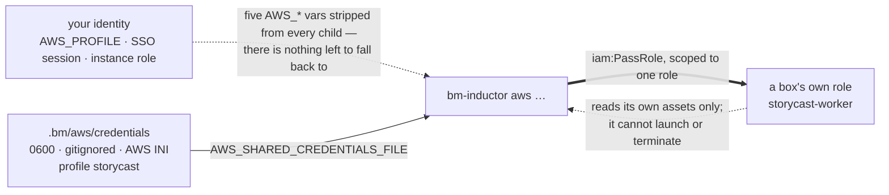

# AWS identity and IAM

How this app gets an AWS identity, and what that identity is allowed to do.
Everything here is derived from what the code actually calls — the `aws` argv
built in `bm_core::provision::aws` and the credential resolution in
`bm_core::provision::aws_credentials`.

**Creating the identity is [AWS-IAM-USER.md](AWS-IAM-USER.md).** This file is
what it is, where it lives, and why.

## Two identities, and they are not the same one

| | who it is | what it needs |
|---|---|---|
| **The operator's** | an **IAM user created for this app**, stored by `bm-inductor aws login` | EC2, to create and destroy boxes |
| **The worker's** | the role attached to each box | read the asset plane (S3), once that is wired |

(A **box** is the repo's word for a machine running a worker — here, one EC2
instance. `LinkedBox` is the type, "onboard a box" the verb.)

They are separate on purpose. The operator's key never goes on a box, and a box
that is compromised cannot launch or terminate anything — it can only read its
own assets. Do not be tempted to reuse one for both.



The dotted edge is the one to read twice: it is a *non*-edge. The app does not
consult your identity at all, and the box cannot act as the operator.

## Where the operator's credentials live

**One place: `.bm/aws/credentials`.** 0600, gitignored, written in **AWS's own
INI format** by `bm-inductor aws login`.

There is no second source and no fallback. That is the design, not an omission:

- **The app runs as one named user, or it does not run.** No file means the next
  AWS command is refused, naming the fix. It does not become whatever this
  machine happens to be — an `AWS_PROFILE`, an SSO session, an instance role.
  A fallback is silent, and silence is what makes "why did it work on my
  machine" unanswerable.
- **Revoking the key is an actual revocation.** With a chain behind it, deleting
  the key would leave the app running happily as somebody else.
- **The pool definition stays shareable.** Two people with the same repo and
  different accounts each log in as their own user, and neither can commit the
  other's key.

`bm-inductor aws show` names the user and the account it will act as, as its
first line.

### Why the app has a file of its own

Not to invent a config format — to avoid one. The `aws` CLI already parses that
format and already knows the precedence rules, so no secret is ever parsed,
logged or re-serialised by this code. It shells out with
`AWS_SHARED_CREDENTIALS_FILE` and `AWS_PROFILE` in the child's environment and
the CLI does the rest. The file stays exactly as portable as
`~/.aws/credentials`.

### The shell cannot override it

Environment-variable keys outrank a shared credentials file in the CLI's own
resolution order, so a stray `AWS_ACCESS_KEY_ID` exported in the shell would win
silently while `aws show` reported the IAM user. Every `aws` child process the
app starts therefore has these removed first:

```
AWS_ACCESS_KEY_ID  AWS_SECRET_ACCESS_KEY  AWS_SESSION_TOKEN
AWS_PROFILE  AWS_DEFAULT_PROFILE
```

A credential source that can be overridden without saying so is not a source.
(`AWS_CONFIG_FILE` is left alone: it carries region and endpoint settings, and
none of the five above.)

## Registering the user's key

```sh
bm-inductor aws login --csv ~/Downloads/accessKeys.csv
```

In the dashboard this is `:login` — the prompt asks for the same CSV path, and
nothing else, because a screen has nowhere to type a secret without echoing it.
`aws discover` has the matching `:discover`, taking the same flags. Both run the
same `aws_ops` verbs, so neither front end has its own copy of the
verify-then-write order.

The CSV is the one the console's **Download .csv file** button gives you when you
create the access key, so the usual path is: click, then hand over the file. The
two values are read out of it by column name, so a BOM, CRLF, quoted fields or
extra columns all still work.

To type them instead, omit `--csv`:

```sh
bm-inductor aws login --access-key-id AKIA…
```

and it prompts for the secret. The secret is read from **stdin and never taken
as an argument** — `argv` is visible in `ps` on every box it was typed on. It is
hidden with `stty -echo` when stdin is a terminal, and read plainly when piped,
so a script works:

```sh
printf '%s\n' "$AWS_SECRET_ACCESS_KEY" | bm-inductor aws login --access-key-id AKIA…
```

What it does, in order:

1. Verifies the key with `sts get-caller-identity`.
2. **Refuses unless the identity is an IAM user** (`…:user/…`). A root key or an
   assumed role is the identity this replaced, so it is rejected and nothing is
   written — writing first would leave a file the next `aws ls` would quietly
   run as.
3. Writes `.bm/aws/credentials`, mode 0600, recording the user's ARN and account
   as comments so `aws show` can name them with no network call.
4. Prints the **key id** (an identifier, like a username) and a **hash prefix**
   of the secret — enough to confirm *which* key is loaded, never the key.

Step 1 needs no permission of its own — AWS documents `sts:GetCallerIdentity` as
requiring none — so it works before the policy is attached. That ordering is
deliberate: prove the *identity*, then prove the *permissions* with `aws ls`.

When the account cannot be reached at all (offline, no CLI, policy not attached
yet) the key is stored **unverified**, and `aws show` says so rather than
pretending.

To hand the machine back its own identity, delete the file:

```sh
rm .bm/aws/credentials
```

The next AWS command then refuses — it does not fall back. That is the point.

## The policy

The operator user's least-privilege policy is the tracked
[`aws-policy.json`](../aws-policy.json). `bm-inductor aws policy` prints it along
with the commands that create the user and attach it.
[AWS-IAM-USER.md](AWS-IAM-USER.md#1-create-the-policy) has the paste-ready
document — the two placeholders `<ACCOUNT_ID>` and `<WORKER_ROLE>` already filled
in for the names used there — and
[AWS-IAM-USER.md](AWS-IAM-USER.md#what-the-policy-grants-and-why-each-piece)
explains it statement by statement.

One document, used by both the command that prints it and the
`aws iam put-user-policy` that installs it — so what you read and what you
install cannot drift apart. That is also why `aws init` no longer recites a
hand-maintained action list.

**Nothing account-wide, no billing, no S3 write, no IAM beyond passing that one
role.** The policy cannot create users or read a bucket.

## The worker's role

The instance profile attached to each box. It needs read access to the asset
plane, once the S3 publish step exists:

```json
{
  "Version": "2012-10-17",
  "Statement": [
    {
      "Effect": "Allow",
      "Action": "s3:GetObject",
      "Resource": "arn:aws:s3:::<BUCKET>/profiles/*"
    },
    {
      "Effect": "Allow",
      "Action": "s3:ListBucket",
      "Resource": "arn:aws:s3:::<BUCKET>",
      "Condition": {
        "StringLike": { "s3:prefix": "profiles/*" }
      }
    }
  ]
}
```

No write, no delete, no other prefix. **S3 is designed but not wired yet** —
`bm_core::provision::profile_object` computes the key, and nothing calls it. If
you leave `bucket` empty in the pool definition, assets are rsynced from the
inductor instead and this role needs no permissions at all — but the role itself
is still required, because every launch names an instance profile.

## One-off setup

These are deliberately not automated — they create account-level things that
should be a decision, not a side effect. All of it is console work, and it is
[AWS-IAM-USER.md](AWS-IAM-USER.md) steps 1–6: the policy, the IAM user, its
access key, the worker role, the SSH keypair, and the security group the boxes sit
behind.

The policy cannot touch firewall rules — no `ec2:CreateSecurityGroup`, no
`ec2:AuthorizeSecurityGroupIngress` — so opening port 22 is deliberately a
separate, human act, not something a launch can do to itself. On a connection
whose address moves, the usual answer is `0.0.0.0/0` with key-only auth rather
than a `/32` that stops matching; the reasoning is in
[AWS-IAM-USER.md](AWS-IAM-USER.md#which-source-address-if-your-ip-rotates).

Two of those the app then finishes for you, so there is nothing to look up by
hand:

```sh
# The keypair's .pem, where the boxes expect it (0600). The console names the
# download after the key pair, so the name is filled in from the file too.
bm-inductor aws discover --region <region> --pem ~/Downloads/storycast.pem

# The AMI for that region, resolved from Canonical's public parameter and
# written into `.bm/aws.json` — explicit and reviewable, never re-resolved
# behind you. `--ami ami-…` is how you pin a different one.
bm-inductor aws discover --region <region>
```

A keypair is **per region**, which is why `keypairs` is a map: an EC2 keypair
belongs to exactly one region, and a name that exists in one is not a keypair in
another. Changing region means creating a keypair there and running `discover`
again.

The AMI must be a literal `ami-…` — the value is also passed to
`describe-images` to resolve the root device, which does not accept an SSM
reference.

## Verifying

```sh
bm-inductor aws show     # names the IAM user, then what is still missing
bm-inductor aws ls       # the real test: reaches the API and lists tagged boxes
```

`aws ls` is the credential check — if it answers, `aws up` can too. It fails in
three distinguishable ways and says which: the stored key was not accepted, the
key is stale or deleted, or the user is not allowed to make the call. The last
one is a policy problem, not a key problem.

To test the policy without creating anything, AWS's own mechanism is `--dry-run`,
which performs the authorization check and stops:

```sh
aws ec2 run-instances --dry-run --image-id ami-… --instance-type c7i.xlarge \
    --count 1 --region <region> --output json
```

`DryRunOperation` means the permissions are right; `UnauthorizedOperation` names
what is missing. Policy changes take a few minutes to propagate — if a fresh
policy still refuses, wait five minutes before changing anything.

## Rotating

```sh
aws iam create-access-key --user-name storycast-operator   # a second key
bm-inductor aws login --access-key-id AKIA…                # store the new one
aws iam delete-access-key --user-name storycast-operator \
    --access-key-id AKIA…                                  # the old one
```

Both keys work during the overlap, so there is no window in which the app cannot
reach AWS. To revoke everything immediately, just delete the key and
`rm .bm/aws/credentials` — the app then refuses rather than finding another way
in.
