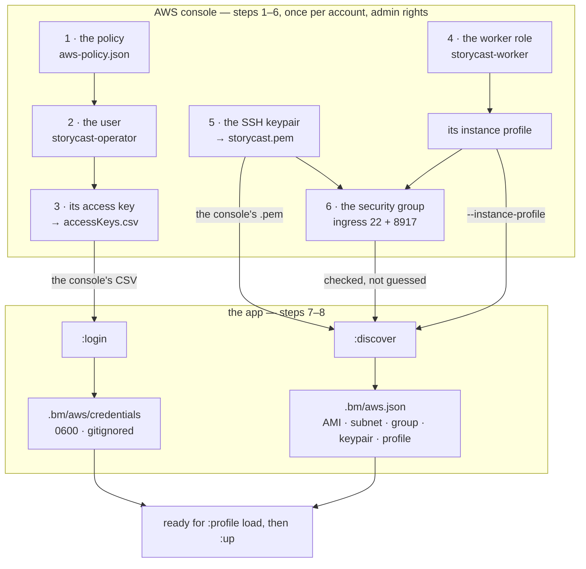

# Creating the IAM user this app runs as

The app talks to AWS as **one IAM user that exists for it alone** — not as you,
not as your machine's `AWS_PROFILE`, and not as a role borrowed from SSO.

**Everything is created in the [AWS Management Console](https://console.aws.amazon.com/iam/).**
No `aws` CLI command appears anywhere in this guide, and you do not have to
install it. **Steps 1–6** are console clicks, once per AWS account, by someone
with admin rights. **Steps 7–8** are the app's own two commands: the app is a
CLI, so there is no console equivalent for those — but they take the files the
console hands you and fill in the rest themselves.



Three things that diagram is trying to make obvious:

- **Steps 1–6 need permissions the created user deliberately does not have.**
  That is the split, not an oversight: if you are not an account admin, hand
  them this page and `aws-policy.json`.
- **Steps 4 and 5 are not optional.** `:up` refuses to launch without an
  instance profile, and a box you cannot log into cannot be provisioned.
- **The console hands over exactly two files** — `accessKeys.csv` and
  `storycast.pem` — and every other value in `.bm/aws.json` is *read off the
  account* by `:discover` rather than typed.

Read it once, top to bottom. The same steps 1–6 in a terminal are at the end, if
you prefer that.

## Why not just use your own credentials

Because of what the credentials can do. The operator's identity can launch
instances and terminate them, and it runs unattended from a shell script. Two
things follow:

- **The blast radius should be a name.** A dedicated user can be revoked — the
  key deleted, the policy detached — without touching anybody's laptop, SSO
  session or instance profile.
- **"Which identity is it using" should have one answer.** With the standard
  chain, the answer depends on the shell the command happened to run in. The app
  used to fall back to it silently; now there is nothing to fall back *to*, and
  `aws show` names the user it will act as before it acts.

The permissions are the same either way. What changes is that they belong to
something you can point at.

## What you end up with

| | |
|---|---|
| **The user** | `storycast-operator` — an IAM user with **no console access** and no groups |
| **Its policy** | [`aws-policy.json`](../aws-policy.json), attached directly to the user. EC2 to launch and destroy boxes, one lookup for the AMI, `iam:PassRole` on one role, and nothing else |
| **Its key** | One access key, stored in `.bm/aws/credentials` (0600, gitignored) by `bm-inductor aws login` |
| **The worker role** | `storycast-worker` — a *separate* role attached to each box, so a compromised box can read its own assets and cannot launch or terminate anything |
| **An SSH keypair** | Created in the console; its `.pem` is imported into `.bm/aws/` so boxes can be reached |

The last two rows are not optional: `aws up` refuses to launch without an
`iam_instance_profile`, and a box you cannot log into cannot be provisioned.

**"Box" is this repo's word for a machine that runs a worker** — in this guide,
one EC2 instance. `aws up --count 3` launches three boxes; each runs `bm-agent`
and is handed chapters to crawl, digest, render and merge. The word is used
throughout the code (`LinkedBox`, "onboard a box"), so it is worth knowing once.

## Part 1 — in the AWS console, once per account

Steps 1–6 need IAM and EC2 permissions (`iam:CreatePolicy`, `iam:CreateUser`,
`iam:CreateAccessKey`, `iam:CreateRole`, `ec2:CreateKeyPair`, …) that the user
being created deliberately does **not** have — that is the point of the split. If
you are not an account admin, hand them this page and
[`aws-policy.json`](../aws-policy.json).

### 1. Create the policy

**IAM → Policies → Create policy.**

1. Switch the editor to the **JSON** tab and replace the placeholder document.
2. Paste this, replacing `<YOUR_ACCOUNT_ID>` with your 12-digit account id:

   ```json
   {
     "Version": "2012-10-17",
     "Statement": [
       {
         "Sid": "ReadOnlyLookups",
         "Effect": "Allow",
         "Action": [
           "ec2:DescribeInstances",
           "ec2:DescribeImages",
           "ec2:DescribeSubnets",
           "ec2:DescribeSecurityGroups",
           "ec2:DescribeKeyPairs"
         ],
         "Resource": "*"
       },
       {
         "Sid": "ResolveTheAmi",
         "Effect": "Allow",
         "Action": "ssm:GetParameter",
         "Resource": "arn:aws:ssm:*::parameter/aws/service/canonical/ubuntu/*"
       },
       {
         "Sid": "SeeWhatExistsToChooseFrom",
         "Effect": "Allow",
         "Action": "iam:ListInstanceProfiles",
         "Resource": "*"
       },
       {
         "Sid": "LaunchAndTag",
         "Effect": "Allow",
         "Action": ["ec2:RunInstances", "ec2:CreateTags"],
         "Resource": "*"
       },
       {
         "Sid": "TerminateOnlyBoxesCarryingOurTag",
         "Effect": "Allow",
         "Action": "ec2:TerminateInstances",
         "Resource": "arn:aws:ec2:*:*:instance/*",
         "Condition": {
           "StringLike": { "aws:ResourceTag/storycast-worker": "*" }
         }
       },
       {
         "Sid": "HandTheBoxItsOwnRole",
         "Effect": "Allow",
         "Action": "iam:PassRole",
         "Resource": "arn:aws:iam::<YOUR_ACCOUNT_ID>:role/storycast-worker",
         "Condition": {
           "StringEquals": { "iam:PassedToService": "ec2.amazonaws.com" }
         }
       }
     ]
   }
   ```

   Your account id is in the **account menu at the top right** of the console —
   open it and copy the **Account ID**.

3. **Next**, then on the review page name it `storycast-operator` and choose
   **Create policy**.

`<YOUR_ACCOUNT_ID>` is the only thing to replace. This is exactly the tracked
[`aws-policy.json`](../aws-policy.json) with its two placeholders filled in — the
role name is already `storycast-worker`, which is what step 4 creates.

### 2. Create the user

**IAM → Users → Create user.**

1. **Specify user details** — for **User name** type `storycast-operator`.
   Leave **Provide user access to the AWS Management Console** **unticked**: the
   app is the only thing that needs this user, and a console password would be a
   second way in that nothing uses. Then **Next**.
2. **Set permissions** — choose **Attach policies directly** (not "Add user to
   group", not "Copy permissions"). Search for `storycast-operator`, tick the
   policy you just made, then **Next**.
3. **Tags** — skip. Choose **Create user**.
4. On the success page choose **View user** to go to the user's detail page.

### 3. Create its access key

Still on that user's page: the **Security credentials** tab → the **Access keys**
section → **Create access key**.

1. On **Access key best practices & alternatives**, choose your use case —
   **Command Line Interface (CLI)** is the honest one for this app — tick the
   acknowledgement that you still want a long-term key, then **Next**.
2. On **Set description tag** (optional), something like `storycast inductor`
   makes the key identifiable later. Choose **Create access key**.
3. On **Retrieve access key**, choose **Show**, then **Download .csv file**.

**This is the only time the secret is visible.** AWS does not show it again, and
neither does the app. Step 7 reads that file directly, so keep it until then.

If **Create access key** is greyed out, the user already has two keys — IAM
allows two per user, so delete one first.

### 4. Create the worker role

A separate identity, attached to the *boxes* rather than to anything you run.
Every launch names this role, so it has to exist before `aws up`.

**IAM → Roles → Create role.**

1. **Trusted entity type** — **AWS service**.
2. **Service or use case** — **EC2**. Then **Next**.
3. **Permissions policies** — leave it empty and choose **Next**. The worker role
   needs nothing unless you publish the asset plane to S3 (below).
4. **Name, review, and create** — for **Role name** type `storycast-worker`.
   Choose **Create role**.

The console creates the matching **instance profile** for you, with the same
name — that is the name that goes in `iam_instance_profile`. (With the CLI you
have to create the instance profile yourself and add the role to it; see the CLI
section.)

**Only if you set `bucket` in the pool definition:** open the role → the
**Permissions** tab → **Add permissions** → **Create inline policy** → **JSON**,
and paste the S3 read policy from
[AWS-CREDENTIALS.md](AWS-CREDENTIALS.md#the-workers-role). With `bucket` empty
the boxes rsync their assets from your machine and the role needs nothing.

### 5. Create the SSH keypair

This is how you get into a box afterwards — to provision it, and to read a log
when something goes wrong.

**Check the region selector at the top right of the console first.** An EC2
keypair belongs to exactly one region, and a keypair created in one is invisible
in another — so a keypair made with the wrong region selected looks fine, imports
fine, and then fails at launch with *"The key pair 'storycast' does not exist"*.
The selector is nowhere near the button that creates the pair, which is what
makes this easy to get wrong. It must match the `region` you give `discover` in
step 8.

**EC2 → Network & Security → Key pairs → Create key pair.**

1. **Name** — `storycast`.
2. **Key pair type** — RSA. **Private key file format** — `.pem` (this is what
   `ssh` wants; the `.ppk` option is for PuTTY).
3. **Create key pair.**

The browser downloads `storycast.pem`. **That is the only copy** — AWS keeps the
public half and cannot give you the private half again. Step 8 imports it; if you
lose it, create a new keypair and re-import.

`discover` names the keypair from the file name and then **checks it against the
region**, so getting this wrong costs you a sentence rather than a failed launch:

```
keypair storycast   — WARNING: eu-central-1 has no such keypair (it has none)
  EC2 keypairs are region-scoped. Create one in eu-central-1 (the console's
  region selector must match), or point --region at the one you have.
```

Note it will not write the name into the pool when it cannot find it — a pool
that says "ready" while the launch would be refused is worse than one that says
what is missing.

### 6. Create the security group

The firewall in front of the boxes. Worth doing by hand rather than letting
`discover` pick: it otherwise fills in the account's **default** group, which is
shared with everything else in your default VPC — and which has no inbound rule
that admits you.

**Check the region selector at the top right first — the same trap as the
keypair.** A security group belongs to one region *and* one VPC, so a group made
with the wrong region selected is invisible to everything below. `discover`
refuses an id it cannot read rather than launching into it, so you get a sentence
instead of an `InvalidGroup.NotFound` at launch:

```
security group sg-0e54641a60163fb3a   — WARNING: not readable in eu-central-1
  a group belongs to one region and one VPC — check the console's region
  selector, or pass --region to match
```

**EC2 → Network & Security → Security Groups → Create security group.**

1. **Name** — `storycast-workers`. **VPC** — the same one as the subnet
   `discover` picked (the default VPC, unless you have your own).
2. **Inbound rules** — **two**, both from wherever you run the inductor:
   - **SSH (22)** — provisioning pushes the mirror in over ssh + rsync.
   - **Custom TCP (8917)** — the inductor driving the box. The transport is
     inverted, so the *inductor* makes this call: `GET /status`, `POST /task`,
     `GET /unit`, `POST /shutdown`. Every request carries the cluster token
     (`Authorization: Bearer …`), which provisioning copies to the box — and a
     box with no token refuses to serve at all.

   Source **Anywhere-IPv4** (`0.0.0.0/0`). See below before you use *My IP*
   instead.
3. **Outbound rules** — leave the default (all traffic).
4. **Create security group.** Copy the `sg-…` id and pass it to `discover` in
   step 8 as `--security-group sg-…`.

**Missing the task port is the quieter of the two mistakes**, and worth
understanding before you launch anything: a box with 22 open and 8917 closed
starts, accepts ssh, looks perfectly healthy in the console, and is never once
driven — it sits at `Offline` in the dashboard for ever. A closed 22 at least
hangs loudly. `discover` checks both and says which is missing.

#### What the boxes do *not* need to reach

The outbound rules are wide open, and that is correct — but not for the reason
it is tempting to assume. **Nothing on a box ever dials the inductor.** That is
the design, not a setting: a launched worker is given no inductor address at all,
so it cannot call home, and the guarantee is the absence of the argument.

What the egress is actually for:

| | |
|---|---|
| **Chapter URLs** | the worker crawls them, and that is a real internet fetch |
| **S3** | if you set `bucket`, the box pulls its own asset plane (not wired yet) |
| **The Gemini API** | only if you use that engine rather than VieNeu |
| **The inductor** | **never.** The inductor dials the box, not the other way round |

You can skip this whole step and let `discover` use the default group — but then
the rules have to go on the shared group, where they apply to every instance
using it.

#### Which source address, if your IP rotates

The console's **My IP** button fills in a `/32` — a single address. That is right
for a fixed connection and wrong for a moving one: the rule stops matching the
moment your ISP moves you, and the symptom is an `ssh` that hangs with nothing in
any log. If your address changes often, use **Anywhere-IPv4**.

That sounds worse than it is, because the `/32` was never the actual control:

- **Authentication is key-only.** Ubuntu's cloud images ship with password
  authentication disabled (`cloud-init` writes `PasswordAuthentication no`) and
  the `ubuntu` user has no password, so the private key is the only way in. Check
  it on a box once with `sudo sshd -T | grep -i passwordauth` — it should answer
  `no`.
- **Nothing else is listening.** The worker binds a task port that only the
  inductor calls, and the TTS sidecar is on loopback.

What you accept is scanner noise: port 22 is found within minutes and usernames
get tried. They cannot get past a key. What you avoid is being locked out of a
running box because your address moved.

**If you would rather keep it narrow**, the rule has to follow you: revoke the old
`/32` and authorize the new one whenever your address changes. That needs
`ec2:AuthorizeSecurityGroupIngress` and `ec2:RevokeSecurityGroupIngress` added to
the policy plus something scheduled to run it — the app does not do this, and it
is exactly the sort of helper that fails silently at the moment you need it. A
middle path: use *My IP* while you are working and delete the rule afterwards.
The boxes are short-lived anyway (spot, `ttl_hours`, idle auto-off).

## Part 2 — the app's half

Two commands. The first takes the CSV the console gave you, the second takes the
`.pem`, and between them they fill in everything else by asking AWS — so nothing
is looked up by hand, and nothing is re-resolved on the next launch.

**In the dashboard these are `:login` and `:discover`** — the same `aws_ops`
code, so use whichever you are already in (the prompt for `:login` asks for the
CSV path; `:discover` takes the same flags as below). The commands here are the
CLI spelling, for a scripted or headless run.

### 7. Store the key

```sh
bm-inductor aws login --csv ~/Downloads/accessKeys.csv
```

The CSV is the file **Download .csv file** gave you in step 3. It already holds
both halves, so there are no prompts to paste into. (If you would rather type
them, `bm-inductor aws login --access-key-id AKIA…` prompts for the secret from
stdin — never from an argument, because `argv` is visible in `ps`.)

It writes `.bm/aws/credentials`, mode 0600, in AWS's own INI format, and nowhere
else. What it does, in order:

1. Calls `sts get-caller-identity` with the key you supplied.
2. **Refuses unless the answer is an IAM user** (`…:user/…`). A root key or an
   assumed role is the identity this whole exercise replaces, so it is rejected
   and nothing is written.
3. Writes the file, recording the user's ARN and account as comments.
4. Prints the key id and a **hash prefix** of the secret — enough to confirm
   *which* key is loaded, never the key.

Step 2 can pass before the policy is attached: `sts:GetCallerIdentity` needs no
permission of its own. That is deliberate — it proves the *identity* first, and
the next step proves the *permissions*.

### 8. Let it fill in the pool

```sh
bm-inductor aws discover --region eu-central-1 \
    --pem ~/Downloads/storycast.pem \
    --instance-profile storycast-worker
```

That is the whole configuration step. It looks up what a console page cannot hand
you as a copy-paste, prints each answer, and writes it into `.bm/aws.json`:

| | where it comes from |
|---|---|
| `images.<region>` | the current Ubuntu LTS AMI, via SSM — the one field you would otherwise hunt through the AMI catalogue for |
| `subnet_id` | the default VPC's default subnet |
| `security_group_id` | the default security group |
| `keypairs.<region>` | the name of the `.pem` you passed, since the console names the download after the key pair |
| `iam_instance_profile` | `--instance-profile`, or the only one in the account if you leave it off |

Everything it learns is **written down and printed**, so the choice stays visible
and reviewable rather than being re-resolved behind your back on every launch.

**Three flags name what the account cannot choose for you.** Each is checked
before it is written, so a typo costs a sentence rather than a failed launch.

`--instance-profile` is only optional when the account holds exactly one — an
account that also runs something else will have more, and `discover` will not
guess between them: it lists them and leaves the field empty. Naming one is
checked against the account, so a typo is caught here rather than at
`RunInstances`:

```
instance profile storycast-wroker   — WARNING: not in this account, which has 2:
                                      rodeo893-prod-instance, storycast-worker
  the launch will refuse until the name matches
```

`--security-group` and `--subnet` name the other two. They matter when the
defaults are wrong for you: the default group is shared with everything else in
the default VPC, and the default subnet is one AZ out of several. Both are kept
if you name them, and re-checked — `--security-group` re-runs the port-22 check
against *your* group rather than the one it would have picked.

**Re-importing a key takes `--force`.** `discover` compares the `.pem` you pass
with the one already in `.bm/aws/`: identical is nothing to do, *different* means
a key is being replaced — and the old private half cannot be recovered from AWS,
so that is not automatic:

```
key .bm/aws/eu-central-1.pem already exists and is a DIFFERENT key — pass --force to replace it
```

The distinction is worth knowing, because the two claims are separate: the
**launch** is ready either way (the box gets the public half from AWS, not from
your file), so a stale local key would let you start a box you then cannot log
into. `discover` says which of the two it means rather than reporting a flat
"ready".

Then:

```sh
bm-inductor aws show     # names the IAM user, then what is still missing
bm-inductor aws ls       # the real check: reaches the API as that user
```

`aws ls` fails in three distinguishable ways and says which: the key was not
accepted, the key is stale or deleted, or the user is not allowed to make the
call. The last one means the policy is wrong, not the key — re-run
`bm-inductor aws policy` and compare.

**The one thing `discover` cannot do for you is open port 22.** It checks, and
tells you:

```
security group sg-0fe0cc48ab8ca3bc0   (kept)
  NOTE: no inbound rule admits you, so ssh will HANG (not refuse):
  EC2 → Security Groups → sg-0fe0cc48ab8ca3bc0 → Edit inbound rules → Add rule → SSH → My IP
```

Worth understanding, because the failure is invisible: a closed port does not
*refuse* an ssh connection, it **swallows** it. No error, no log line, just a hang.
So the check is read off the group itself rather than assumed from its name — and
a rule that names only the group does not count, because that is group-to-group
traffic, not you.

**Where that rule goes is a real choice, and the default group is usually the
wrong place for it.** It is shared: anything else in the default VPC using it —
including a production deployment you already have — gets the new rule too. A
group of your own costs nothing and changes nothing else:

1. EC2 → Security Groups → **Create security group**, name it `storycast-workers`,
   same VPC as the subnet, inbound rule **SSH from My IP**, no other rules.
2. `bm-inductor aws discover --region <region> --security-group sg-…` — `discover`
   keeps what you name and re-checks *that* group's ingress, so you find out here
   rather than from a hung ssh.

Next: [AWS-WORKERS.md](AWS-WORKERS.md) — `aws up --dry-run`, then `aws up`, then
onboarding the boxes.

## The same thing with the AWS CLI

Steps 1–6 again, for a terminal. Everything here is one-shot account setup and
needs admin rights. Nothing in Part 2 changes: `aws login --csv` and
`aws discover` are the app's own commands either way.

```sh
# 1. the policy, with the placeholders filled in
mkdir -p .bm
ACCOUNT_ID=$(aws sts get-caller-identity --query Account --output text)
sed -e "s/<ACCOUNT_ID>/$ACCOUNT_ID/" -e "s/<WORKER_ROLE>/storycast-worker/" \
    aws-policy.json > .bm/aws-policy.json
aws iam create-policy --policy-name storycast-operator \
    --policy-document file://.bm/aws-policy.json

# 2. the user, and the policy attached to it
aws iam create-user --user-name storycast-operator
aws iam attach-user-policy --user-name storycast-operator \
    --policy-arn arn:aws:iam::$ACCOUNT_ID:policy/storycast-operator

# 3. the access key — the secret is printed once and never again
aws iam create-access-key --user-name storycast-operator

# 4. the worker role, plus the instance profile the console would have made
cat > .bm/trust.json <<'EOF'
{
  "Version": "2012-10-17",
  "Statement": [
    {
      "Effect": "Allow",
      "Principal": { "Service": "ec2.amazonaws.com" },
      "Action": "sts:AssumeRole"
    }
  ]
}
EOF
aws iam create-role --role-name storycast-worker \
    --assume-role-policy-document file://.bm/trust.json
aws iam create-instance-profile --instance-profile-name storycast-worker
aws iam add-role-to-instance-profile \
    --instance-profile-name storycast-worker --role-name storycast-worker

# 5. the keypair — the console downloads the .pem, the CLI prints it to stdout,
#    so redirect it or you have no private half at all
aws ec2 create-key-pair --key-name storycast --region <region> \
    --query KeyMaterial --output text > .bm/aws/<region>.pem
chmod 600 .bm/aws/<region>.pem

# 6. the security group — 22 for provisioning, 8917 for the inductor driving
#    the box, 0.0.0.0/0 because auth is key-only and the alternative locks you
#    out when your address moves (see step 6 above)
aws ec2 create-security-group --group-name storycast-workers \
    --description "storycast workers: ssh + task port" --region <region> \
    --query GroupId --output text
aws ec2 authorize-security-group-ingress --group-name storycast-workers \
    --region <region> --protocol tcp --port 22 --cidr 0.0.0.0/0
aws ec2 authorize-security-group-ingress --group-name storycast-workers \
    --region <region> --protocol tcp --port 8917 --cidr 0.0.0.0/0
```

Two differences from the console worth knowing. `attach-user-policy` attaches a
*managed* policy, while the console walkthrough attaches an inline one to the
user — both work, and the CLI form is easier to re-run. And the instance profile
is **not** created for you here, which is why it takes three commands instead of
none.

Step 5 is the other asymmetry, and the more dangerous one: `create-key-pair`
prints the private key to **stdout** and stores nothing, so if you run it without
the redirect the key is gone and only the public half remains. The console cannot
get this wrong. (With `--pem` already in hand, `aws discover` imports the
downloaded file for you and this step is not needed at all.)

Step 6 needs `ec2:CreateSecurityGroup` and `ec2:AuthorizeSecurityGroupIngress`,
which the operator policy does **not** grant — so run it as an admin, or do it in
the console. The policy deliberately cannot manage firewall rules.

## What the policy grants, and why each piece

The JSON in step 1, statement by statement:

- **`ReadOnlyLookups` is a separate statement with no condition.** EC2
  `Describe*` actions do not support resource-level permissions, so they must not
  be mixed into a statement that carries a `Resource` or a `Condition` — AWS's
  own guidance is to keep them apart.
- **`ec2:DescribeInstances`** — `aws ls`, the cap check in `aws up`, and the
  instance list `aws down` resolves before terminating.
- **`ec2:DescribeImages`** — `aws up` resolves the AMI's root device name from
  the image, so `disk_gb` is honoured on any image rather than silently ignored
  on half of them.
- **`ec2:DescribeSubnets` / `DescribeSecurityGroups` / `DescribeKeyPairs`** — not
  called directly by a launch. `RunInstances` validates against them, and
  `discover` reads them to fill in the pool; a read-only describe costs nothing
  to include and saves a debugging round.
- **`ResolveTheAmi`** — `ssm:GetParameter`, scoped to Canonical's own public
  Ubuntu parameters (`arn:aws:ssm:*::parameter/aws/service/canonical/ubuntu/*`,
  where the empty account field is what marks a public parameter). It is the one
  lookup that exists so nobody has to find an `ami-…` by hand. Read-only, one
  value, and the result is written into `.bm/aws.json` — so if you would rather
  pin a specific image, set `images.<region>` and this permission is never used.
- **`SeeWhatExistsToChooseFrom`** — `iam:ListInstanceProfiles`, so `discover` can
  see the role you created in step 4 instead of making you type its name. It
  lists names only; it cannot read a policy or create anything.
- **`ec2:RunInstances` on `"*"`** — the instance does not exist yet, so this
  action cannot be scoped to one. The tag condition below is what limits the
  damage.
- **`ec2:CreateTags`** — required for the `--tag-specifications` that stamps
  every box with the marker tag. That tag is the safety mechanism, not
  decoration: `aws down` filters on it and terminates **by explicit id**, so a
  box without it is one this tool can never terminate by accident — including a
  stranger's.
- **`ec2:TerminateInstances` scoped by tag** — this is the one that matters.
  Without the condition, the user can terminate anything in the account. With it,
  only instances carrying `storycast-worker` (any value — the value is the
  profile hash). An untagged instance does not satisfy the condition and is
  refused.
- **`iam:PassRole`** — needed because `RunInstances` attaches the instance
  profile. Scoped to one role and to EC2 as the target service, so this cannot be
  used to hand an arbitrary role to an arbitrary service.

**Nothing account-wide, no billing, no S3 write, no IAM beyond passing that one
role and listing instance profile names.** The user cannot create other users,
read a bucket, or delete a volume.

### One caveat, stated plainly

Tag-based restrictions can be circumvented by anything that can *change* the tag
— the policy grants `ec2:CreateTags`, so this user could in principle retag a box
and then terminate it. That is not a hole in the threat model this is for
(limiting the blast radius of the operator's own key), but it is not a hard
security boundary either. Treat the tag condition as protection against mistakes,
which is what it is for.

## Rotating and revoking

In the console, rotation without downtime is: open the user → **Security
credentials** → **Create access key** again (a second key is allowed), store the
new CSV with `bm-inductor aws login --csv`, then select the old key → **Actions**
→ **Deactivate**, and **Delete** once nothing has used it. The same thing in a
terminal:

```sh
aws iam create-access-key --user-name storycast-operator   # a second key
bm-inductor aws login --csv ~/Downloads/accessKeys.csv     # store the new one
aws iam delete-access-key --user-name storycast-operator \
    --access-key-id AKIA…                                  # the old one
```

Revoking everything the app can do, immediately:

```sh
aws iam delete-access-key --user-name storycast-operator --access-key-id AKIA…
```

The next command the app runs refuses, naming the missing key. To also take the
machine-local copy out of the picture:

```sh
rm .bm/aws/credentials
```

That is the whole story now — there is no chain behind it for the app to fall
back to, which is what makes revoking the key an actual revocation.

## What this does not do

- **It does not give the app your identity.** `AWS_PROFILE`, SSO, an instance
  role and `AWS_ACCESS_KEY_ID` in the shell are all removed from every `aws`
  child process the app starts, so none of them can win silently. The IAM user is
  the identity, or there is no identity.
- **It does not create the user for you.** Steps 1–6 create account-level things
  and are a decision rather than a side effect, so they stay explicit — in the
  console or in the terminal, your choice.
- **It does not store anything in the repo.** The policy is tracked because it is
  not a secret. The key is not: `.bm/` is gitignored, and the credentials file is
  0600 by construction and refused if it is ever not.

The AMI you end up with is the current Ubuntu LTS at the moment you ran
`discover`. It is written into `.bm/aws.json`, so it will not move under you:
running `discover` again leaves it alone, and `--ami ami-…` is how you move it
deliberately. Nothing is re-resolved behind your back.
