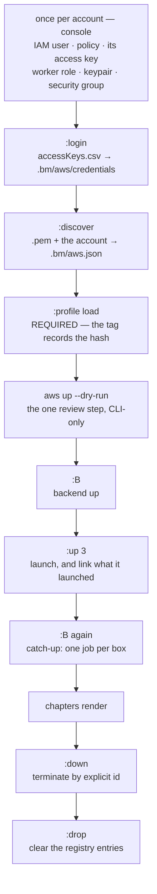

# AWS workers — the guide

The whole path from an empty AWS account to workers rendering chapters: the
order to do it in, what to expect at each step, and what is deliberately not
built yet.

Read [AWS-CREDENTIALS.md](AWS-CREDENTIALS.md) alongside this — the account
setup is the only part that needs something from you that the tool cannot do
itself. Creating it is [AWS-IAM-USER.md](AWS-IAM-USER.md).

## The short path — zero to a worker on EC2

If you just want it running, this is the whole sequence. The sections after this
explain *why* each one is shaped that way; this is the *what*.



Two steps in that chain are the ones people skip and regret: **`:profile load`
before `:up`** (a launch with no loaded profile is refused), and **`aws up
--dry-run`** before the first real spend.

**It is driven from the TUI.** Storing the key, reading the account into the
pool, launching, linking, provisioning, starting workers and destroying boxes are
all `:` commands. The only step outside the dashboard is the AWS **console** —
creating the IAM user, its access key, the keypair and the security group — and
that is browser work because AWS offers no other way to create them. Nothing in
this guide needs a terminal.

**Once per account** — console clicks, no CLI needed, and it blocks everything
else: create the IAM user, attach [`aws-policy.json`](../aws-policy.json), create
its access key, create the `storycast-worker` role the boxes assume, the SSH
keypair, and the security group. [AWS-IAM-USER.md](AWS-IAM-USER.md) steps 1–6
walks it.

**Two files are the only things you download by hand.** Nothing else is copied,
placed, or edited — no file is dropped into the repo, and neither of these goes
in it (both land under the gitignored `.bm/aws/`). Every other value the tool
reads off the account itself.

| File | Where it comes from (console) | The command that takes it | Where it lands |
|---|---|---|---|
| `accessKeys.csv` | **IAM → Users → `storycast-operator` → Security credentials → Access keys → Create access key → Download .csv file.** Usually lands in `~/Downloads/`. **The secret is shown this once** — AWS never shows it again. | `:login` — the prompt asks for the path, prefilled `~/Downloads/accessKeys.csv` | `.bm/aws/credentials` (0600, AWS's own INI format) |
| `storycast.pem` | **EC2 → Network & Security → Key pairs → Create key pair** (name `storycast`, type **RSA**, format **`.pem`**). The browser downloads `storycast.pem` for you. AWS keeps only the public half — **this is the only copy**. | `:discover --region eu-central-1 --pem ~/Downloads/storycast.pem` | `.bm/aws/eu-central-1.pem` (0600) |

So you hand the two files over with two `:` commands — `:login` for the CSV and
`:discover` for the `.pem` — and the tool copies the key to where the boxes
expect it and never asks for the path again. A leading `~/` is expanded for you,
because a prompt has no shell to do it. (Lost the CSV? Create a second access key
— a user may hold two. Lost the `.pem`? AWS cannot re-issue it; make a new
keypair and re-import with `--force`.
[AWS-CREDENTIALS.md](AWS-CREDENTIALS.md#rotating) has the rotation commands.)

A key id alone is refused by `:login` on purpose: the TUI has nowhere to type a
secret without echoing it, so the console's CSV — which carries both halves — is
the only login route a dashboard offers.

Click-by-click for both, including the region trap on the keypair, is
[AWS-IAM-USER.md](AWS-IAM-USER.md) steps 3 and 5.

**Once per pool** — those two `:` commands are the whole setup. `:login` verifies
the key is an IAM user *before* storing it, and names the account it stored;
`:discover` reaches AWS for everything else and writes it down, so you never open
or edit `.bm/aws.json` unless you want to change `region` — the only field that
is ever yours to type. Both stream their lines into the event pane, exactly as
the CLI prints them; the two front ends run the same `aws_ops` verbs, so `:login`
cannot accept a key the CLI would reject.

**Load a profile — before you launch anything.** Every box carries a marker tag
whose *value is the profile hash it was launched for*, and a launch with no
loaded profile is refused (`the marker tag records which profile a box was built
for`). A fresh clone has the example `assets/` + `prompts/` but no
`.bm/profile`, so seed one from the shipped tree:

`:profile` → `pack default`, then `:profile` → `default`. If you publish bundles
as GitHub releases, `:profile` → `default` loads one you have fetched; the fetch
itself is `tools/profile.sh fetch <name>`, an implementation note rather than a
step in this guide (the `:profile` screen runs that script for pack, unpack and
list too).

**Look before you spend (CLI-only).** The dashboard's `:up` has no dry run, so
this single review step is still a terminal command — it makes no call at all,
and works even before the account is ready:

```sh
bm-inductor aws up --count 3 --dry-run
```

**Then, in the TUI** (`make tui`) — the launch links what it starts, so there is
no `aws ls` → `:add` copy-paste step:

| | |
|---|---|
| `:B` | backend up. `:up` and `:prov` `POST` to the API, so nothing works without this |
| `:up 3` | launch three tagged boxes; each is registered with the pool's `.pem` (`AwsConfig::key_file()`) and `ssh_user` |
| `:pool` (`l`) | the Cloud view: what the account holds, and what is `not linked` |
| `:B` again | the catch-up: every linked box that is **not already working** gets its own provision-and-start job, all at once. A box already `online` is skipped and says so — re-provisioning a working box is what used to make this slow. `p` is the deliberate re-provision |
| `↓` then `:prov` (`p`) | provision one box and start its worker, if you prefer per-box control |

`:up` asks nothing before it spends — the guard that matters is `max_workers` in
`.bm/aws.json`, checked against what the account already holds. Review the call
with `bm-inductor aws up --dry-run` first if you want to see it.

Then queue a chapter as usual and watch it go crawl → digest → render → merge.

**Stop** — terminate by explicit id, or let the work finish and stop the workers:

```sh
bm-inductor aws down --dry-run   # lists what it would terminate
bm-inductor aws down             # terminate by explicit id, never a filter
```

In the TUI, `:down` (`o`) does the same behind a `danger` confirmation and
refuses while a render is in flight on one of the boxes (`:down force`
overrides). **It works from the Cloud view, so run `:pool` (`l`) first** —
`:down` with no listing yet refuses and says so, rather than guessing at ids.
The terminated boxes' registry entries stay until you `:drop` them.
Termination is always explicit: the idle timer stops *work*, it does not destroy
infrastructure.

## Where this stands

Built and proven on real chapters:

- **The transport is inverted.** The inductor drives; a worker is a server that
  answers `GET /status`, `POST /task`, `GET /unit`, `POST /shutdown`. A launched
  worker is given **no inductor address at all**, so it cannot call home — the
  guarantee is the absence of the argument, not a flag. Verified with `lsof`:
  no outbound connection, ever.
- **Merge runs where the segments are** — on the box that rendered the chapter,
  carried as task affinity. It used to be pinned to the literal `127.0.0.1`,
  which meant a cluster of remote workers rendered for ever and never merged.
- **A remote-shaped run works end to end**: a worker at a non-loopback address
  with its own root rendered 37 units, the inductor fetched all 37 over
  `GET /unit`, the merge ran on that worker, and the mp3 came home in the
  report. 487.6 s, 48 kHz mono, identical on both sides.
- **Idle auto-off**: `Settings.idle_mins` (default 5, `0` disables). The
  dispatcher arms it, tells each worker to stop, and exits. A worker also exits
  on its own after the same silence plus a margin, which covers an inductor that
  died without saying goodbye.

That is the *cluster* half, and it is real. The **AWS half is built but has never
been exercised** — the verbs exist (`aws policy`, `aws login`, `aws init`,
`aws discover`, `aws show`, `aws ls`, `aws up`, `aws down`), the argv they build
is unit-tested, and the read-only ones have been checked against a stub `aws` on
`PATH`. Nothing has touched an account. The last section lists what is missing
and how that was established.

## The same steps, as commands

**The dashboard covers all of this** — the short path above is the intended
route. What follows is the identical sequence spelled as commands, including the
CLI spellings of the same verbs, kept for a headless or scripted run.

### 1. The IAM user, its policy, and the key

Yours, and it blocks everything else. **The app runs as an IAM user created for
it** — not as your own machine's AWS identity, which is what it used to fall
back to.

```sh
bm-inductor aws policy                          # the policy, and the commands that create it
bm-inductor aws login --csv ~/Downloads/accessKeys.csv   # straight from the console
bm-inductor aws ls                              # the real check: reaches the API
```

[AWS-IAM-USER.md](AWS-IAM-USER.md) is the walkthrough — create the user, attach
[`aws-policy.json`](../aws-policy.json), create the access key, create the
`storycast-worker` role the boxes assume, the SSH keypair, and the security group
the boxes sit behind. **Steps 1–6 there are all console clicks**, once per
account, by an admin; the CLI equivalent is a section at the end for anyone who
wants it. No `aws` CLI command is needed.

`aws login` refuses anything that is not an IAM user (a root key, an assumed
role), and `aws ls` failing is not a code problem — it distinguishes "the stored
key was not accepted", "the key is stale or deleted" and "the user is not allowed
to make this call", and says which. (`aws ls` also needs a region, so run it
again after step 2 — a complaint about the region is the pool talking, not the
credentials.)

### 2. Let it fill in the pool

```sh
bm-inductor aws discover --region eu-central-1 --pem ~/Downloads/storycast.pem \
    --instance-profile storycast-worker
```

That is the whole configuration step, and it is deliberately not a file you edit
by hand. It reads the account — the current Ubuntu LTS AMI via SSM, the default
subnet and security group, the keypair name from the `.pem` you passed, the
instance profile — prints every answer, and writes them into `.bm/aws.json`.
`aws init` is only needed if you want the template on its own; `discover` seeds it
if it is missing.

Anything ambiguous is left alone and named: with two instance profiles in the
account it lists both instead of picking one, and `--instance-profile <name>`
settles it (checked against the account, so a typo is caught before
`RunInstances`). `aws show` then lists whatever is still missing, and the only
field that is ever yours to type is `region`; assets reach a box by rsync from
this machine, so there is no bucket to create.

The AMI is written down rather than re-resolved, so it will not move under you —
`discover` is the one command that looks something up, and everything after it
reads a value you can see and change.

Two things it will tell you that are worth reading rather than skimming:

- **It checks whether the security group admits you, on both ports**, and names
  the ones that do not. A closed port does not refuse a connection, it swallows
  it — so **22** hangs and you notice, while an unadmitted **task port (8917)**
  gives you a box that launches, accepts ssh, looks healthy in the console and is
  never driven. The default group is shared with everything else in the default
  VPC, so on an account that already runs something else make a group of your own
  and name it with `--security-group`.
- **A keypair is region-scoped.** The `.pem` goes to `.bm/aws/<region>.pem`, and
  changing region needs a keypair created in the new one.

### 3. Look before you spend

```sh
bm-inductor aws up --count 3 --dry-run
```

Prints the exact `aws ec2 run-instances` call and **makes no call at all**. That
is deliberate: a dry run has to work *before* the account is set up, which is
exactly when seeing the call matters most.

### 4. Launch

```sh
bm-inductor aws up --count 3
```

Guards run before the first call: an incomplete pool and a missing profile are
both refused with no network. The cap is checked against what the account
**already holds**, not against what this invocation asks for — so a permissions
problem stops the launch before `RunInstances` rather than after.

**Two account-level things no guard can check**, both of which surface here as
AWS errors rather than as anything this tool can predict:

- **The instance type has to be eligible for your account's plan.** On an AWS
  **Free plan** account, `c7i.xlarge` is refused outright:
  `InvalidParameterCombination: The specified instance type is not eligible for
  Free Tier`. Nothing in the policy can read a plan, so `aws show` will have said
  "ready" and meant it. **The fix is not more money — it is a different type.**
  The free-tier list includes `c7i-flex.large` (2 vCPU / 4 GiB) and
  `m7i-flex.large` (2 vCPU / 8 GiB); flex instances run at full CPU 95% of the
  time with a 40% baseline. (The command AWS's own error suggests —
  `describe-instance-types --filters Name=free-tier-eligible,Values=true` — needs
  admin; the operator policy does not grant `ec2:DescribeInstanceTypes`.)

  **RAM decides which of those two, and it is measured on the target platform.**
  On an `m7i-flex.large` (linux/x86_64, release build) the sidecar is **~2.85 GB
  resident the moment the weights are loaded** and **~2.88 GB after a dozen
  renders** — the load dominates and renders add ~30 MB:

  | RAM | verdict |
  |---|---|
  | 1–2 GiB | **cannot run it** |
  | 4 GiB (`c7i-flex.large`) | **does not fit** — ~2.9 GB of sidecar plus the agent and the OS will not fit in ~3.9 GB usable |
  | **8 GiB (`m7i-flex.large`)** | **the size to use** — ~2.9 GB of 7.8 GB |

  So on a Free-plan account the field to set is `"instance_type":
  "m7i-flex.large"`. Two cautions from the measurement: a **macOS/arm64** build of
  the same binary idles at ~1.0 GB, so measuring on the wrong platform understates
  the need by ~2.8×; and `models/` is 668 MB on disk, so **sizing a box from `du`
  is wrong by roughly 4×**. For reference, a dozen paragraph renders took 118 s on
  2 vCPU — about 10 s each.
- **Spot needs `AWSServiceRoleForEC2Spot`.** If the account has never used spot,
  a launch fails with `AuthFailure.ServiceLinkedRoleCreationNotPermitted`. The
  operator user cannot create it (no `iam:CreateServiceLinkedRole`, deliberately)
  — request one spot instance once in the console, which creates the role, or set
  `"spot": false`.

### 5. Onboard and start

```sh
bm-inductor aws ls                                 # the address, per box
bm-inductor link --addr <ip> --name box-1 \
    --user ubuntu --key .bm/aws/eu-central-1.pem   # remember how to reach it
bm-inductor provision --box box-1                  # probe, push, verify
```

**`aws ls` is where the address comes from.** A box has no address while it is
`pending`, so the line right after `aws up` shows `-` — run `aws ls` again a few
seconds later and the public IP is there (a box in a private subnet shows its
private IP instead, and is reached from inside the VPC).

**Pass the key.** An AWS box is reached with the `.pem` from `discover`, not with
your own ssh keys, and `link` is where that is recorded — it is the box's
`ssh_key`, and it wins over the app-wide default. Without it, ssh falls through to
your agent and `~/.ssh/config`, which have never seen this instance, and the
symptom is `Permission denied (publickey)` on a box that is running perfectly.

That is a *different* failure from a closed firewall, and the two look nothing
alike: a security group with no inbound rule on port 22 makes the connection
**hang and time out**, while a missing key **connects** and then refuses. If it
times out, the rule is the problem; if it says `Permission denied`, the key is.

`--user ubuntu` matches `ssh_user` in the pool (the stock Ubuntu AMIs; it is
`ec2-user` on Amazon Linux). Both are per box, so a mixed pool works.

`provision` fills the box's mirror and verifies it, and **does not start the
worker** — that is the TUI's job today (see the gap below). In the dashboard:

- `:prov` on a selected machine provisions it *and* starts its worker.
- `:B` starts the backend and runs a **catch-up loop** that starts a worker on
  every machine that lacks one — the one command that brings a fresh pool up.

### 6. Watch it work

The dispatcher polls each box every 2 s. A machine that answers goes `Online`
and its row shows what it is doing; a box that does not is marked `Offline`
rather than left claiming to be up. Then queue a chapter and watch it go
crawl → digest → render → merge, with `output/<title>.mp3` landing on the
inductor.

### 7. Stop

```sh
bm-inductor aws down --dry-run    # lists what it would terminate, then stops
bm-inductor aws down
```

`down` resolves ids from the marker tag, prints them, and terminates **by
explicit id** — never a filter. A filter means "terminate whatever matches",
which is how an autopilot deletes the wrong account's boxes.

Or just leave it: with `idle_mins` set, the cluster shuts itself down after the
queue drains and the workers exit on their own. Terminating the instances is
still a separate, explicit act.

## What is not built yet

Named so the gap is not discovered at the wrong moment.

| | why it matters |
|---|---|
| **The CLI `aws up` still prints only** | `:up` in the dashboard spawns *and registers*, but `bm-inductor aws up` is lines out and nothing else — a box launched there is bound by `link`/`:add` as before. One implementation, one verb; this is the front end not yet taught to link |
| **The artifact plane** | Every new box takes the full ~886 MB upload from your connection, 668 MB of it models that are identical on every machine and change only when you re-bake. Publishing them as a release artifact each box fetches and verifies itself is designed in [ARTIFACTS.md](ARTIFACTS.md) and not built. There is also no `S3Store`: `SegmentStore` has only `LocalStore` |
| **The TTL reaper** | `ttl_hours` is in the config, sanity-checked by `missing()` and printed in the summary — and enforced by nothing. A box that outlives its work is the whole cost of a cloud pool |
| **A headless worker-start** | `provision` on the CLI onboards a box but cannot start its worker; only the TUI can (`:prov`, or `:B` for the catch-up). Small to add, and it is what makes a scripted launch possible |
| **The AMI bake** | Provisioning pushes the whole mirror every time. Baking an image with the models, binaries and ffmpeg already in place drops it to a few MB, and `.provision_stamp.json` already decides what is missing |
| **Deleting the pull protocol** | `bm-agent --inductor …` still exists and still works. Nothing this inductor launches uses it — it is the transition path, and removing it is the point at which the local/remote conditionals are finally gone for good |

**The spawn-to-registry seam is closed.** `:up` in the dashboard launches tagged
boxes and, in the same job that reads the launch reply, `POST`s each one to
`/api/machines` as a `Machine` — the address the reply carried, the pool's
`ssh_user`, and the `.pem` from `AwsConfig::key_file()`, so the keypair that used
to be display-only is finally read. No instance id is stored: the registry keys
machines by address, exactly as `:add` does, and there is nothing to correlate
later. `:down` terminates the live boxes over explicit ids, refusing while a
render is in flight unless forced.

**What has actually been exercised, as of 2026-09-20** — the honest ledger:

| | |
|---|---|
| `login --csv`, `discover`, `show`, `ls` | run against a real account, with a stub `aws` before that |
| `up` | run for real **once**: one `t3.micro` on-demand, launched and reachable |
| `ssh` to the box | verified key-only (`BatchMode=yes`), as the console keypair intended |
| the firewall | verified on both ports — 22 answers, 8917 connects and is **refused** with nothing listening, which is the right shape before a worker starts |
| `down` | verified: terminated by explicit id from the tag filter, `ls` clean afterwards |
| **provisioning** | **not** exercised — the run was sandboxed, and the provisioner's ssh needs a real route to the box. (It does *not* need `~/.ssh/known_hosts`: the transport deliberately never reads or writes it, and refuses host-key verification on purpose — see [ARCHITECTURE.md](ARCHITECTURE.md) §"Host keys are not verified, on purpose") |
| **a chapter rendered on a box** | **not** exercised, and cannot be on this account: see below |

**The pipeline has not yet run on EC2, and the reason is a config field, not the
account.** The account is on an AWS **Free plan**, which caps the instance type:
`c7i.xlarge` is refused outright. The eligible type to name is
**`m7i-flex.large`** — 2 vCPU / **8 GiB**. It has to be that one and not the
smaller `c7i-flex.large` on the same free-tier list: at 4 GiB the sidecar does
not fit, which is the measurement in §4 above and not a preference. Nothing the
tool can read can see a plan, so `aws show` says "ready" and means it. What is
genuinely unproven is the last mile: provisioning, and a chapter rendering on a
box.

## From scratch, in the TUI

**The AWS half is in the dashboard now.** The account itself is still console +
CLI work, once; after that a session never leaves the TUI:

| | where |
|---|---|
| the IAM user, policy, keypair, security group | console, once — AWS has nothing else — [AWS-IAM-USER.md](AWS-IAM-USER.md) |
| storing the key, reading the account | `:login`, `:discover` — TUI |
| **loading a profile** | `:profile` — **before `:up`**, see the short path above |
| **creating the instances** | `:up [count]` — TUI, and it links them |
| listing them | `:pool` (`l`) — the Cloud view |
| provisioning and starting the workers | **TUI** |
| destroying them | `:down` — TUI |

### 1. Account and pool — console, then `:login` / `:discover`

The console steps (the IAM user, the keypair, the security group) are AWS's own
and stay in the browser, as in the short path above. The app's half is two `:`
commands:

| | |
|---|---|
| `:login` | the console's `accessKeys.csv` — it carries both halves, so no secret is typed |
| `:discover --region eu-central-1 --pem ~/Downloads/storycast.pem --instance-profile storycast-worker` | read the account into `.bm/aws.json`; anything already set is kept |

### 2. Launch, onboard and start — TUI

Two prerequisites before the first `:up`: a **loaded profile** (every marker tag
records its hash — see "Load a profile" above), and a **running backend**.

```sh
make tui     # then :B for the backend, and :up 3
```

| | |
|---|---|
| `:B` | backend up — `:up` `POST`s to it, so nothing works without this |
| `:up 3` | launch three tagged boxes; each is registered with the pool's key and login |
| `:pool` (`l`) | the Cloud view: what the account holds, and what is not linked |
| `:B` again | provision every linked box that is not ready and start its worker |
| `↓` then `:prov` | move to one box and onboard it — `:prov` starts its worker too |
| `:down` | terminate the live boxes; asks first, refuses mid-render |

The `.pem` and `ssh_user` from the pool ride along with every `:up` box, so the
two app-wide defaults below are only needed for boxes you add by hand with
`:add`:

| | |
|---|---|
| `:sshuser ubuntu` | an AWS box logs in as `ubuntu`, not as your own username |
| `:sshkey .bm/aws/eu-central-1.pem` | the `.pem` `discover` imported — **not** your own keys |

**Bring the backend up — `:backend` (`B`) — before anything else.** `:up` and
`:add` do not write a file: they `POST` the machine to the inductor's API, so
with no backend running they fail (or, for `:up`, link with a warning naming
`:add`). Everything below assumes `:B` (or `make serve`) has already been
pressed.

**The manual route, for a box you did not launch with `:up`** — a hand-added
machine, or one from `bm-inductor aws up` on the CLI. Per box:

| | |
|---|---|
| `:add` (`a`) | the prompt is prefilled `ubuntu 22 .bm/aws/eu-central-1.pem` with the cursor at the front — **type the address and press Enter** |
| `↓` / `j` | move to the machine you just added, in the Machines pane |
| `:prov` (`p`) | confirm → provisions it **and starts its worker** |
| `:prov` again | cheap: an already-configured box is detected and skipped, and it says why |

You no longer need this for a box `:up` launched: it is already linked with the
pool's `.pem` and login, so `:B` (or `:prov`) picks it up by itself.

`:backend` also provisions, in the background, **every machine already in the
registry that is not yet ready**, joining as they come up. Note what that does and
does not mean: it walks `machines.json`, so it acts on **linked** boxes only — it
does not discover instances in your EC2 account. A box started outside this tool
shows up in `:pool` (as `not linked`) but must be `:add`ed before `:B` will act
on it.

`Enter` on a machine opens its screen — state, the last provision log, what it is
working on. `:stop` stops everything everywhere, local and remote. `:drain`
(`:shutdown-when-idle`) lets workers exit on their own once the queue empties,
which is how a pool goes quiet without you watching it.

### What is left outside the TUI

Only the AWS console, because AWS offers nothing else for these:

| | |
|---|---|
| the IAM user, its access key, the keypair, the security group | console, once — [AWS-IAM-USER.md](AWS-IAM-USER.md) |

Everything else is in the dashboard: `:up [count]` (`w`, `:launch`) launches and
**links what came back** in the same job. `:pool` (`l`, `:aws`) opens the Cloud
view, which shows the account and marks any row the registry has not linked.
`:down` (`o`, `:terminate`) terminates the live boxes behind a `danger`
confirmation, and **refuses while a task is in flight** on one of them — a box
killed mid-render loses that render, and TTS is stochastic, so it cannot be
reproduced; `:down force` overrides. `:up`, `:pool` and `:down` are words first
and keys second, and a stray `w`/`o`/`l` in Normal mode only points at the
command line, exactly like every other operator action.

### Why `:add` is prefilled that way

The prompt reads `addr [user [port [key]]]` and starts with the app-wide defaults
already in it, cursor at the front — so the address is typed first and the
defaults shift right untouched. That only works if the defaults are *right*: with
the shipped default user in place, typing `10.0.0.5 ubuntu` leaves a stray
username in the port position and it fails with `port "…" is not a number`. Set
`:sshuser` and `:sshkey` first, and then the address really is all you type.

## Things that will bite

- **`Settings.advertise` no longer matters.** It existed so a worker could dial
  the inductor. Nothing dials the inductor now, so a home-NAT inductor is fine
  and no tunnel is needed. If you find yourself reaching for one, something has
  reintroduced a call home.
- **But the traffic has to get *in*.** Inverting the direction moved the
  reachability requirement from the inductor to the box: a NAT'd inductor is
  fine, and a box the inductor cannot reach on its task port is a box that never
  does any work. That is what the two inbound rules in
  [AWS-IAM-USER.md](AWS-IAM-USER.md) step 6 are for, and why `subnet_id` has to
  be a subnet with a reachable address rather than a genuinely private one.
- **Your own AWS setup is not used, and that is deliberate.** `AWS_PROFILE`, SSO,
  an instance role and `AWS_ACCESS_KEY_ID` are all removed from every `aws` child
  process the app starts. If a command says there is no IAM user, that is the
  answer — `aws login`, not "it works in my shell".
- **`aws up` counts what the account holds**, so a launch refused for the cap is
  often a leftover box rather than a mistake in `--count`. `aws ls` first.
- **Termination is explicit, always.** No autoscaler, no auto-terminate on idle.
  The idle timer stops *work*; it does not destroy infrastructure. That is
  deliberate and should stay that way.
- **Policy changes take a few minutes to propagate.** If a fresh policy still
  refuses, wait five minutes before changing anything.
